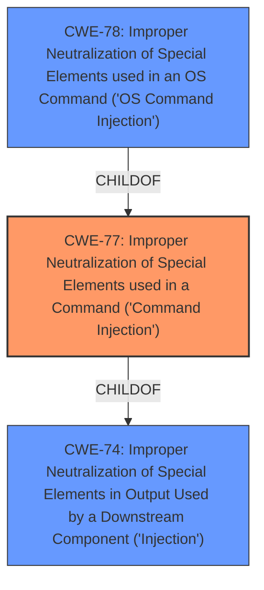

# Analysis Report for CVE-2021-45575

# Vulnerability Analysis Report: CVE-2021-45575

## Description


## Analysis (with Relationship Data)

# Summary
| CWE ID  | CWE Name  | Confidence | CWE Abstraction Level | CWE Vulnerability Mapping Label | CWE-Vulnerability Mapping Notes |
|---|---|---|---|---|---|
| CWE-77 | Improper Neutralization of Special Elements used in a Command ('Command Injection') | 1.0 | Class | Allowed-with-Review | Primary CWE |

## Evidence and Confidence

*   **Confidence Score:** 1.0
*   **Evidence Strength:** HIGH

## Relationship Analysis
The primary CWE selected is CWE-77, which is a Class-level weakness. Its child CWE, CWE-78 (OS Command Injection), was considered but deemed less appropriate because the description doesn't explicitly specify that the command injection is happening at the OS level. CWE-77's parent is CWE-74 (Improper Neutralization of Special Elements in Output Used by a Downstream Component ('Injection')), which is a more general case of injection. The relationship analysis guided the selection of CWE-77 as the most specific applicable CWE.



## Vulnerability Chain
The vulnerability chain involves the **improper neutralization** of input, leading to **command injection**. The attacker, being authenticated, exploits this flaw to execute arbitrary commands.

## Summary of Analysis
The analysis is based on the provided vulnerability description and associated information. The description clearly states "**command injection** by an authenticated user." The CVE Reference Links Content Summary also confirms that the **root cause** of the vulnerability is a post-authentication **command injection** flaw. This aligns well with the definition of CWE-77: "The product constructs all or part of a command using externally-influenced input from an upstream component, but it does not neutralize or incorrectly neutralizes special elements that could modify the intended command when it is sent to a downstream component." While CWE-78 (OS Command Injection) is a more specific case, there is no explicit mention that the command injection occurs at the operating system level. Therefore, CWE-77 is the most appropriate and specific CWE.

The selection of CWE-77 is supported by the Retriever Results, where it is ranked as the top combined result with a score of 1.0. The mapping guidance for CWE-77 suggests reviewing CWE-78 to ensure that it is not a better fit, which was considered and ruled out.

Relevant CWE Information:
- **CWE-77: Improper Neutralization of Special Elements used in a Command ('Command Injection')**
  - **Description:** The product constructs all or part of a command using externally-influenced input from an upstream component, but it does not neutralize or incorrectly neutralizes special elements that could modify the intended command when it is sent to a downstream component.
  - **Why it was selected:** The vulnerability description explicitly mentions command injection, making this the most relevant CWE.
- **CWE-78: Improper Neutralization of Special Elements used in an OS Command ('OS Command Injection')**
  - **Description:** The product constructs all or part of an OS command using externally-influenced input from an upstream component, but it does not neutralize or incorrectly neutralizes special elements that could modify the intended OS command when it is sent to a downstream component.
  - **Why it was not selected:** While command injection is mentioned, it doesn't explicitly state that it is an OS command.

Considering other CWEs from the Complete CWE Specifications:

*   CWE-74 (Improper Neutralization of Special Elements in Output Used by a Downstream Component ('Injection')): This is a more general injection category and is parent of CWE-77.
*   CWE-121 (Stack-based Buffer Overflow): This is not relevant as the vulnerability is related to command injection and not buffer overflows.
*   CWE-400 (Uncontrolled Resource Consumption): This is not relevant as the vulnerability is related to command injection and not resource consumption.
*   CWE-94 (Improper Control of Generation of Code ('Code Injection')): This is not relevant as the vulnerability is related to command injection, not code injection.
*   CWE-79 (Improper Neutralization of Input During Web Page Generation ('Cross-site Scripting')): This is not relevant as the vulnerability is related to command injection and not XSS.
*   CWE-22 (Improper Limitation of a Pathname to a Restricted Directory ('Path Traversal')): This is not relevant as the vulnerability is related to command injection and not path traversal.
*   CWE-917 (Improper Neutralization of Special Elements used in an Expression Language Statement ('Expression Language Injection')): This is not relevant as the vulnerability is related to command injection and not expression language injection.
*   CWE-269 (Improper Privilege Management): This is not the root cause, but a pre-condition for the attack (attacker needs to be authenticated).


## CWE Relationship Analysis

Current CWEs represent these abstraction levels: .


### Vulnerability Chain Analysis

**Chain starting from CWE-121:**
- 121 (Stack-based Buffer Overflow) - ROOT


**Chain starting from CWE-79:**
- 79 (Improper Neutralization of Input During Web Page Generation ('Cross-site Scripting')) - ROOT


### CWE Relationship Diagram

```mermaid
graph TD
    classDef primary fill:#f96,stroke:#333,stroke-width:2px
    classDef secondary fill:#69f,stroke:#333
    classDef tertiary fill:#9e9,stroke:#333
```


*Report generated on 2025-04-01 17:04:18*
