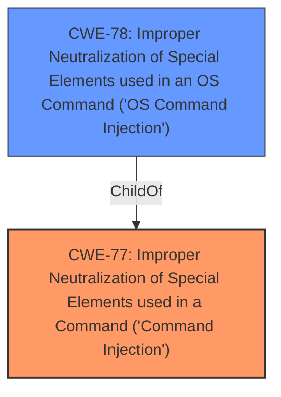

# Enhanced Analysis for CVE-2021-45577

# Summary
| CWE ID | CWE Name | Confidence | CWE Abstraction Level | CWE Vulnerability Mapping Label | CWE-Vulnerability Mapping Notes |
|---|---|---|---|---|---|
| CWE-77 | Improper Neutralization of Special Elements used in a Command ('Command Injection') | 1.0 | Class | Allowed-with-Review | Primary CWE |
| CWE-78 | Improper Neutralization of Special Elements used in an OS Command ('OS Command Injection') | 0.7 | Base | Allowed | Secondary Candidate |

## Evidence and Confidence

*   **Confidence Score:** 0.9
*   **Evidence Strength:** HIGH

## Relationship Analysis
The primary relationship influencing the decision is the parent-child relationship between CWE-77 and CWE-78. CWE-78 is a specific type of CWE-77, focusing on OS commands. The vulnerability description indicates command injection, making CWE-77 a strong candidate, but the specific context needs further clarification if its related to OS commands.


## Vulnerability Chain
The chain of events is as follows:
1.  **Root Cause:** Improper neutralization of special elements in a command.
2.  **Weakness:** Command injection vulnerability.
3.  **Impact:** Arbitrary command execution, potential compromise of affected devices.

## Summary of Analysis
Initially, the vulnerability description points strongly to **command injection**, making CWE-77 the primary candidate. The description states: "Certain NETGEAR devices are affected by **command injection** by an authenticated user." The **Vulnerability Description Key Phrases** reinforces this, with the **weakness** identified as **command injection**.

The "CVE Reference Links Content Summary" confirms that this is a "Post-authentication **command injection** vulnerability" and that it "Allows for arbitrary command execution after successful authentication."

The retriever results also highly suggest CWE-77.

CWE-77 is a Class-level CWE, while CWE-78 is a Base-level CWE. Since the provided text states "command injection" but does not explicitly limit this to OS commands, selecting CWE-77 is the more appropriate choice, though it should be reviewed to see if it is actually OS commands.

*   **CWE-77: Improper Neutralization of Special Elements used in a Command ('Command Injection')**
    *   This CWE describes a situation where a product constructs a command using external input but fails to neutralize special elements that could modify the intended command. The vulnerability description aligns with this CWE, as it involves command injection in NETGEAR devices.
    *   The security implication is that an attacker could execute arbitrary commands on the device, potentially leading to complete compromise.
    *   CWE-77 is a Class-level CWE.
    *   The MITRE mapping guidance suggests that CWE-77 is often misused when OS command injection (CWE-78) was intended. Therefore, a review is required to validate that the command injection is not OS specific.
*   **CWE-78: Improper Neutralization of Special Elements used in an OS Command ('OS Command Injection')**
    *   This CWE is a more specific case of CWE-77, focusing on OS commands. While the vulnerability description mentions command injection, it doesn't explicitly state that it's limited to OS commands.
    *   If the command injection is indeed related to OS commands, CWE-78 would be a more appropriate choice.
    *   CWE-78 is a Base-level CWE, making it more specific than CWE-77.
    *   The security implication is that an attacker could execute arbitrary OS commands on the device.

Other CWEs considered:
*   CWE-74: Improper Neutralization of Special Elements in Output Used by a Downstream Component ('Injection') - This is a more general class of injection vulnerabilities. Since the type of injection is command injection, CWE-77 is more appropriate.
*   CWE-94: Improper Control of Generation of Code ('Code Injection') - This is for code injection, which is a different type of injection than command injection.
*   CWE-79: Improper Neutralization of Input During Web Page Generation ('Cross-site Scripting') - This is for Cross-site Scripting, which is not the type of injection described in the vulnerability.


## CWE Relationship Analysis

Current CWEs represent these abstraction levels: .


### Vulnerability Chain Analysis

**Chain starting from CWE-79:**
- 79 (Improper Neutralization of Input During Web Page Generation ('Cross-site Scripting')) - ROOT


**Chain starting from CWE-78:**
- 78 (Improper Neutralization of Special Elements used in an OS Command ('OS Command Injection')) - ROOT


### CWE Relationship Diagram

```mermaid
graph TD
    classDef primary fill:#f96,stroke:#333,stroke-width:2px
    classDef secondary fill:#69f,stroke:#333
    classDef tertiary fill:#9e9,stroke:#333
```