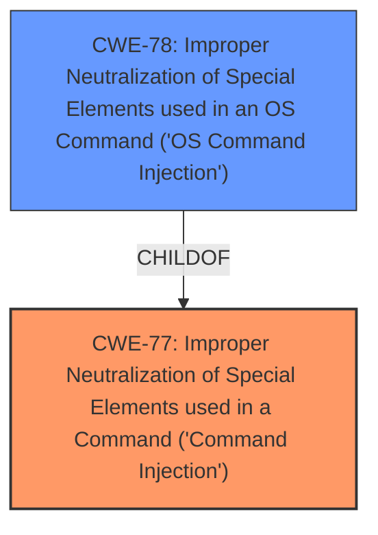

# Raw Analyzer Response for CVE-2021-45579

# Summary
| CWE ID | CWE Name | Confidence | CWE Abstraction Level | CWE Vulnerability Mapping Label | CWE-Vulnerability Mapping Notes |
|---|---|---|---|---|---|
| CWE-77 | Improper Neutralization of Special Elements used in a Command ('Command Injection') | 1.0 | Class | Allowed-with-Review | Primary CWE: Matches the **command injection** vulnerability described. |
| CWE-78 | Improper Neutralization of Special Elements used in an OS Command ('OS Command Injection') | 0.7 | Base | Allowed | Secondary CWE: Considered as a more specific variant if the commands are OS commands. |

## Evidence and Confidence

*   **Confidence Score:** 0.9
*   **Evidence Strength:** HIGH

## Relationship Analysis
The primary relationship impacting the decision is the parent-child relationship between CWE-77 and CWE-78. CWE-78 is a more specific Base case of CWE-77, focusing specifically on OS commands. The decision hinges on whether the **command injection** is strictly limited to OS commands or if it involves other command languages. Since the provided description lacks specific details, the higher-level CWE-77 is chosen with a possibility of refining it to CWE-78 if more information becomes available.

## Vulnerability Chain
The vulnerability chain starts with the **improper neutralization** of special elements within a command string, leading to **command injection**, and ultimately resulting in potential compromise of Confidentiality, Integrity, and Availability.
  - **Root Cause:** **Improper Neutralization**
  - **Weakness:** **Command Injection** (CWE-77)
  - **Impact:** Confidentiality, Integrity, and Availability compromise

## Summary of Analysis
Initially, the vulnerability description points directly to a **command injection** vulnerability. The primary CWE match from similar CVE descriptions also suggests CWE-77. The retriever results further reinforce this selection, with CWE-77 being the top combined result.

The description explicitly states a **command injection** vulnerability affecting NETGEAR devices. The CVE Reference Links Content Summary confirms this, stating "post-authentication **command injection** vulnerability". The advisory indicates a CVSS score of 8.4, with High impact for Confidentiality, Integrity and Availability, suggesting a successful exploit could allow an attacker to gain full control of the affected device. This evidence strongly supports the selection of CWE-77.

The choice between CWE-77 and CWE-78 depends on the specific type of command being injected. CWE-77 is a Class that encompasses various command languages, while CWE-78 is a Base that is specific to OS commands. Given the lack of specific details in the description, CWE-77 is chosen as the primary CWE. If the injected commands are confirmed to be OS commands, then CWE-78 would be a more appropriate and specific choice.

The decision is based on the available evidence and the abstraction level of the CWEs. CWE-77 is selected because it directly reflects the stated **command injection** vulnerability and is a commonly used CWE for similar vulnerabilities. The confidence level is high due to the clear and direct evidence from the vulnerability description and supporting documentation.

# Relevant CWE Information:

The following CWEs were identified as potentially relevant to this vulnerability:

## CWE-653: Improper Isolation or Compartmentalization
**Abstraction Level**: Class
**Similarity Score**: 0.75
**Source**: dense

**Description**:
The product does not properly compartmentalize or isolate functionality, processes, or resources that require different privilege levels, rights, or permissions.

**Mapping Guidance**:
- Usage: Allowed
- Rationale: This CWE entry is at the Base level of abstraction, which is a preferred level of abstraction for mapping to the root causes of vulnerabilities.

*Not selected:* This CWE is related to isolation issues, which are not the primary concern in this case. The vulnerability focuses on command injection due to **improper neutralization**, not isolation failures.

## CWE-266: Incorrect Privilege Assignment
**Abstraction Level**: Base
**Similarity Score**: 0.74
**Source**: dense

**Description**:
A product incorrectly assigns a privilege to a particular actor, creating an unintended sphere of control for that actor.

**Mapping Guidance**:
- Usage: Allowed
- Rationale: This CWE entry is at the Base level of abstraction, which is a preferred level of abstraction for mapping to the root causes of vulnerabilities.

*Not selected:* While the attacker needs to be authenticated with "High Privileges", the root cause is not **incorrect privilege assignment**, but **command injection** due to **improper neutralization**.

## CWE-274: Improper Handling of Insufficient Privileges
**Abstraction Level**: Base
**Similarity Score**: 0.74
**Source**: dense

**Description**:
The product does not handle or incorrectly handles when it has insufficient privileges to perform an operation, leading to resultant weaknesses.

**Mapping Guidance**:
- Usage: Discouraged
- Rationale: This CWE entry could be deprecated in a future version of CWE.

*Not selected:* This CWE is about handling insufficient privileges, which isn't the primary issue. The attacker has sufficient privileges to authenticate, but then exploits the **command injection** vulnerability.

## CWE-664: Improper Control of a Resource Through its Lifetime
**Abstraction Level**: Pillar
**Similarity Score**: 0.73
**Source**: dense

**Description**:
The product does not maintain or incorrectly maintains control over a resource throughout its lifetime of creation, use, and release.

**Mapping Guidance**:
- Usage: Discouraged
- Rationale: This CWE entry is high-level when lower-level children are available.

*Not selected:* This is a very high-level CWE and does not accurately reflect the **command injection** vulnerability.

## CWE-267: Privilege Defined With Unsafe Actions
**Abstraction Level**: Base
**Similarity Score**: 0.72
**Source**: dense

**Description**:
A particular privilege, role, capability, or right can be used to perform unsafe actions that were not intended, even when it is assigned to the correct entity.

**Mapping Guidance**:
- Usage: Allowed
- Rationale: This CWE entry is at the Base level of abstraction, which is a preferred level of abstraction for mapping to the root causes of vulnerabilities.

*Not selected:* Similar to CWE-266, the root cause is **command injection**, not how privileges are defined.

## CWE-280: Improper Handling of Insufficient Permissions or Privileges
**Abstraction Level**: Base
**Similarity Score**: 0.72
**Source**: dense

**Description**:
The product does not handle or incorrectly handles when it has insufficient privileges to access resources or functionality as specified by their permissions. This may cause it to follow unexpected code paths that may leave the product in an invalid state.

**Mapping Guidance**:
- Usage: Allowed
- Rationale: This CWE entry is at the Base level of abstraction, which is a preferred level of abstraction for mapping to the root causes of vulnerabilities.

*Not selected:* This is the inverse of what's happening; the attacker has enough privileges, but then exploits **command injection**.

## CWE-691: Insufficient Control Flow Management
**Abstraction Level**: Pillar
**Similarity Score**: 0.72
**Source**: dense

**Description**:
The code does not sufficiently manage its control flow during execution, creating conditions in which the control flow can be modified in unexpected ways.

**Mapping Guidance**:
- Usage: Discouraged
- Rationale: This CWE entry is extremely high-level, a Pillar. However, classification research is limited for weaknesses of this type, so there can be gaps or organizational difficulties within CWE that force use of this weakness, even at such a high level of abstraction.

*Not selected:* Too high-level. The control flow is modified due to **command injection**, which is more specific.

## CWE-74: Improper Neutralization of Special Elements in Output Used by a Downstream Component ('Injection')
**Abstraction Level**: Class
**Similarity Score**: 0.71
**Source**: dense

**Description**:
The product constructs all or part of a command, data structure, or record using externally-influenced input from an upstream component, but it does not neutralize or incorrectly neutralizes special elements that could modify how it is parsed or interpreted when it is sent to a downstream component.

**Mapping Guidance**:
- Usage: Discouraged
- Rationale: CWE-74 is high-level and often misused when lower-level weaknesses are more appropriate.

*Not selected:* While related to injection, CWE-74 is too broad. CWE-77 is a more specific child that addresses **command injection**.

## CWE-668: Exposure of Resource to Wrong Sphere
**Abstraction Level**: Class
**Similarity Score**: 0.71
**Source**: dense

**Description**:
The product exposes a resource to the wrong control sphere, providing unintended