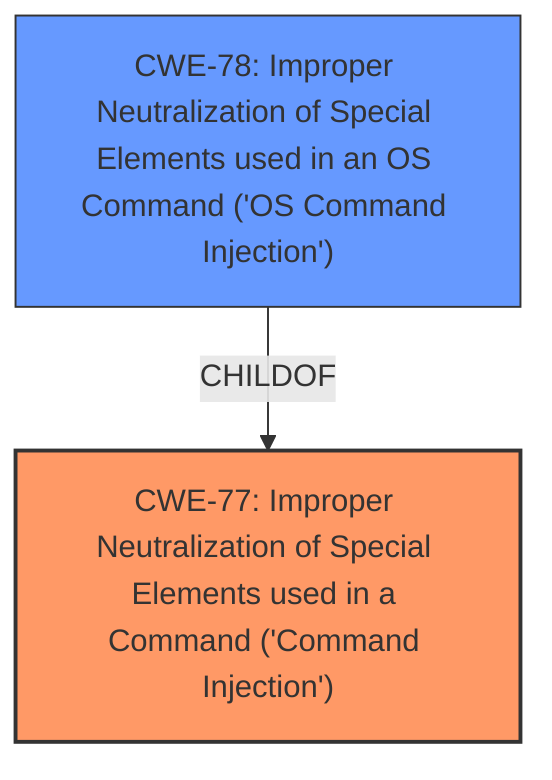

# Raw Analyzer Response for CVE-2021-45581

# Summary
| CWE ID | CWE Name | Confidence | CWE Abstraction Level | CWE Vulnerability Mapping Label | CWE-Vulnerability Mapping Notes |
|---|---|---|---|---|---|
| CWE-77 | Improper Neutralization of Special Elements used in a Command ('Command Injection') | 1.00 | Class | Allowed-with-Review | Primary CWE |
| CWE-78 | Improper Neutralization of Special Elements used in an OS Command ('OS Command Injection') | 0.7 | Base | Allowed | Secondary Candidate |

## Evidence and Confidence

*   **Confidence Score:** 0.9
*   **Evidence Strength:** MEDIUM

## Relationship Analysis
The primary CWE, CWE-77, is a Class-level weakness that describes the improper neutralization of special elements in a command. CWE-78, a Base-level weakness, is a more specific type of command injection focusing on OS commands. CWE-77 is a parent of CWE-78. Given the lack of specific details about the command being injected, I selected the broader CWE-77.

## Vulnerability Chain
The vulnerability chain involves an authenticated user injecting a command due to **improper neutralization** (CWE-77). The injection leads to potential data exfiltration, system compromise, or denial of service.

## Summary of Analysis
The initial analysis identified **command injection** as the primary **weakness**. The "CWE for similar CVE Descriptions" section reinforces this, listing CWE-77 as the primary match. The "CVE Reference Links Content Summary" also points to command injection but is unrelated to the specific CVE.

The Retriever Results list CWE-77 as the top combined result. Given the authenticated user context and the **command injection**, CWE-77 seems most appropriate. CWE-78 is also considered but lacks evidence to confirm it's specifically an OS command. CWE-74 is too high-level and discouraged.

I'm selecting CWE-77 as the primary CWE because the vulnerability description explicitly mentions **command injection** by an authenticated user. The provided evidence supports this, and the retriever results confirm it as the top match. I am choosing the Class level because the description lacks specifics to narrow it down to an OS command (CWE-78).

Relevant CWE Information:

# Enhanced Context (25 CWEs)

## CWE-653: Improper Isolation or Compartmentalization
**Abstraction Level**: Class
**Similarity Score**: 0.75
**Source**: dense
*Not Selected*: No evidence of isolation or compartmentalization issues.

## CWE-274: Improper Handling of Insufficient Privileges
**Abstraction Level**: Base
**Similarity Score**: 0.73
**Source**: dense
*Not Selected*: The issue is not about handling insufficient privileges.

## CWE-266: Incorrect Privilege Assignment
**Abstraction Level**: Base
**Similarity Score**: 0.73
**Source**: dense
*Not Selected*: The vulnerability is related to **command injection**, not privilege assignment.

## CWE-664: Improper Control of a Resource Through its Lifetime
**Abstraction Level**: Pillar
**Similarity Score**: 0.73
**Source**: dense
*Not Selected*: Too high-level and not directly related to the **command injection** issue.

## CWE-691: Insufficient Control Flow Management
**Abstraction Level**: Pillar
**Similarity Score**: 0.72
**Source**: dense
*Not Selected*: Too high-level and not directly related to the **command injection** issue.

## CWE-405: Asymmetric Resource Consumption (Amplification)
**Abstraction Level**: Class
**Similarity Score**: 0.71
**Source**: dense
*Not Selected*: Not related to resource consumption.

## CWE-280: Improper Handling of Insufficient Permissions or Privileges
**Abstraction Level**: Base
**Similarity Score**: 0.71
**Source**: dense
*Not Selected*: The issue is not about handling insufficient privileges.

## CWE-267: Privilege Defined With Unsafe Actions
**Abstraction Level**: Base
**Similarity Score**: 0.71
**Source**: dense
*Not Selected*: The vulnerability is related to **command injection**, not unsafe privilege definitions.

## CWE-74: Improper Neutralization of Special Elements in Output Used by a Downstream Component ('Injection')
**Abstraction Level**: Class
**Similarity Score**: 0.71
**Source**: dense
*Not Selected*: While injection is involved, CWE-77 is more specific to commands.

## CWE-668: Exposure of Resource to Wrong Sphere
**Abstraction Level**: Class
**Similarity Score**: 0.71
**Source**: dense
*Not Selected*: Not related to resource exposure.

## CWE-79: Improper Neutralization of Input During Web Page Generation ('Cross-site Scripting')
**Abstraction Level**: Base
**Similarity Score**: 9651.27
**Source**: sparse
*Not Selected*: Not related to web page generation or cross-site scripting.

## CWE-22: Improper Limitation of a Pathname to a Restricted Directory ('Path Traversal')
**Abstraction Level**: Base
**Similarity Score**: 9618.06
**Source**: sparse
*Not Selected*: Not related to path traversal.

## CWE-88: Improper Neutralization of Argument Delimiters in a Command ('Argument Injection')
**Abstraction Level**: Base
**Similarity Score**: 9492.60
**Source**: sparse
*Not Selected*: While argument injection could be related, the primary issue is **command injection**, making CWE-77 a better fit.

## CWE-74: Improper Neutralization of Special Elements in Output Used by a Downstream Component ('Injection')
**Abstraction Level**: Class
**Similarity Score**: 9434.38
**Source**: sparse
*Not Selected*: While injection is involved, CWE-77 is more specific to commands.

## CWE-116: Improper Encoding or Escaping of Output
**Abstraction Level**: Class
**Similarity Score**: 9433.76
**Source**: sparse
*Not Selected*: Not related to encoding or escaping of output.

## CWE-78: Improper Neutralization of Special Elements used in an OS Command ('OS Command Injection')
**Abstraction Level**: base
**Similarity Score**: 5.03
**Source**: graph
*Considered*: This is a more specific case of command injection. It is selected as a secondary candidate.

## CWE-79: Improper Neutralization of Input During Web Page Generation ('Cross-site Scripting')
**Abstraction Level**: base
**Similarity Score**: 5.03
**Source**: graph
*Not Selected*: Not related to web page generation or cross-site scripting.

## CWE-184: Incomplete List of Disallowed Inputs
**Abstraction Level**: base
**Similarity Score**: 4.33
**Source**: graph
*Not Selected*: While related to input validation, it's not the primary issue.

## CWE-494: Download of Code Without Integrity Check
**Abstraction Level**: base
**Similarity Score**: 4.33
**Source**: graph
*Not Selected*: Not related to code downloads.

## CWE-22: Improper Limitation of a Pathname to a Restricted Directory ('Path Traversal')
**Abstraction Level**: base
**Similarity Score**: 4.33
**Source**: graph
*Not Selected*: Not related to path traversal.

## CWE-770: Allocation of Resources Without Limits or Throttling
**Abstraction Level**: base
**Similarity Score**: 4.33
**Source**: graph
*Not Selected*: Not related to resource allocation.

## CWE-1284: Improper Validation of Specified Quantity in Input
**Abstraction Level**: base
**Similarity Score**: 4.33
**Source**: graph
*Not Selected*: Not related to quantity validation.

## CWE-410: Insufficient Resource Pool
**Abstraction Level**: base
**Similarity Score**: 4.33
**Source**: graph
*Not Selected*: Not related to resource pools.

## CWE-789: Memory Allocation with Excessive Size Value
**Abstraction Level**: variant
**Similarity Score**: 3.88
**Source**: graph
*Not Selected*: Not related to memory allocation.

## CWE-190: Integer Overflow or Wraparound
**Abstraction Level**: base
**Similarity Score**: 3.65
**Source**: graph
*Not Selected*: Not related to integer overflow.