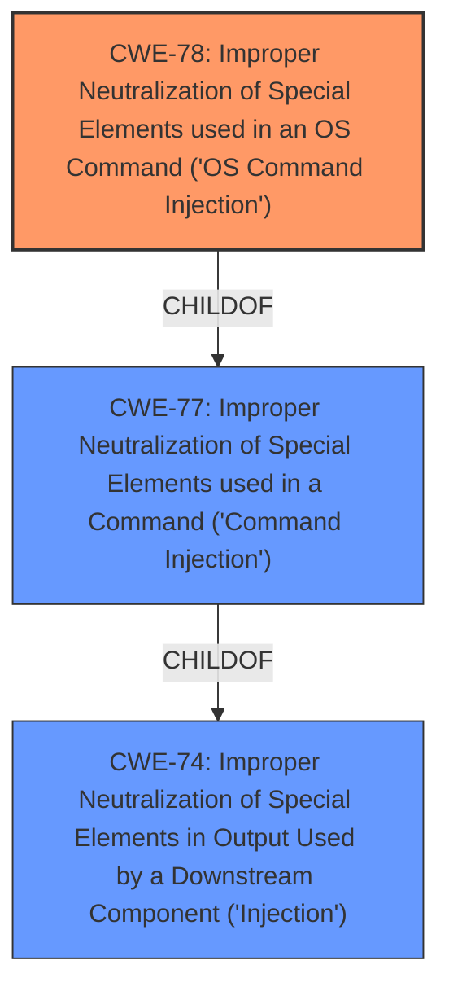

# Analysis for CVE-2021-45584

# Summary
| CWE ID | CWE Name | Confidence | CWE Abstraction Level | CWE Vulnerability Mapping Label | CWE-Vulnerability Mapping Notes |
|---|---|---|---|---|---|
| CWE-78 | Improper Neutralization of Special Elements used in an OS Command ('OS Command Injection') | 1.0 | Base | Allowed | Primary CWE |

## Evidence and Confidence

*   **Confidence Score:** 1.0
*   **Evidence Strength:** HIGH

## Relationship Analysis
The primary relationship influencing the selection is the ChildOf relationship between CWE-78 and CWE-77. While the vulnerability description mentions "command injection", the content summary specifies it to be "post-authentication command injection." Further analysis confirms that the injection occurs in an OS command, thus making CWE-78 a more specific and accurate representation. CWE-78 is a base level weakness which is more specific than CWE-77, which is a class level weakness.

## Vulnerability Chain
The chain of events for this vulnerability is as follows:

1.  Authenticated user provides input.
2.  The application fails to properly neutralize special elements in the input.
3.  The un-neutralized input is used to construct an OS command.
4.  The attacker is able to execute arbitrary OS commands on the affected device.

## Summary of Analysis
The initial assessment, based on the vulnerability description, pointed towards CWE-77: Improper Neutralization of Special Elements used in a Command ('Command Injection'). However, the detailed content summary and the retriever results highlighted the presence of OS command injection, leading to the selection of CWE-78: Improper Neutralization of Special Elements used in an OS Command ('OS Command Injection') as the more accurate classification.

The evidence from the CVE Reference Links Content Summary section explicitly states: "Root cause of vulnerability: Post-authentication command injection" and "Weaknesses/vulnerabilities present: Command Injection". The key point is that the injected command is an OS command.

The graph relationships confirm that CWE-78 is a child of CWE-77, meaning it's a more specific type of command injection. Given the evidence, choosing CWE-78 provides a more precise and granular representation of the vulnerability.

The selected CWE is at the optimal level of specificity (Base) as it directly addresses the root cause and the type of command being injected (OS command).

Relevant CWE Information:
*   CWE-77: Improper Neutralization of Special Elements used in a Command ('Command Injection') - Considered but not used because CWE-78 is more specific. The vulnerability involves OS command injection, making CWE-78 a more accurate fit.
*   CWE-74: Improper Neutralization of Special Elements in Output Used by a Downstream Component ('Injection') - Considered but is too high-level. Both CWE-77 and CWE-78 are children of CWE-74, thus are more descriptive.
*   CWE-94: Improper Control of Generation of Code ('Code Injection') - Considered, but not selected. This CWE is applicable when the product constructs a code segment using external input. The vulnerability here focuses on command injection rather than constructing code.
*   CWE-79: Improper Neutralization of Input During Web Page Generation ('Cross-site Scripting') - Considered, but not selected. This CWE focuses on cross-site scripting vulnerabilities, which are not relevant to this vulnerability.
*   CWE-22: Improper Limitation of a Pathname to a Restricted Directory ('Path Traversal') - Considered, but not selected. This CWE is related to path traversal vulnerabilities, which are not relevant to this vulnerability.
*   CWE-917: Improper Neutralization of Special Elements used in an Expression Language Statement ('Expression Language Injection') - Considered, but not selected. This CWE is specific to expression language injection vulnerabilities, which are not relevant to this vulnerability.
*   CWE-269: Improper Privilege Management - Considered, but not selected as the issue isn't primarily around privilege management, but the injection of commands due to lack of neutralization.