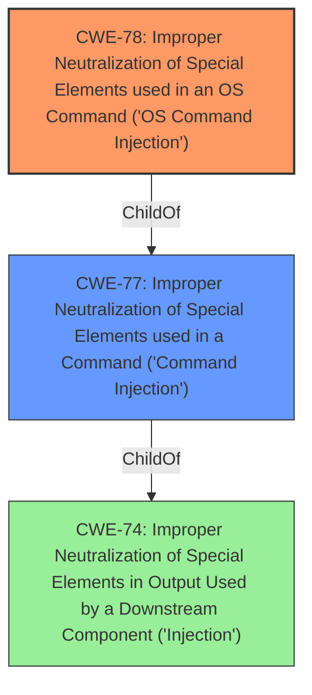

# Enhanced Analysis for CVE-2021-45585

# Summary
| CWE ID | CWE Name | Confidence | CWE Abstraction Level | CWE Vulnerability Mapping Label | CWE-Vulnerability Mapping Notes |
|---|---|---|---|---|---|
| CWE-78 | Improper Neutralization of Special Elements used in an OS Command ('OS Command Injection') | 1.0 | Base | Allowed | Primary CWE |

## Evidence and Confidence

*   **Confidence Score:** 1.0
*   **Evidence Strength:** HIGH

## Relationship Analysis
The primary relationship is that CWE-78 [Improper Neutralization of Special Elements used in an OS Command ('OS Command Injection')] is a child of CWE-77 [Improper Neutralization of Special Elements used in a Command ('Command Injection')]. While the vulnerability description indicates a "**command injection**" vulnerability, the presence of "OS Command Injection" as a Top CWE, combined with the CWE-78's description focusing on OS commands makes it the more specific and appropriate choice. CWE-78 is a Base level CWE which is preferred.



## Vulnerability Chain
The chain of events starts with the **improper neutralization** of input, leading to the ability to inject OS commands. The impact is the ability to execute arbitrary commands on the system.

## Summary of Analysis
The initial assessment, based on the "**command injection**" phrase in the vulnerability description, pointed towards CWE-77 [Improper Neutralization of Special Elements used in a Command ('Command Injection')]. However, the retriever results and the definition of CWE-78 [Improper Neutralization of Special Elements used in an OS Command ('OS Command Injection')] made it a better fit. The "CWE for similar CVE Descriptions" section lists CWE-77 as the primary match and top CWE. However, given the specificity of CWE-78 relating to OS commands, and the lack of information to suggest the command injection relates to another type of command, CWE-78 is chosen. The description clearly states "**command injection** by an authenticated user," indicating the **improper neutralization** of input. This is strong evidence that the product constructs an OS command using externally-influenced input but fails to neutralize special elements. This decision is also influenced by the mapping guidance for CWE-78, which states that it is at the Base level of abstraction, a preferred level, and to carefully read the name and description to ensure appropriate fit.

Relevant CWE Information:

# Enhanced Context (25 CWEs)

## CWE-78: Improper Neutralization of Special Elements used in an OS Command ('OS Command Injection')
**Abstraction:** Base
**Status:** Stable

### Description
The product constructs all or part of an OS command using externally-influenced input from an upstream component, but it does not neutralize or incorrectly neutralizes special elements that could modify the intended OS command when it is sent to a downstream component.


## CWE Relationship Analysis

Current CWEs represent these abstraction levels: .


### Vulnerability Chain Analysis

**Chain starting from CWE-78:**
- 78 (Improper Neutralization of Special Elements used in an OS Command ('OS Command Injection')) - ROOT


**Chain starting from CWE-74:**
- 74 (Improper Neutralization of Special Elements in Output Used by a Downstream Component ('Injection')) - ROOT


### CWE Relationship Diagram

```mermaid
graph TD
    classDef primary fill:#f96,stroke:#333,stroke-width:2px
    classDef secondary fill:#69f,stroke:#333
    classDef tertiary fill:#9e9,stroke:#333
```