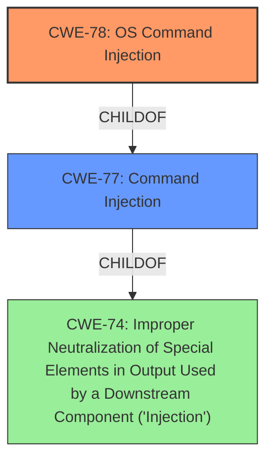

# Analysis for CVE-2021-45587

# Summary
| CWE ID  | CWE Name   | Confidence | CWE Abstraction Level | CWE Vulnerability Mapping Label | CWE-Vulnerability Mapping Notes |
|------------------|--------------------------------------------------------------------------------------------------|------------------|--------------------------|------------------------------------|------------------------------------------------------------------------------------------------------------|
| CWE-78 | Improper Neutralization of Special Elements used in an OS Command ('OS Command Injection') | 1 | Base | Allowed | Primary CWE |
| CWE-77 | Improper Neutralization of Special Elements used in a Command ('Command Injection') | 0.7 | Class | Allowed-with-Review | Secondary Candidate |

## Evidence and Confidence

*   **Confidence Score:** 0.9
*   **Evidence Strength:** HIGH

## Relationship Analysis
The primary relationship that influenced the decision was the hierarchical relationship between CWE-77 (Class) and CWE-78 (Base). Since the vulnerability specifically involves **command injection** in an OS command, the more specific CWE-78 was chosen over its parent CWE-77. While both apply, CWE-78 provides a more precise characterization of the weakness. There is also a peer relationship between CWE-78 and CWE-88 (Improper Neutralization of Argument Delimiters), but there's no evidence to suggest argument injection is involved. The vulnerability description explicitly indicates **command injection** by an authenticated user, supporting the selection of a **command injection** related CWE.

## Vulnerability Chain
The vulnerability chain involves the following sequence:
1.  Improper handling of external input when constructing an OS command (CWE-78).
2.  The ability for an authenticated user to inject commands.

## Summary of Analysis
The initial assessment strongly pointed towards **command injection**, supported by the **Vulnerability Description** and the **CWE for similar CVE Descriptions**. The retriever results also highlighted CWE-77 and CWE-78 as top candidates. The final decision to select CWE-78 was based on the explicit mention of an OS command in the vulnerability, making it a more specific and accurate representation of the weakness compared to the more general CWE-77. The evidence provided explicitly identifies "**command injection** by an authenticated user," solidifying the choice of a **command injection** related CWE. The graph relationships further guided the selection of CWE-78 as a child of CWE-77, representing a more specific type of **command injection**.

Relevant CWE Information:
- The vulnerability description explicitly mentions "**command injection** by an authenticated user," providing direct evidence.
- CWE-78 is a Base level CWE, which is the preferred level of abstraction.
- CWE-78's description aligns perfectly with the vulnerability: "The product constructs all or part of an OS command using externally-influenced input...but it does not neutralize or incorrectly neutralizes special elements that could modify the intended OS command..."

CWEs considered but not used:
- CWE-77: While also related to **command injection**, it's a more general Class-level CWE. Since the vulnerability specifically involves an OS command, CWE-78 is a better fit.
- CWE-74: Too general, representing a high-level "Injection" weakness. The vulnerability is more specific than a general injection issue.
- CWE-94: "Improper Control of Generation of Code ('Code Injection')" - This is a different type of injection related to generating code, and this vulnerability isn't generating code.