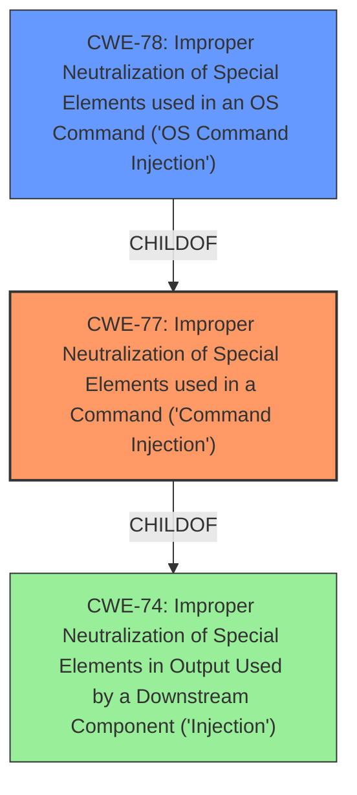

# Analysis Report for CVE-2021-45594

# Vulnerability Analysis Report: CVE-2021-45594

## Description


## Analysis (with Relationship Data)

# Summary
| CWE ID | CWE Name | Confidence | CWE Abstraction Level | CWE Vulnerability Mapping Label | CWE-Vulnerability Mapping Notes |
|---|---|---|---|---|---|
| CWE-77 | Improper Neutralization of Special Elements used in a Command ('Command Injection') | 1.0 | Class | Allowed-with-Review | Primary CWE. The vulnerability description clearly states "command injection" by an authenticated user, aligning with the definition of CWE-77. |
| CWE-78 | Improper Neutralization of Special Elements used in an OS Command ('OS Command Injection') | 0.8 | Base | Allowed | Secondary candidate. While CWE-77 is the primary mapping, CWE-78 is a more specific version related to OS commands. It is possible this vulnerability is specifically related to OS commands, so it is a strong secondary candidate. |

## Evidence and Confidence

*   **Confidence Score:** 0.9
*   **Evidence Strength:** HIGH

## Relationship Analysis
The analysis considered the following CWE relationships:
  - CWE-77 is a parent of CWE-78, indicating a specialization towards OS commands.
  - CWE-77 and CWE-74 are related as both deal with injection, but CWE-77 is specific to command injection.
  - Usage guidance for CWE-77 recommends considering CWE-78.



## Vulnerability Chain
The vulnerability chain starts with the **command injection** **weakness**.
  - An authenticated user is able to inject commands.
  - The commands are executed by the system.
  - The impact is potentially complete compromise of the device.

## Summary of Analysis
The initial analysis focused on the direct statement of "**command injection**" in the vulnerability description. The retriever results also prominently listed CWE-77 and CWE-78. Further analysis considered the relationships between CWEs, especially the parent-child relationship between CWE-77 and CWE-78.

The primary decision is based on the vulnerability description stating "**command injection**" by an authenticated user. The supporting evidence is: "Certain NETGEAR devices are affected by **command injection** by an authenticated user."

CWE-77 is selected as the primary CWE because it directly addresses "**Improper Neutralization of Special Elements used in a Command ('Command Injection')**". While CWE-78 is more specific to OS commands, the provided description doesn't explicitly state that the injected commands are OS commands, even though that could be the case. Therefore, CWE-77 is the more appropriate initial classification. However, CWE-78 is a strong secondary candidate because it is a very common form of command injection.

CWE-77 is at the Class level, which allows for a broader range of command types, while CWE-78 is at the Base level, focusing specifically on OS commands. The choice of CWE-77 provides the optimal level of specificity given the available information.

The following CWEs were considered but not used:

*   CWE-74: While related to injection, it's a more general case. The description specifically mentions command injection, making CWE-77 a better fit. Also the mapping guidance discourages its use, with a recommendation to find more precise mappings.
*   CWE-20: This is a very general CWE for improper input validation. While input validation might be a contributing factor, the core issue is the command injection itself, making CWE-77 more appropriate. Also the mapping guidance discourages its use, with a recommendation to find more precise mappings.
*   CWE-93: This is specific to CRLF injection, which isn't mentioned in the vulnerability description.
*   CWE-94: This refers to code injection, which is different from command injection.
*   CWE-22 and CWE-23: Path traversal is not relevant in this case.
*   CWE-269: Improper privilege management is not the root cause here. The vulnerability description mentions an authenticated user, suggesting the issue is with command processing, not privilege assignment.


## CWE Relationship Analysis

Current CWEs represent these abstraction levels: .


### Vulnerability Chain Analysis

**Chain starting from CWE-78:**
- 78 (Improper Neutralization of Special Elements used in an OS Command ('OS Command Injection')) - ROOT


**Chain starting from CWE-74:**
- 74 (Improper Neutralization of Special Elements in Output Used by a Downstream Component ('Injection')) - ROOT


### CWE Relationship Diagram

```mermaid
graph TD
    classDef primary fill:#f96,stroke:#333,stroke-width:2px
    classDef secondary fill:#69f,stroke:#333
    classDef tertiary fill:#9e9,stroke:#333
```


*Report generated on 2025-04-01 22:05:33*
