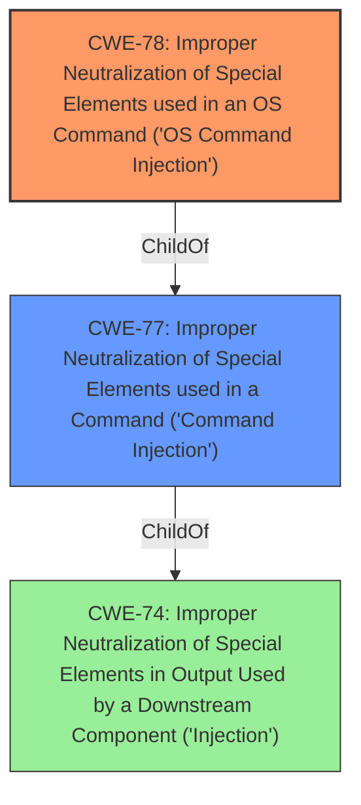

# Raw Analyzer Response for CVE-2021-45595

# Summary
| CWE ID | CWE Name | Confidence | CWE Abstraction Level | CWE Vulnerability Mapping Label | CWE-Vulnerability Mapping Notes |
|---|---|---|---|---|---|
| CWE-78 | Improper Neutralization of Special Elements used in an OS Command ('OS Command Injection') | 1.0 | Base | Allowed | Primary CWE |
| CWE-77 | Improper Neutralization of Special Elements used in a Command ('Command Injection') | 0.7 | Class | Allowed-with-Review | Secondary Candidate |

## Evidence and Confidence

*   **Confidence Score:** 1.0
*   **Evidence Strength:** HIGH

## Relationship Analysis
The primary relationship that influenced the decision was the parent-child relationship between CWE-77 and CWE-78. CWE-78 is a base variant of CWE-77 and is more specific to OS commands. The description clearly states **command injection**, which strongly suggests the involvement of OS commands, making CWE-78 a more appropriate choice.

## Vulnerability Chain
The vulnerability chain involves the lack of proper neutralization of special elements in a command, leading to the ability for an authenticated user to inject commands.
  - The root cause is the **improper neutralization**.
  - The weakness is **command injection**.
  - The impact is unauthorized command execution.

## Summary of Analysis
The initial analysis identified **command injection** as the primary issue. The Retriever Results suggested CWE-77 and CWE-78 as top candidates. Given that the vulnerability involves **command injection** in NETGEAR devices, and considering the hierarchical relationship where CWE-78 is a specific type of command injection related to OS commands, CWE-78 was selected as the primary CWE.

The selection of CWE-78 is based on the vulnerability description explicitly mentioning **command injection** and the nature of the affected devices (NETGEAR), which suggests the injected commands are likely OS commands. The MITRE mapping guidance recommends using the most specific CWE available, and CWE-78 fits this criterion.

The vulnerability description states: "Certain NETGEAR devices are affected by **command injection** by an authenticated user." This directly supports the selection of CWE-78, as it indicates the ability to inject and execute OS commands on the affected devices.

# Relevant CWE Information:

## Enhanced Context (25 CWEs)
The following CWEs were identified as potentially relevant to this vulnerability:

## CWE-74: Improper Neutralization of Special Elements in Output Used by a Downstream Component ('Injection')
**Abstraction Level**: Class
**Similarity Score**: 0.73
**Source**: dense

**Description**:
The product constructs all or part of a command, data structure, or record using externally-influenced input from an upstream component, but it does not neutralize or incorrectly neutralizes special elements that could modify how it is parsed or interpreted when it is sent to a downstream component.

**Mapping Guidance**:
- Usage: Discouraged
- Rationale: CWE-74 is high-level and often misused when lower-level weaknesses are more appropriate.

## CWE-78: Improper Neutralization of Special Elements used in an OS Command ('OS Command Injection')
**Abstraction Level**: base
**Similarity Score**: 5.03
**Source**: graph

**Description**:
CWE-78: Improper Neutralization of Special Elements used in an OS Command ('OS Command Injection')

**Mapping Guidance**:
- Usage: Allowed
- Rationale: This CWE entry is at the Base level of abstraction, which is a preferred level of abstraction for mapping to the root causes of vulnerabilities.

**Relationships**:
- CANFOLLOW -> CWE-184
- CANALSOBE -> CWE-88
- CHILDOF -> CWE-77
- CHILDOF -> CWE-77
- CHILDOF -> CWE-74

## CWE-77: Improper Neutralization of Special Elements used in a Command ('Command Injection')
**Abstraction Level:** Class
**Status:** Draft

### Description
The product constructs all or part of a command using externally-influenced input from an upstream component, but it does not neutralize or incorrectly neutralizes special elements that could modify the intended command when it is sent to a downstream component.

### Extended Description
Many protocols and products have their own custom command language. While OS or shell command strings are frequently discovered and targeted, developers may not realize that these other command languages might also be vulnerable to attacks.

### Alternative Terms
Command injection: an attack-oriented phrase for this weakness. Note: often used when "OS command injection" (CWE-78) was intended.

### Relationships
ChildOf -> CWE-74
ChildOf -> CWE-74

### Mapping Guidance
**Usage:** Allowed-with-Review
**Rationale:** CWE-77 is often misused when OS command injection (CWE-78) was intended instead [REF-1287].
**Comments:** Ensure that the analysis focuses on the root-cause error that allows the execution of commands, as there are many weaknesses that can lead to this consequence. See Terminology Notes. If the weakness involves a command language besides OS shell invocation, then CWE-77 could be used.
**Reasons:**
- Frequent Misuse
**Suggested Alternatives:**
- CWE-78: OS Command Injection

## CWE-22: Improper Limitation of a Pathname to a Restricted Directory ('Path Traversal')
**Abstraction Level:** Base
**Similarity Score**: 9547.55
**Source**: sparse

**Description**:
The product uses external input to construct a pathname that is intended to identify a file or directory that is located underneath a restricted parent directory, but the product does not properly neutralize special elements within the pathname that can cause the pathname to resolve to a location that is outside of the restricted directory.

## CWE-20: Improper Input Validation
**Abstraction Level:** Class
**Similarity Score**: 0.430
**Source**: sparse

**Description**:
The product receives input or data, but it does not validate or incorrectly validates that the input has the properties that are required to process the data safely and correctly.

CWE-74, CWE-22, and CWE-20 were considered but not chosen because they are less specific than CWE-78. CWE-74 is a high-level injection weakness, while CWE-22 and CWE-20 relate to path traversal and input validation, respectively, which are not the primary issues described in the vulnerability.