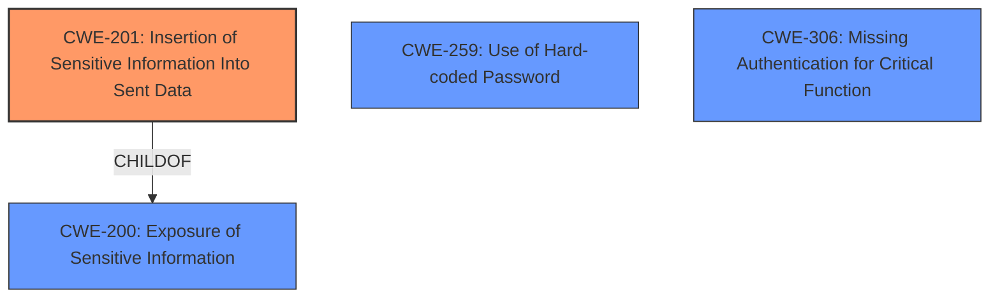

# Enhanced Analysis for CVE-2021-45603

# Summary
| CWE ID  | CWE Name                                                                                       | Confidence | CWE Abstraction Level | CWE Vulnerability Mapping Label | CWE-Vulnerability Mapping Notes |
| :-------- | :--------------------------------------------------------------------------------------------- | :---------- | :---------------------- | :------------------------------ | :------------------------------ |
| CWE-201 | Insertion of Sensitive Information Into Sent Data                                          | 0.9        | Base                    | Primary CWE                     | Allowed                       |
| CWE-259 | Use of Hard-coded Password                                                                     | 0.6         | Variant                  | Secondary Candidate             | Allowed                       |
| CWE-306 | Missing Authentication for Critical Function  | 0.5         | Base                  | Secondary Candidate             | Allowed                       |

## Evidence and Confidence

*   **Confidence Score:** 0.8
*   **Evidence Strength:** MEDIUM

## Relationship Analysis
The primary CWE selected is CWE-201 (Insertion of Sensitive Information Into Sent Data), which is a Base level CWE. It is related to CWE-200 (Exposure of Sensitive Information) as its parent. CWE-201 describes the specific case of sensitive information being sent in data, aligning with the vulnerability description of the device's serial number being revealed in a UPnP request. The advisory mentions "post-authentication command injection and sensitive information disclosure security vulnerabilities" but does not specify the root cause.



## Vulnerability Chain
The vulnerability chain starts with the NETGEAR device, which, upon receiving a UPnP request, **discloses** the device's serial number. This serial number can then be used for a password reset, leading to unauthorized access. The **root cause** here is the **unintentional inclusion** of the serial number in the UPnP response.
  - **CWE-201**: Insertion of Sensitive Information Into Sent Data (Root Cause - Disclosure of Serial Number)
  - (Potential Step): Use of Serial Number for Password Reset (Implicit Weakness - Not explicitly covered but implied in description)
  - (Impact): Unauthorized Access (Impact)

## Summary of Analysis
The initial analysis identified **CWE-201 (Insertion of Sensitive Information Into Sent Data)** as the most relevant CWE, supported by the vulnerability description stating that a UPnP request reveals the device's serial number. This is direct evidence of sensitive information being sent in data. The retriever results also list CWE-201 with a high similarity score. Other considered CWEs included **CWE-259 (Use of Hard-coded Password)** and **CWE-306 (Missing Authentication for Critical Function)**.

**CWE-259 (Use of Hard-coded Password)** could be a secondary factor if the password reset mechanism relies on a hard-coded default password, but this is not explicitly stated in the description. If the serial number is used in combination with a hardcoded value for password reset, it would apply, but there is no evidence of it.

**CWE-306 (Missing Authentication for Critical Function)** could be relevant if the UPnP service itself lacks proper authentication, allowing unauthorized access to the serial number, but this is not the primary issue described.

The decision to prioritize **CWE-201** is based on the direct evidence of sensitive information disclosure. While **CWE-259** and **CWE-306** are plausible secondary issues, they are not explicitly supported by the provided description. The selection of **CWE-201** is at the Base level of abstraction, which is the preferred level, and accurately represents the weakness of sensitive information being inadvertently included in sent data.
Relevant CWE Information:

# Enhanced Context (25 CWEs)
The following CWEs were identified as potentially relevant to this vulnerability:

## CWE-74: Improper Neutralization of Special Elements in Output Used by a Downstream Component ('Injection')
**Abstraction Level**: Class
**Similarity Score**: 0.75
**Source**: dense

**Description**:
The product constructs all or part of a command, data structure, or record using externally-influenced input from an upstream component, but it does not neutralize or incorrectly neutralizes special elements that could modify how it is parsed or interpreted when it is sent to a downstream component.

**Mapping Guidance**:
- Usage: Discouraged
- Rationale: CWE-74 is high-level and often misused when lower-level weaknesses are more appropriate.


## CWE-807: Reliance on Untrusted Inputs in a Security Decision
**Abstraction Level**: Base
**Similarity Score**: 0.75
**Source**: dense

**Description**:
The product uses a protection mechanism that relies on the existence or values of an input, but the input can be modified by an untrusted actor in a way that bypasses the protection mechanism.

**Mapping Guidance**:
- Usage: Allowed
- Rationale: This CWE entry is at the Base level of abstraction, which is a preferred level of abstraction for mapping to the root causes of vulnerabilities.


## CWE-639: Authorization Bypass Through User-Controlled Key
**Abstraction Level**: Base
**Similarity Score**: 0.73
**Source**: dense

**Description**:
The system's authorization functionality does not prevent one user from gaining access to another user's data or record by modifying the key value identifying the data.

**Mapping Guidance**:
- Usage: Allowed
- Rationale: This CWE entry is at the Base level of abstraction, which is a preferred level of abstraction for mapping to the root causes of vulnerabilities.


## CWE-1390: Weak Authentication
**Abstraction Level**: Class
**Similarity Score**: 0.73
**Source**: dense

**Description**:
The product uses an authentication mechanism to restrict access to specific users or identities, but the mechanism does not sufficiently prove that the claimed identity is correct.

**Mapping Guidance**:
- Usage: Allowed-with-Review
- Rationale: This CWE entry is a Class and might have Base-level children that would be more appropriate


## CWE-184: Incomplete List of Disallowed Inputs
**Abstraction Level**: Base
**Similarity Score**: 0.73
**Source**: dense

**Description**:
The product implements a protection mechanism that relies on a list of inputs (or properties of inputs) that are not allowed by policy or otherwise require other action to neutralize before additional processing takes place, but the list is incomplete.

**Mapping Guidance**:
- Usage: Allowed
- Rationale: This CWE entry is at the Base level of abstraction, which is a preferred level of abstraction for mapping to the root causes of vulnerabilities.


## CWE-138: Improper Neutralization of Special Elements
**Abstraction Level**: Class
**Similarity Score**: 0.73
**Source**: dense

**Description**:
The product receives input from an upstream component, but it does not neutralize or incorrectly neutralizes special elements that could be interpreted as control elements or syntactic markers when they are sent to a downstream component.

**Mapping Guidance**:
- Usage: Discouraged
- Rationale: This CWE entry is a level-1 Class (i.e., a child of a Pillar). It might have lower-level children that would be more appropriate


## CWE-41: Improper Resolution of Path Equivalence
**Abstraction Level**: Base
**Similarity Score**: 0.73
**Source**: dense

**Description**:
The product is vulnerable to file system contents disclosure through path equivalence. Path equivalence involves the use of special characters in file and directory names. The associated manipulations are intended to generate multiple names for the same object.

**Mapping Guidance**:
- Usage: Allowed
- Rationale: This CWE entry is at the Base level of abstraction, which is a preferred level of abstraction for mapping to the root causes of vulnerabilities.


## CWE-303: Incorrect Implementation of Authentication Algorithm
**Abstraction Level**: Base
**Similarity Score**: 0.73
**Source**: dense

**Description**:
The requirements for the product dictate the use of an established authentication algorithm, but the implementation of the algorithm is incorrect.

**Mapping Guidance**:
- Usage: Allowed
- Rationale: This CWE entry is at the Base level of abstraction, which is a preferred level of abstraction for mapping to the root causes of vulnerabilities.


## CWE-1391: Use of Weak Credentials
**Abstraction Level**: Class
**Similarity Score**: 0.73
**Source**: dense

**Description**:
The product uses weak credentials (such as a default key or hard-coded password) that can be calculated, derived, reused, or guessed by an attacker.

**Mapping Guidance**:
- Usage: Allowed-with-Review
-


## CWE Relationship Analysis

Current CWEs represent these abstraction levels: .


### Vulnerability Chain Analysis

**Chain starting from CWE-306:**
- 306 (Missing Authentication for Critical Function) - ROOT


**Chain starting from CWE-303:**
- 303 (Incorrect Implementation of Authentication Algorithm) - ROOT


### CWE Relationship Diagram

```mermaid
graph TD
    classDef primary fill:#f96,stroke:#333,stroke-width:2px
    classDef secondary fill:#69f,stroke:#333
    classDef tertiary fill:#9e9,stroke:#333
```