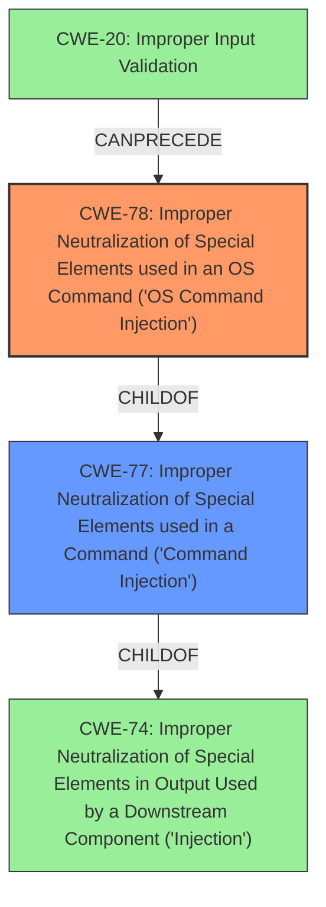

# Raw Analyzer Response for CVE-2021-45617

# Summary
| CWE ID | CWE Name | Confidence | CWE Abstraction Level | CWE Vulnerability Mapping Label | CWE-Vulnerability Mapping Notes |
|---|---|---|---|---|---|
| CWE-78 | Improper Neutralization of Special Elements used in an OS Command ('OS Command Injection') | 1.0 | Base | Primary | Allowed |
| CWE-20 | Improper Input Validation | 0.5 | Class | Secondary | Discouraged |

## Evidence and Confidence

*   **Confidence Score:** 0.8
*   **Evidence Strength:** HIGH

## Relationship Analysis
The primary relationship impacting the decision is the parent-child relationship between CWE-77 (Improper Neutralization of Special Elements used in a Command ('Command Injection')) and CWE-78 (Improper Neutralization of Special Elements used in an OS Command ('OS Command Injection')). CWE-78 is a more specific base-level CWE that directly addresses the **OS command injection** vulnerability described. CWE-74 (Improper Neutralization of Special Elements in Output Used by a Downstream Component ('Injection')) is a parent of both.

## Vulnerability Chain
The chain of weaknesses starts with potentially **improper input validation** (CWE-20), which allows the attacker to inject malicious commands. This leads to **improper neutralization of special elements** within the OS command (CWE-78), ultimately resulting in arbitrary command execution on the device.

## Summary of Analysis
The initial assessment strongly pointed towards CWE-78 (OS Command Injection) due to the explicit mention of **command injection** in the vulnerability description and the summary of CVE Reference Links Content which states "***Root cause of vulnerability:** The vulnerability stems from a pre-authentication command injection flaw." The Retriever results further supported this, with CWE-78 being a strong candidate.

The selection of CWE-78 is at the optimal level of specificity because it directly reflects the **root cause** of the vulnerability, which is the **improper neutralization of special elements used in an OS command**. While other CWEs like CWE-20 (Improper Input Validation) might be contributing factors, CWE-78 accurately captures the core weakness that enables the attacker to execute arbitrary commands.

CWE-20 was considered a secondary CWE because **improper input validation** often precedes **command injection** vulnerabilities. However, the evidence primarily focuses on the **command injection** itself rather than specific details about input validation failures.

The final decision emphasizes the importance of selecting the most specific CWE that accurately represents the **root cause** of the vulnerability based on the available evidence and relationship analysis.