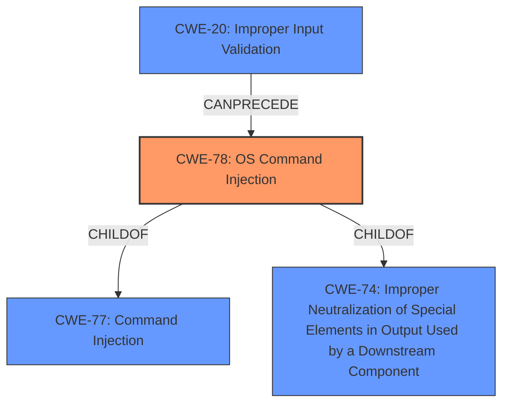

# Enhanced Analysis for CVE-2021-45621

# Summary
| CWE ID | CWE Name | Confidence | CWE Abstraction Level | CWE Vulnerability Mapping Label | CWE-Vulnerability Mapping Notes |
|---|---|---|---|---|---|
| CWE-78 | Improper Neutralization of Special Elements used in an OS Command ('OS Command Injection') | 1.0 | Base | Primary | Allowed |
| CWE-20 | Improper Input Validation | 0.7 | Class | Secondary | Allowed-with-Review |

## Evidence and Confidence

*   **Confidence Score:** 0.9
*   **Evidence Strength:** HIGH

## Relationship Analysis
The primary CWE is CWE-78, which is a Base level CWE. This is a child of CWE-77 ('Command Injection') and CWE-74 (Improper Neutralization of Special Elements in Output Used by a Downstream Component). CWE-78 is the most specific and accurate representation of the vulnerability, as it directly addresses the **improper neutralization** of special elements used in OS commands. CWE-20 (Improper Input Validation) can often precede CWE-78, as **lack of input validation** is a common cause for command injection vulnerabilities.



## Vulnerability Chain
The vulnerability chain starts with **improper input validation** (CWE-20), which allows an attacker to inject special elements into an OS command. The **improper neutralization** of these elements leads to OS command injection (CWE-78), resulting in arbitrary command execution and potential compromise of the affected NETGEAR device.

## Summary of Analysis
The analysis is based on the vulnerability description and the CVE Reference Links Content Summary, which clearly indicate a **command injection** vulnerability due to **improper input validation** affecting NETGEAR devices.

The vulnerability description key phrases include:
- **rootcause:** **command injection**
- **weakness:** **Improper input validation**

The CVE Reference Links Content Summary states:
*   **Root cause of vulnerability:** Pre-authentication command injection vulnerability
*   **Weaknesses/vulnerabilities present:**
    *   Command injection: An attacker can inject arbitrary commands that will be executed on the device's operating system.

The retriever results also support the selection of CWE-78, with a high similarity score for alternate terms.

CWE-78 is the most appropriate choice, as it directly reflects the root cause and technical details of the vulnerability.

Other CWEs considered:

*   CWE-77: Improper Neutralization of Special Elements used in a Command ('Command Injection') - This is a more general class of command injection. While applicable, CWE-78 is more specific as it involves OS commands.
*   CWE-74: Improper Neutralization of Special Elements in Output Used by a Downstream Component ('Injection') - This is a higher-level class that encompasses various types of injection vulnerabilities. It is less specific than CWE-78.
*   CWE-94: Improper Control of Generation of Code ('Code Injection') - This is relevant if the injected command leads to the generation of new code. However, the primary issue is the execution of existing commands, making CWE-78 more suitable.
*   CWE-22: Improper Limitation of a Pathname to a Restricted Directory ('Path Traversal') - While this involves path manipulation, it's not the primary weakness here. The core issue is the ability to execute arbitrary commands.

Based on the evidence, the vulnerability is best characterized as CWE-78, with contributing factor of CWE-20.


## CWE Relationship Analysis

Current CWEs represent these abstraction levels: .


### Vulnerability Chain Analysis

**Chain starting from CWE-78:**
- 78 (Improper Neutralization of Special Elements used in an OS Command ('OS Command Injection')) - ROOT


**Chain starting from CWE-74:**
- 74 (Improper Neutralization of Special Elements in Output Used by a Downstream Component ('Injection')) - ROOT


### CWE Relationship Diagram

```mermaid
graph TD
    classDef primary fill:#f96,stroke:#333,stroke-width:2px
    classDef secondary fill:#69f,stroke:#333
    classDef tertiary fill:#9e9,stroke:#333
```