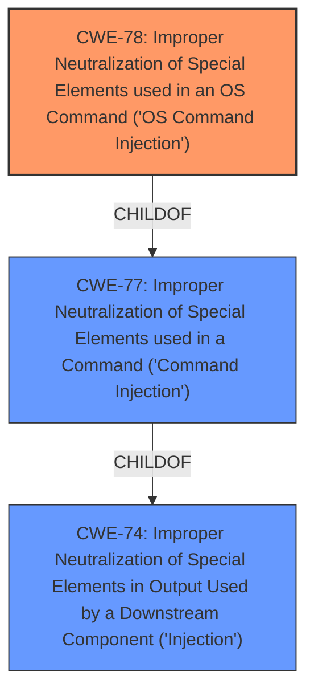

# Analysis for CVE-2021-45624

# Summary
| CWE ID  | CWE Name                                                                                      | Confidence | CWE Abstraction Level | CWE Vulnerability Mapping Label | CWE-Vulnerability Mapping Notes |
| :-------- | :--------------------------------------------------------------------------------------------- | :---------- | :----------------------- | :------------------------------ | :--------------------------------- |
| CWE-78  | Improper Neutralization of Special Elements used in an OS Command ('OS Command Injection') | 1          | Base                     | Primary                        | Allowed                          |

## Evidence and Confidence

*   **Confidence Score:** 1
*   **Evidence Strength:** HIGH

## Relationship Analysis
The primary relationship influencing the choice of CWE-78 is its direct association with **command injection** vulnerabilities, specifically at the operating system level. While CWE-77 is a broader class encompassing various command injections, the evidence points directly to OS command injection due to the context of network devices and the ability to execute commands on the underlying OS. CWE-78 is a child of CWE-77, representing a more specific case. Therefore, selecting CWE-78 provides a more accurate representation of the vulnerability.

## Vulnerability Chain
The vulnerability chain starts with the **improper neutralization** of special elements, leading directly to the ability to inject OS commands. This bypasses the need for authentication, demonstrating a critical flaw in the device's security implementation.

## Summary of Analysis
The initial analysis clearly identifies a **command injection** vulnerability, which aligns strongly with CWE-78. The provided evidence, especially the summary of the CVE reference links, confirms that this is a pre-authentication issue, meaning the attacker can inject commands before any authentication is required. This detail reinforces the choice of CWE-78 as the most specific and accurate classification.

The decision to use CWE-78 is based on the evidence that directly describes the vulnerability as a "pre-authentication **command injection** security vulnerability." This aligns with the CWE-78 description, which focuses on the **improper neutralization** of special elements used in OS commands. The relationship graph further supports this, showing how CWE-78 is a specific type of command injection, making it the optimal choice.

The selection of CWE-78 is at the Base level, providing the appropriate level of specificity for this vulnerability. It avoids the higher-level abstraction of CWE-77, which encompasses a broader range of command injections, and accurately reflects the OS-level nature of the vulnerability.