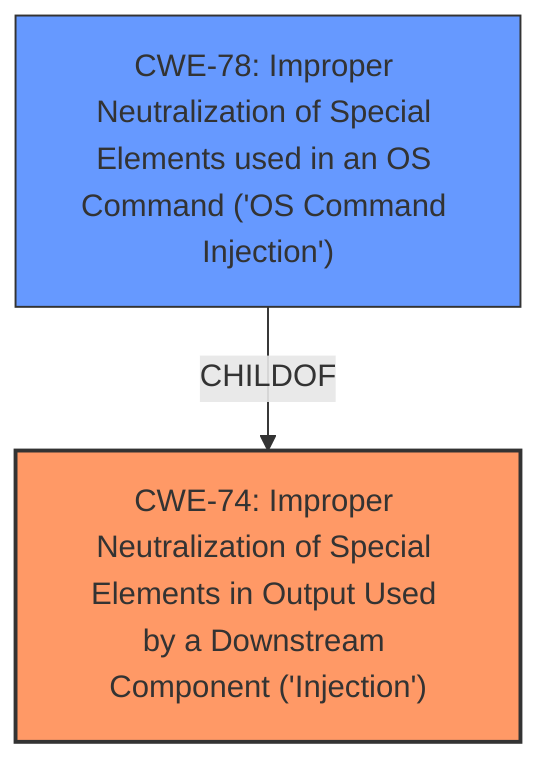

# Raw Analyzer Response for CVE-2021-45655

# Summary
| CWE ID | CWE Name | Confidence | CWE Abstraction Level | CWE Vulnerability Mapping Label | CWE-Vulnerability Mapping Notes |
|---|---|---|---|---|---|
| CWE-74 | Improper Neutralization of Special Elements in Output Used by a Downstream Component ('Injection') | 0.75 | Class | Primary | Allowed-with-Review |
| CWE-78 | Improper Neutralization of Special Elements used in an OS Command ('OS Command Injection') | 0.6 | Base | Secondary | Allowed |

## Evidence and Confidence

*   **Confidence Score:** 0.7
*   **Evidence Strength:** MEDIUM

## Relationship Analysis
The primary relationship impacting the CWE selection is the parent-child relationship where CWE-78 ('OS Command Injection') is a child of CWE-74 ('Improper Neutralization of Special Elements in Output Used by a Downstream Component'). The description indicates a **server-side injection** vulnerability, which suggests a broad category of injection flaws. While CWE-74 is a high-level class, it serves as a starting point. Given the context, and the retriever results, CWE-78 could be a more specific option if there's OS command construction involved.

## Vulnerability Chain
The vulnerability chain involves an initial **server-side injection** weakness. Without specific details, the chain begins with:
  1. **Improper Neutralization** (CWE-74): The server fails to neutralize special elements in the input.
  2. **OS Command Injection** (CWE-78): If the injection leads to the execution of OS commands.
The chain might be incomplete due to lack of details in the description.

## Summary of Analysis
The initial analysis focused on the **server-side injection** **weakness**. The evidence is based on the "Vulnerability Description Key Phrases" section: **weakness:** **server-side injection**.
The primary selection is CWE-74 ('Improper Neutralization of Special Elements in Output Used by a Downstream Component') because it's a general class for injection vulnerabilities. However, the retriever results suggest that CWE-78 ('Improper Neutralization of Special Elements used in an OS Command') is also a strong candidate, especially given the high score in the retriever results (0.611).

The final decision is to include both CWE-74 and CWE-78, with CWE-74 as the primary and CWE-78 as secondary. CWE-74 is at a higher level of abstraction, representing the generic injection issue. CWE-78 is included as a possibility because **server-side injection** might lead to OS command execution, but there isn't enough evidence to confirm this.
CWE-74 is chosen because the description explicitly mentions **server-side injection**.

Relevant CWE Information:

# Enhanced Context (25 CWEs)
The following CWEs were identified as potentially relevant to this vulnerability:

## CWE-74: Improper Neutralization of Special Elements in Output Used by a Downstream Component ('Injection')
**Abstraction Level**: Class
**Similarity Score**: 0.77
**Source**: dense

**Description**:
The product constructs all or part of a command, data structure, or record using externally-influenced input from an upstream component, but it does not neutralize or incorrectly neutralizes special elements that could modify how it is parsed or interpreted when it is sent to a downstream component.

**Mapping Guidance**:
- Usage: Discouraged
- Rationale: CWE-74 is high-level and often misused when lower-level weaknesses are more appropriate.

## CWE-78: Improper Neutralization of Special Elements used in an OS Command ('OS Command Injection')
**Abstraction Level**: Base
**Similarity Score**: 5.03
**Source**: graph

**Description**:
CWE-78: Improper Neutralization of Special Elements used in an OS Command ('OS Command Injection')

**Mapping Guidance**:
- Usage: Allowed
- Rationale: This CWE entry is at the Base level of abstraction, which is a preferred level of abstraction for mapping to the root causes of vulnerabilities.

## CWE-79: Improper Neutralization of Input During Web Page Generation ('Cross-site Scripting')
**Abstraction Level**: Base
**Similarity Score**: 8637.73
**Source**: sparse

**Description**:
The product does not neutralize or incorrectly neutralizes user-controllable input before it is placed in output that is used as a web page that is served to other users.

**Mapping Guidance**:
- Usage: Allowed
- Rationale: This CWE entry is at the Base level of abstraction, which is a preferred level of abstraction for mapping to the root causes of vulnerabilities.