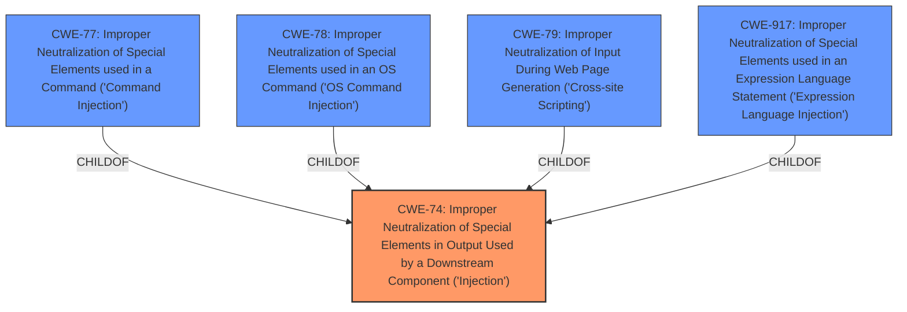

# Analysis for CVE-2021-45656

# Summary
| CWE ID | CWE Name | Confidence | CWE Abstraction Level | CWE Vulnerability Mapping Label | CWE-Vulnerability Mapping Notes |
|---|---|---|---|---|---|
| CWE-74 | Improper Neutralization of Special Elements in Output Used by a Downstream Component ('Injection') | 0.8 | Class | Allowed-with-Review | Primary CWE. While a class, it directly relates to the **server-side injection** mentioned. |

## Evidence and Confidence

*   **Confidence Score:** 0.8
*   **Evidence Strength:** MEDIUM

## Relationship Analysis
The primary CWE, CWE-74, is a class-level weakness that sits atop a hierarchy of more specific injection vulnerabilities. This relationship suggests that while CWE-74 broadly captures the **injection** aspect, a more detailed CWE might exist within its descendants. The other CWEs considered, such as CWE-78 and CWE-79, represent specific types of injection, hinting at potential refinement of the classification if more details were available.

## Vulnerability Chain
The vulnerability chain starts with the **server-side injection** flaw. The lack of proper input validation or output encoding leads to the possibility of an attacker injecting malicious code. This code is then executed by the server, potentially leading to unauthorized access, modification of settings, or execution of arbitrary commands. The chain highlights a direct progression from the initial coding error to the final impact.

## Summary of Analysis
The initial assessment pointed towards **server-side injection**, which is broadly covered by CWE-74. The criticism involved exploring more specific injection types, such as OS Command Injection (CWE-78) or Cross-Site Scripting (CWE-79). However, based solely on the provided evidence, the general "Improper Neutralization of Special Elements in Output Used by a Downstream Component ('Injection')" (CWE-74) seems most fitting as the specific type of injection is not detailed enough to warrant a lower-level CWE.

The decision to select CWE-74 is primarily based on the vulnerability description's mention of **server-side injection** and the CVE Reference Links Content Summary which identifies the root cause as **server-side injection**.
> **Vulnerability Description Key Phrases:** **weakness:** **server-side injection**
> **CVE Reference Links Content Summary:** **Root cause of vulnerability:** Server-side injection.

CWE-74 is a class-level CWE.

Other CWEs Considered:
- CWE-77: Improper Neutralization of Special Elements used in a Command ('Command Injection') - While command injection is a possibility, the description does not provide specific evidence of command execution.
- CWE-78: Improper Neutralization of Special Elements used in an OS Command ('OS Command Injection') - Similar to CWE-77, there's no explicit indication of OS command execution.
- CWE-79: Improper Neutralization of Input During Web Page Generation ('Cross-site Scripting') - The description doesn't mention web page generation or cross-site scripting context.
- CWE-917: Improper Neutralization of Special Elements used in an Expression Language Statement ('Expression Language Injection') - There is no evidence of the vulnerability involving expression language injection.