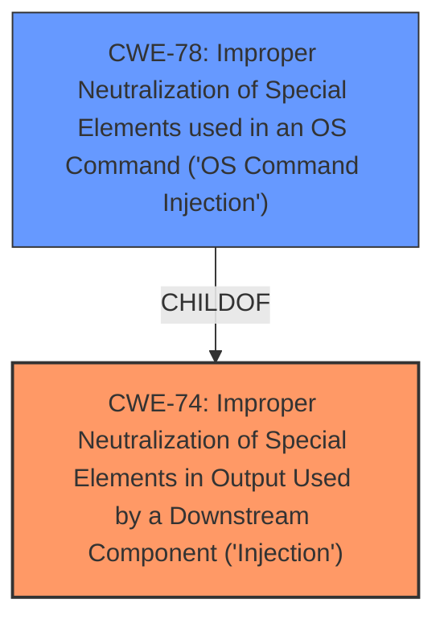

# Raw Analyzer Response for CVE-2021-45660

# Summary
| CWE ID | CWE Name | Confidence | CWE Abstraction Level | CWE Vulnerability Mapping Label | CWE-Vulnerability Mapping Notes |
|---|---|---|---|---|---|
| CWE-74 | Improper Neutralization of Special Elements in Output Used by a Downstream Component ('Injection') | 0.7 | Class | Primary | Allowed |
| CWE-78 | Improper Neutralization of Special Elements used in an OS Command ('OS Command Injection') | 0.6 | Base | Secondary | Allowed |

## Evidence and Confidence

*   **Confidence Score:** 0.7
*   **Evidence Strength:** MEDIUM

## Relationship Analysis
The primary CWE identified is CWE-74, which is a class-level CWE, indicating a high-level categorization of the vulnerability. CWE-74 serves as a parent to more specific injection-related CWEs. The secondary CWE is CWE-78, which is a Base level CWE, giving more specificity to the type of injection by describing it as an OS Command Injection. The analysis considered this relationship to provide a more accurate classification.

## Vulnerability Chain
The chain of events starts with the **improper neutralization** of special elements in the output, which leads to the possibility of **OS Command Injection**.
  - The root cause is the **improper neutralization** of special elements.
  - The vulnerability is **OS Command Injection**.

## Summary of Analysis
The initial assessment identified the vulnerability as a **server-side injection**. The Retriever Results suggested CWE-74, CWE-78, and CWE-917 as potential candidates.

- CWE-74 is a class-level CWE that describes **improper neutralization** of special elements in output, which aligns with the high-level description of a server-side injection.
- CWE-78, **Improper Neutralization of Special Elements used in an OS Command ('OS Command Injection')**, is more specific than CWE-74 but still relevant because OS Command Injection is a type of server-side injection.

The relationships between these CWEs influenced the final selection. CWE-78 is a child of CWE-74, indicating that OS Command Injection is a specific type of Injection.

The final selection of CWE-74 and CWE-78 provides a balance between breadth and specificity. CWE-74 captures the general nature of the injection vulnerability, while CWE-78 identifies the specific type of injection. The evidence is the phrase "**server-side injection**" from the "Vulnerability Description Key Phrases" section of the provided text.

Relevant CWE Information:

# Enhanced Context (25 CWEs)
The following CWEs were identified as potentially relevant to this vulnerability:

## CWE-74: Improper Neutralization of Special Elements in Output Used by a Downstream Component ('Injection')
**Abstraction Level**: Class
**Similarity Score**: 0.78
**Source**: dense

**Description**:
The product constructs all or part of a command, data structure, or record using externally-influenced input from an upstream component, but it does not neutralize or incorrectly neutralizes special elements that could modify how it is parsed or interpreted when it is sent to a downstream component.

**Mapping Guidance**:
- Usage: Discouraged
- Rationale: CWE-74 is high-level and often misused when lower-level weaknesses are more appropriate.

## CWE-78: Improper Neutralization of Special Elements used in an OS Command ('OS Command Injection')
**Abstraction Level**: Base
**Similarity Score**: 5.03
**Source**: graph

**Description**:
CWE-78: Improper Neutralization of Special Elements used in an OS Command ('OS Command Injection')

**Mapping Guidance**:
- Usage: Allowed
- Rationale: This CWE entry is at the Base level of abstraction, which is a preferred level of abstraction for mapping to the root causes of vulnerabilities.