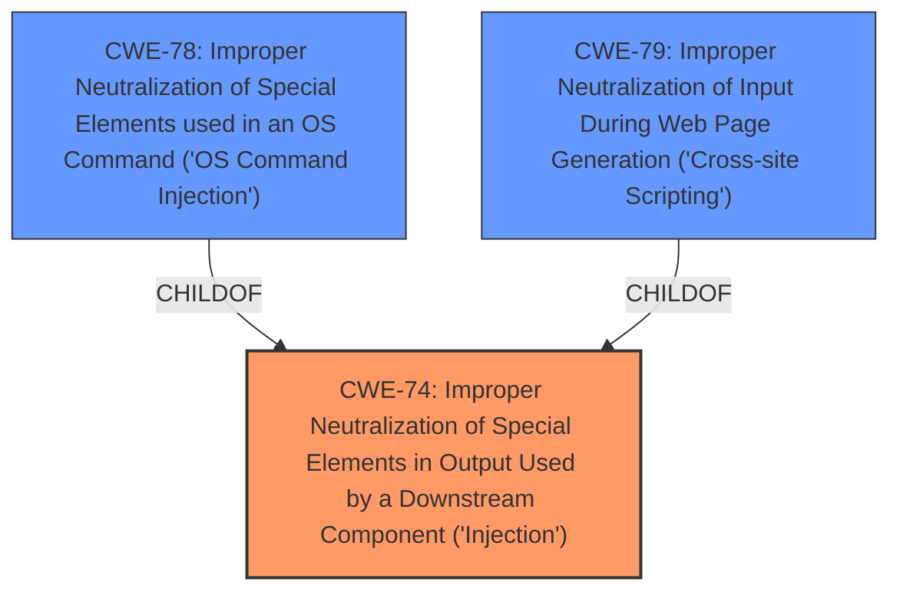

# Analysis for CVE-2021-45661

# Summary
| CWE ID | CWE Name | Confidence | CWE Abstraction Level | CWE Vulnerability Mapping Label | CWE-Vulnerability Mapping Notes |
|---|---|---|---|---|---|
| CWE-74 | Improper Neutralization of Special Elements in Output Used by a Downstream Component ('Injection') | 0.7 | Class | Primary | The vulnerability is described as **server-side injection**, which aligns with the general concept of CWE-74. However, it's a high-level classification. |
| CWE-78 | Improper Neutralization of Special Elements used in an OS Command ('OS Command Injection') | 0.6 | Base | Secondary | If the server-side injection allows for the execution of OS commands, then CWE-78 would be a more specific classification than CWE-74. Requires more information to confirm. |
| CWE-79 | Improper Neutralization of Input During Web Page Generation ('Cross-site Scripting') | 0.5 | Base | Secondary | If the server-side injection leads to the generation of a web page with un-neutralized input, resulting in XSS, then CWE-79 would be applicable. Requires more information to confirm. |

## Evidence and Confidence

*   **Confidence Score:** 0.7
*   **Evidence Strength:** MEDIUM

## Relationship Analysis
The analysis considered the following relationships:
  - CWE-74 is a high-level Class that encompasses various types of injection.
  - CWE-78 and CWE-79 are both children of CWE-74, representing specific types of injection.
  - The choice between CWE-74, CWE-78, and CWE-79 depends on the specifics of the injection vulnerability, which are not fully detailed in the description.
  - The Abstraction Level was a key factor, favoring the more specific Base level CWEs (CWE-78 and CWE-79) if the evidence supports it.

## Vulnerability Chain
The potential chain of events:
  1. **Root Cause:** **Server-side injection** due to **improper neutralization** of input. (CWE-74)
  2. If the injection allows OS commands: OS Command Injection (CWE-78)
  3. If the injection leads to XSS: Cross-site Scripting (CWE-79)

## Summary of Analysis
The initial analysis identified a **server-side injection** vulnerability. The primary candidate CWE is CWE-74 because the high-level description aligned well, and it was the top result returned by the retriever. However, CWE-74 is a high-level Class.

The analysis considered other CWEs, specifically CWE-78 and CWE-79, which are more specific types of injection and child CWEs of CWE-74. These were the primary candidates based on the "Top CWEs" listed ("- CWE-79 (Count: 138), - CWE-787 (Count: 129), - CWE-77 (Count: 125)"). The provided description is vague and does not provide the specifics for these more precise CWEs.

The retriever results also suggested CWE-78 and CWE-79, and also listed CWE-77 as a potential match. However, the evidence is insufficient to determine if the **server-side injection** leads to OS command execution (CWE-78), expression language injection (CWE-917), or cross-site scripting (CWE-79). More information is needed to confirm these more specific classifications.

The final decision is to classify the vulnerability as CWE-74 due to the generic nature of the description, but to also list CWE-78 and CWE-79 as secondary candidates that could be more appropriate with additional information.

Relevant CWE Information:
- CWE-74: Used due to the broad description of **server-side injection**.
- CWE-78: Considered due to the possibility of OS command execution.
- CWE-79: Considered due to the possibility of XSS.