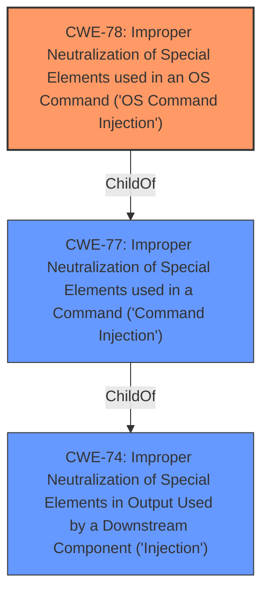

# Enhanced Analysis for CVE-2021-45742

# Summary
| CWE ID | CWE Name | Confidence | CWE Abstraction Level | CWE Vulnerability Mapping Label | CWE-Vulnerability Mapping Notes |
|---|---|---|---|---|---|
| CWE-78 | Improper Neutralization of Special Elements used in an OS Command ('OS Command Injection') | 1.0 | Base | Allowed | Primary CWE |

## Evidence and Confidence

*   **Confidence Score:** 1.0
*   **Evidence Strength:** HIGH

## Relationship Analysis
The primary relationship that influenced the decision was the ChildOf relationship between CWE-78 and CWE-77. Since the **command injection** specifically involves OS commands, the more specific CWE-78 was selected over the more general CWE-77.



## Vulnerability Chain
The vulnerability chain consists of a single step: **improper neutralization** of special elements in the QUERY_STRING parameter leading directly to **OS command injection** and arbitrary command execution.

## Summary of Analysis
The initial analysis focused on identifying the root cause of the vulnerability. The vulnerability description clearly states a **command injection** vulnerability. The primary CWE match from similar CVE descriptions is CWE-78. The retriever results also list CWE-77 and CWE-78 as top candidates.

The final decision to select CWE-78 was based on the following:
1.  The vulnerability description explicitly mentions **command injection** in the context of OS commands.
2.  CWE-78 is a Base level CWE, which is preferred for root cause analysis.
3.  CWE-78's description aligns perfectly with the vulnerability, stating: "The product constructs all or part of an OS command using externally-influenced input... but it does not neutralize or incorrectly neutralizes special elements that could modify the intended OS command..."
4.  The MITRE mapping guidance for CWE-78 recommends its use and states that it is at the Base level of abstraction.

CWE-77 was considered but not used because it is a more general class of **command injection**, and CWE-78 is a more specific base case for OS commands. Other CWEs like CWE-74, CWE-184, CWE-88, CWE-94, CWE-95, CWE-96, CWE-116, CWE-121, CWE-138, CWE-259, CWE-434, CWE-79, CWE-838, CWE-917, CWE-1289, CWE-426, CWE-257, CWE-321, CWE-98 and CWE-790 were not selected as they did not directly relate to the **OS command injection** root cause described in the vulnerability.


## CWE Relationship Analysis

Current CWEs represent these abstraction levels: .


### Vulnerability Chain Analysis

**Chain starting from CWE-96:**
- 96 (Improper Neutralization of Directives in Statically Saved Code ('Static Code Injection')) - ROOT


**Chain starting from CWE-116:**
- 116 (Improper Encoding or Escaping of Output) - ROOT


### CWE Relationship Diagram

```mermaid
graph TD
    classDef primary fill:#f96,stroke:#333,stroke-width:2px
    classDef secondary fill:#69f,stroke:#333
    classDef tertiary fill:#9e9,stroke:#333
```