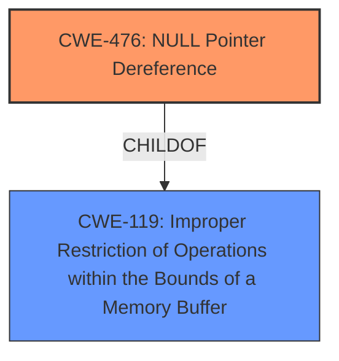

# Analysis for CVE-2021-45762

# Summary
| CWE ID | CWE Name | Confidence | CWE Abstraction Level | CWE Vulnerability Mapping Label | CWE-Vulnerability Mapping Notes |
|---|---|---|---|---|---|
| CWE-476 | NULL Pointer Dereference | 0.9 | Base | Primary | Allowed |
| CWE-119 | Improper Restriction of Operations within the Bounds of a Memory Buffer | 0.6 | Class | Secondary | Discouraged |

## Evidence and Confidence

*   **Confidence Score:** 0.8
*   **Evidence Strength:** HIGH

## Relationship Analysis
The primary relationship influencing my decision is that CWE-476 is a more specific type of memory error than the more general CWE-119. CWE-476 is a Base level CWE, and CWE-119 is a Class level CWE. Although CWE-119 was the primary match for similar CVE descriptions, the explicit mention of **invalid memory address dereference** in the vulnerability description strongly suggests that a NULL pointer dereference is occurring, making CWE-476 a better fit.

## Vulnerability Chain
The chain of events is as follows:
1.  A crafted file is processed by GPAC.
2.  The `gf_sg_vrml_mf_reset()` function is called.
3.  An invalid memory address is dereferenced, specifically a **NULL pointer dereference** (CWE-476).
4.  This leads to a segmentation fault and denial of service (DoS).

## Summary of Analysis
Initially, the "CWE for similar CVE Descriptions" suggested CWE-119 as the primary match. However, the vulnerability description includes the key phrase **invalid memory address dereference**, which, combined with the CVE Reference Links Content Summary indicating the code attempts to access a memory location pointed to by a potentially null pointer, points strongly towards CWE-476.

CWE-476 (NULL Pointer Dereference) is a Base level CWE and accurately describes the root cause. While CWE-119 (Improper Restriction of Operations within the Bounds of a Memory Buffer) is a Class level CWE and also related, it is a more general description of memory buffer errors. Given the specificity of the provided information, CWE-476 is a more appropriate and specific classification.

The decision is based on the vulnerability description and CVE Reference Links Content Summary: "invalid memory address dereference in gf\_sg\_vrml\_mf\_reset()". The crash log showing the program attempting to read from an invalid memory location (`cmp qword ptr [rdi + 8], 0`), with `rdi` being `0x0`.

Relevant CWE Information:

# Enhanced Context (25 CWEs)

## CWE-131: Incorrect Calculation of Buffer Size
**Abstraction Level**: Base
**Similarity Score**: 0.81
**Source**: dense

**Description**:
The product does not correctly calculate the size to be used when allocating a buffer, which could lead to a buffer overflow.
*Not Selected*: This CWE is not selected, as there is no evidence of incorrect buffer size calculation.

## CWE-125: Out-of-bounds Read
**Abstraction Level**: Base
**Similarity Score**: 0.80
**Source**: dense

**Description**:
The product reads data past the end, or before the beginning, of the intended buffer.
*Not Selected*: This CWE is not selected, as the root cause is dereferencing an invalid memory address, not reading outside the bounds of a buffer.

## CWE-191: Integer Underflow (Wrap or Wraparound)
**Abstraction Level**: Base
**Similarity Score**: 0.80
**Source**: dense

**Description**:
The product subtracts one value from another, such that the result is less than the minimum allowable integer value, which produces a value that is not equal to the correct result.
*Not Selected*: This CWE is not selected, as there is no evidence of integer underflow.

## CWE-667: Improper Locking
**Abstraction Level**: Class
**Similarity Score**: 0.79
**Source**: dense

**Description**:
The product does not properly acquire or release a lock on a resource, leading to unexpected resource state changes and behaviors.
*Not Selected*: This CWE is not selected, as there is no evidence of improper locking.

## CWE-824: Access of Uninitialized Pointer
**Abstraction Level**: Base
**Similarity Score**: 0.79
**Source**: dense

**Description**:
The product accesses or uses a pointer that has not been initialized.
*Not Selected*: While an uninitialized pointer *could* be NULL, the description specifically states dereferencing an invalid memory address, so it is more precise to say the code expects a valid pointer but it is NULL.

## CWE-119: Improper Restriction of Operations within the Bounds of a Memory Buffer
**Abstraction Level**: Class
**Similarity Score**: 0.79
**Source**: dense

**Description**:
The product performs operations on a memory buffer, but it reads from or writes to a memory location outside the buffer's intended boundary. This may result in read or write operations on unexpected memory locations that could be linked to other variables, data structures, or internal program data.

**Mapping Guidance**:
- Usage: Discouraged
- Rationale: CWE-119 is commonly misused in low-information vulnerability reports when lower-level CWEs could be used instead, or when more details about the vulnerability are available.
*Selected as secondary CWE*: While more general, the vulnerability does involve an invalid memory access, making this applicable. The usage is discouraged, which supports the selection of the more specific CWE-476.

## CWE-822: Untrusted Pointer Dereference
**Abstraction Level**: Base
**Similarity Score**: 0.79
**Source**: dense

**Description**:
The product obtains a value from an untrusted source, converts this value to a pointer, and dereferences the resulting pointer.
*Not Selected*: This CWE is not selected, as there is no evidence of an untrusted source being converted to a pointer. The pointer is simply NULL.

## CWE-126: Buffer Over-read
**Abstraction Level**: Variant
**Similarity Score**: 0.79
**Source**: dense

**Description**:
The product reads from a buffer using buffer access mechanisms such as indexes or pointers that reference memory locations after the targeted buffer.
*Not Selected*: This CWE is not selected, as the root cause is dereferencing an invalid memory address, not specifically reading past the end of a buffer.

## CWE-476: NULL Pointer Dereference
**Abstraction Level**: Base
**Similarity Score**: 0.79
**Source**: dense

**Description**:
The product dereferences a pointer that it expects to be valid but is NULL.

**Mapping Guidance**:
- Usage: Allowed
- Rationale: This CWE entry is at the Base level of abstraction, which is a preferred level of abstraction for mapping to the root causes of vulnerabilities.
*Selected as primary CWE*: The description matches the **invalid memory address dereference** perfectly, and the CVE Reference Links Content Summary confirms the access of memory location pointed to by a potentially null pointer.

## CWE-129: Improper Validation of Array Index
**Abstraction Level**: Variant
**Similarity Score**: 0.79
**Source**: dense

**Description**:
The product uses untrusted input when calculating or using an array index, but the product does not validate or incorrectly validates the index to ensure the index references a valid position within the array.
*Not Selected*: This CWE is not selected, as the issue is not related to array index validation.

## CWE-190: Integer Overflow or Wraparound
**Abstraction Level**: Base
**Similarity Score**: 7428.83
**Source**: sparse

**Description**:
The product performs a calculation that can
         produce an integer overflow or wraparound when the logic
         assumes that the resulting value will always be larger than
         the original value. This occurs when an integer value is
         incremented to a value that is too large to store in the
         associated representation. When this occurs, the value may
         become a very small or negative number.
*Not Selected*: This CWE is not selected, as there is no evidence of an integer overflow or wraparound.

## CWE-252: Unchecked Return Value
**Abstraction Level**: Base
**Similarity Score**: 7119.89
**Source**: sparse

**Description**:
The product does not check the return value from a method or function, which can prevent it from detecting unexpected states and conditions.
*Not Selected*: This CWE is not selected, as the root cause is not an unchecked return value, but a NULL pointer dereference.

## CWE-125: Out-of-bounds Read