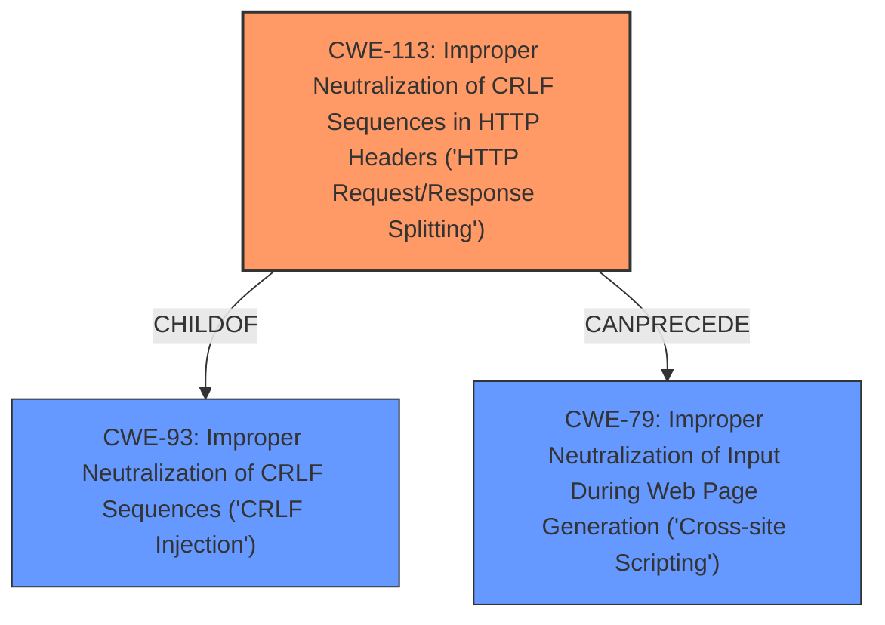

# Enhanced Analysis for CVE-2021-45818

# Summary
| CWE ID | CWE Name | Confidence | CWE Abstraction Level | CWE Vulnerability Mapping Label | CWE-Vulnerability Mapping Notes |
|---|---|---|---|---|---|
| CWE-113 | Improper Neutralization of CRLF Sequences in HTTP Headers ('HTTP Request/Response Splitting') | 1.0 | Variant | Allowed | Primary CWE |

## Evidence and Confidence

*   **Confidence Score:** 1.0
*   **Evidence Strength:** HIGH

## Relationship Analysis
The primary CWE is CWE-113, which is a variant of CWE-93. CWE-113 focuses on the specific case of CRLF injection in HTTP headers, leading to HTTP response splitting. The parent CWE, CWE-93, is a more general case of CRLF injection. CWE-113 can precede CWE-79 (Cross-Site Scripting), indicating a potential exploitation path.



## Vulnerability Chain
The vulnerability chain starts with the **CRLF injection** (**weakness**) which directly leads to HTTP response splitting (**impact**). The product, SAFARI Montage 8.7.32, **fails to neutralize CRLF sequences**, allowing an attacker to manipulate HTTP headers and potentially inject malicious content.

## Summary of Analysis
The vulnerability description clearly states that SAFARI Montage 8.7.32 is affected by a **CRLF injection** vulnerability, which can lead to HTTP response splitting. The key phrase "CRLF injection" directly points to weaknesses related to improper handling of CRLF sequences.

The Retriever Results list CWE-113, "Improper Neutralization of CRLF Sequences in HTTP Headers ('HTTP Request/Response Splitting')", as the top candidate. This CWE accurately describes the vulnerability, where the **failure to neutralize CRLF sequences in HTTP headers** leads to HTTP response splitting. CWE-113 is a Variant, which is a preferred level of abstraction. The "Usage" is "Allowed".
The description of CWE-113, "The product receives data from an HTTP agent/component (e.g., web server, proxy, browser, etc.), but it does not neutralize or incorrectly neutralizes CR and LF characters before the data is included in outgoing HTTP headers," aligns perfectly with the vulnerability description.

Therefore, CWE-113 is the most appropriate mapping.

CWE-93, "Improper Neutralization of CRLF Sequences ('CRLF Injection')", is a more general case of CRLF injection. While it's related, CWE-113 is more specific to the context of HTTP headers and response splitting.

CWE-444, "Inconsistent Interpretation of HTTP Requests ('HTTP Request/Response Smuggling')", is related to HTTP request/response handling, but it's about inconsistencies in how intermediaries interpret messages, not directly about CRLF injection.

CWE-79, "Improper Neutralization of Input During Web Page Generation ('Cross-site Scripting')", is a potential consequence of HTTP response splitting, but it's not the root cause. An attacker might use HTTP response splitting to inject XSS payloads, but the initial weakness is the CRLF injection.

CWE-117, "Improper Output Neutralization for Logs", relates to logging and is not the primary issue described.

Therefore, I am confident that CWE-113 is the best choice.


## CWE Relationship Analysis

Current CWEs represent these abstraction levels: .


### Vulnerability Chain Analysis

**Chain starting from CWE-113:**
- 113 (Improper Neutralization of CRLF Sequences in HTTP Headers ('HTTP Request/Response Splitting')) - ROOT


**Chain starting from CWE-79:**
- 79 (Improper Neutralization of Input During Web Page Generation ('Cross-site Scripting')) - ROOT


### CWE Relationship Diagram

```mermaid
graph TD
    classDef primary fill:#f96,stroke:#333,stroke-width:2px
    classDef secondary fill:#69f,stroke:#333
    classDef tertiary fill:#9e9,stroke:#333
```