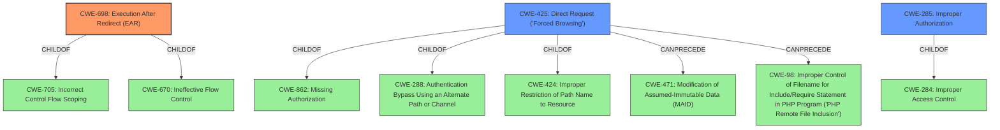

# Raw Analyzer Response for CVE-2021-45852

# Summary
| CWE ID | CWE Name | Confidence | CWE Abstraction Level | CWE Vulnerability Mapping Label | CWE-Vulnerability Mapping Notes |
|---|---|---|---|---|---|
| CWE-698 | Execution After Redirect (EAR) | 1 | Base | Allowed | Primary CWE |
| CWE-425 | Direct Request ('Forced Browsing') | 0.7 | Base | Allowed | Secondary Candidate |
| CWE-285 | Improper Authorization | 0.6 | Class | Discouraged | Secondary Candidate |

## Evidence and Confidence

*   **Confidence Score:** 0.8
*   **Evidence Strength:** HIGH

## Relationship Analysis
The primary CWE, CWE-698, is a Base level CWE that accurately reflects the **missing exit() call after the redirect**. CWE-698 is a `CHILDOF` CWE-705 and CWE-670, which suggests a potential chain of weaknesses related to control flow and code execution.

CWE-425 is related because the **missing authorization** can lead to the user directly requesting the add_patient.php page. It is a `CHILDOF` CWE-862, CWE-288, and CWE-424. It `CANPRECEDE` CWE-471 and CWE-98.

CWE-285 is a high-level Class CWE which can be applicable, but is less specific than CWE-698.

## Vulnerability Chain
The vulnerability chain starts with **Inadequate Access Control** due to the **missing exit() call** after the redirect, leading to **unauthorized data modification** because an attacker can directly request the add_patient.php page and bypass authentication.

## Summary of Analysis
The initial assessment identified the **missing exit() call** as the root cause, which aligns with CWE-698. The retriever results also ranked CWE-698 highly. The relationship analysis highlighted the connection to other CWEs related to control flow.

The vulnerability description key phrases highlight the unauthorized access and the ability to add patients without restriction. The CVE Reference Links Content Summary clearly states that the **code attempts to restrict access but fails to terminate script execution after redirection** due to the **missing exit()**.

Based on the evidence, relationship analysis, and mapping guidance, CWE-698 is the most appropriate and specific CWE for this vulnerability.

Relevant CWE Information:

*   **CWE-698: Execution After Redirect (EAR)**: The vulnerability description specifically mentions the **missing exit() call** after the redirect, which directly matches the description of CWE-698. This is the primary reason for selecting this CWE.
*   **CWE-425: Direct Request ('Forced Browsing')**: This CWE was considered because the **missing authorization** allows direct access to the `add_patient.php` page. While relevant, it's a consequence of the missing exit, not the root cause.
*   **CWE-285: Improper Authorization**: This CWE was considered but is a higher-level abstraction than CWE-698, which is more specific to the **missing exit()** issue.
*   **CWE-284: Improper Access Control**: This CWE was considered as well but it is even more general and not helpful.

The chosen CWEs are at the optimal level of specificity. CWE-698 directly addresses the root cause, while the others describe impacts of the root cause.