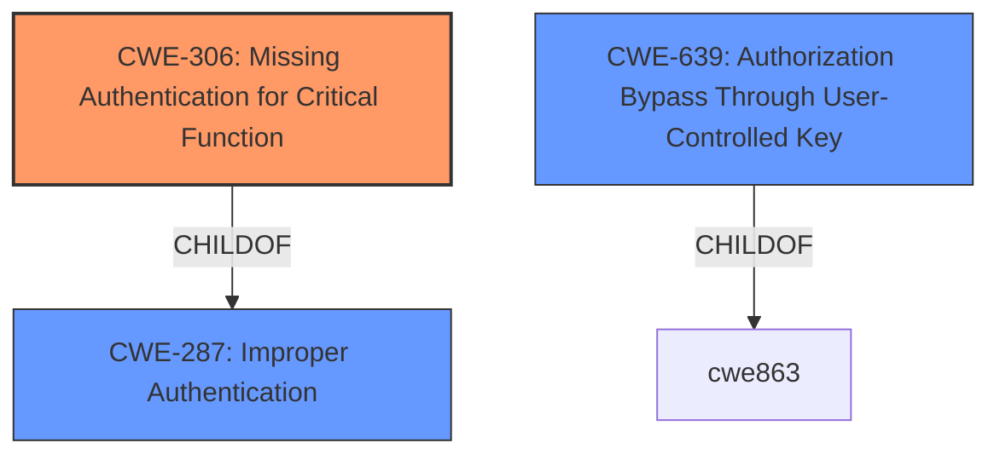

# Enhanced Analysis for CVE-2021-45900

# Summary
| CWE ID | CWE Name | Confidence | CWE Abstraction Level | CWE Vulnerability Mapping Label | CWE-Vulnerability Mapping Notes |
|---|---|---|---|---|---|
| CWE-306 | Missing Authentication for Critical Function | 1.0 | Base | Allowed | Primary CWE |
| CWE-639 | Authorization Bypass Through User-Controlled Key | 0.7 | Base | Allowed | Secondary Candidate |

## Evidence and Confidence

*   **Confidence Score:** 0.9
*   **Evidence Strength:** HIGH

## Relationship Analysis
The primary relationship that influenced the decision was the ChildOf relationship between CWE-306 (**Missing Authentication for Critical Function**) and CWE-287 (**Improper Authentication**). While CWE-287 is a broader class, CWE-306 provides a more specific description of the vulnerability where authentication is completely missing for critical functions. CWE-639 (**Authorization Bypass Through User-Controlled Key**) was considered due to its potential relevance to the ability to modify keys, but the primary issue is the lack of authentication, not an authorization bypass *after* authentication.



## Vulnerability Chain
The vulnerability chain starts with the **missing authentication** for certain APIs, which then leads to the ability to impersonate a user and make state-changing requests.

*   **Root Cause:** **Missing Authentication (CWE-306)**
*   **Impact:** Impersonation and State-Changing Requests

## Summary of Analysis
The initial analysis focused on the **improper API authentication**, which is the root cause of the vulnerability. The Vivoh Webinar Manager before 3.6.3.0 allows certain APIs to be executed without proper authentication, relying only on the `VIVOH_USERNAME` cookie instead of the required `VIVOH_AUTH` cookie.

The selection of CWE-306 is primarily based on the "**rootcause: improper API authentication**" and the CVE Reference Links Content Summary that states the "root cause is **improper API authentication**" because certain APIs could be executed without proper authentication. This directly aligns with the description of CWE-306, "The product does not perform any authentication for functionality that requires a provable user identity or consumes a significant amount of resources."

CWE-287 (**Improper Authentication**) was initially considered but deemed too general, as it encompasses various authentication failures. CWE-306 is a more precise fit because it specifically addresses the absence of authentication, which is the core issue here.

CWE-639 (**Authorization Bypass Through User-Controlled Key**) was also considered, given the potential for attackers to manipulate requests. However, the vulnerability lies in the fact that no authentication is required in the first place, making it a prerequisite rather than the primary weakness.

The evidence strongly supports classifying this vulnerability as CWE-306, as the application **fails to** perform authentication checks for critical APIs. This allows an attacker to bypass authentication entirely and perform actions on behalf of other users.

Relevant CWE Information:

# Enhanced Context (25 CWEs)
The following CWEs were identified as potentially relevant to this vulnerability:

## CWE-306: Missing Authentication for Critical Function
**Abstraction Level**: Base
**Similarity Score**: 0.329
**Source**: sparse

**Description**:
The product does not perform any authentication for functionality that requires a provable user identity or consumes a significant amount of resources.

**Mapping Guidance**:
- Usage: Allowed
- Rationale: This CWE entry is at the Base level of abstraction, which is a preferred level of abstraction for mapping to the root causes of vulnerabilities.

## CWE-639: Authorization Bypass Through User-Controlled Key
**Abstraction Level**: Base
**Similarity Score**: 0.307
**Source**: sparse

**Description**:
The system's authorization functionality does not prevent one user from gaining access to another user's data or record by modifying the key value identifying the data.

**Mapping Guidance**:
- Usage: Allowed
- Rationale: This CWE entry is at the Base level of abstraction, which is a preferred level of abstraction for mapping to the root causes of vulnerabilities.


## CWE Relationship Analysis

Current CWEs represent these abstraction levels: .


### Vulnerability Chain Analysis

**Chain starting from CWE-287:**
- 287 (Improper Authentication) - ROOT


**Chain starting from CWE-306:**
- 306 (Missing Authentication for Critical Function) - ROOT


### CWE Relationship Diagram

```mermaid
graph TD
    classDef primary fill:#f96,stroke:#333,stroke-width:2px
    classDef secondary fill:#69f,stroke:#333
    classDef tertiary fill:#9e9,stroke:#333
```