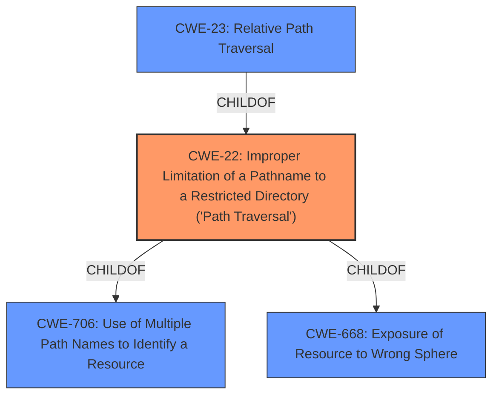

# Analysis for CVE-2021-45967

# Summary
| CWE ID | CWE Name | Confidence | CWE Abstraction Level | CWE Vulnerability Mapping Label | CWE-Vulnerability Mapping Notes |
|---|---|---|---|---|---|
| CWE-22 | Improper Limitation of a Pathname to a Restricted Directory ('Path Traversal') | 1.0 | Base | Allowed | Primary CWE |

## Evidence and Confidence

*   **Confidence Score:** 1.0
*   **Evidence Strength:** HIGH

## Relationship Analysis
The primary CWE is CWE-22, a Base level CWE that describes **improper limitation of a pathname to a restricted directory** which is a form of path traversal. The vulnerability description clearly states a **path traversal** in the Tomcat server, making this the most relevant CWE.

## Vulnerability Chain
The vulnerability chain starts with a **configuration error** between NGINX and a backend Tomcat server which leads to a **path traversal** in the Tomcat server, exposing unintended endpoints.
  - Root Cause: **Configuration Error**
  - Weakness: **Path Traversal**
  - Impact: Exposing unintended endpoints.

## Summary of Analysis
The initial assessment strongly points to CWE-22 as the primary weakness. The vulnerability description explicitly mentions a **path traversal** due to a **configuration error**. The **configuration error** is not specified but the **path traversal** is well defined.

The evidence supporting this decision is:
*   "A **configuration error** between NGINX and a backend Tomcat server leads to a **path traversal** in the Tomcat server, exposing unintended endpoints."

The graph relationships further solidify the selection of CWE-22.

CWE-22 is at the optimal level of specificity because it directly describes the **improper limitation of a pathname to a restricted directory**, which aligns perfectly with the vulnerability description. Other CWEs like CWE-668 are too high-level and don't capture the specific nature of the **path traversal** vulnerability.

Relevant CWE Information:

# Enhanced Context (25 CWEs)

## CWE-22: Improper Limitation of a Pathname to a Restricted Directory ('Path Traversal')
**Abstraction:** Base
**Similarity Score**: 6740.62
**Source**: sparse

**Description**:
The product uses external input to construct a pathname that is intended to identify a file or directory that is located underneath a restricted parent directory, but the product does not properly neutralize special elements within the pathname that can cause the pathname to resolve to a location that is outside of the restricted directory.

**Mapping Guidance**:
- Usage: Allowed
- Rationale: This CWE entry is at the Base level of abstraction, which is a preferred level of abstraction for mapping to the root causes of vulnerabilities.

## CWE-918: Server-Side Request Forgery (SSRF)
This CWE was not selected because the vulnerability description does not indicate that the server is making requests to arbitrary URLs. The issue is focused on path manipulation within the server itself, not external requests.

## CWE-923: Improper Restriction of Communication Channel to Intended Endpoints
This CWE was not selected because it is a class-level CWE that might have more appropriate base-level children. Additionally, the vulnerability is not focused on restricting the communication channel to intended endpoints, but rather on the **improper handling of pathnames**.

## CWE-23: Relative Path Traversal
This CWE was considered but not selected as the primary CWE. While relative path traversal might be a specific type of path traversal, the description doesn't explicitly specify that the traversal is relative. Therefore, the broader CWE-22 is more appropriate.

## CWE-201: Insertion of Sensitive Information Into Sent Data
This CWE was not selected because the vulnerability is not about inserting sensitive information into sent data, but rather about the **improper handling of pathnames**, allowing access to unintended resources.

## CWE-78: Improper Neutralization of Special Elements used in an OS Command ('OS Command Injection')
This CWE was not selected because it is focused on OS command injection, which is not the case in this vulnerability. The vulnerability is about **path traversal**, not injecting commands into the operating system.