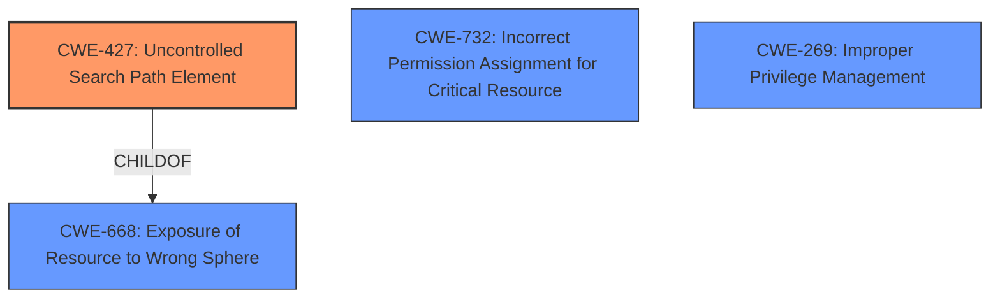

# Analysis Report for CVE-2021-45975

# Vulnerability Analysis Report: CVE-2021-45975

## Description


## Analysis (with Relationship Data)

# Summary
| CWE ID    | CWE Name                                                       | Confidence | CWE Abstraction Level | CWE Vulnerability Mapping Label | CWE-Vulnerability Mapping Notes |
| :-------- | :------------------------------------------------------------- | :--------- | :-------------------- | :------------------------------ | :------------------------------ |
| CWE-427   | Uncontrolled Search Path Element                             | 1          | Base                  | Allowed                         | Allowed                         |
| CWE-269   | Improper Privilege Management                                  | 0.5          | Class                  | Discouraged                      | Discouraged                      |
| CWE-732   | Incorrect Permission Assignment for Critical Resource   | 0.5          | Class                  | Allowed-with-Review                         | Allowed-with-Review                      |

  - The Primary CWE should be first and noted as the Primary CWEs
  - The secondary candidate CWEs should be next and noted as secondary candidates.
  - The confidence is a confidence score 0 to 1 to rate your confidence in your assessment for that CWE.
  - The CWE Abstraction Level as one of these values: Base, Variant, Pillar, Class, Compound
  - The Mapping Notes Usage as one of these values: Allowed, Allowed-with-Review, Prohibited, Discouraged

## Evidence and Confidence

*   **Confidence Score:** 0.8
*   **Evidence Strength:** HIGH

## Relationship Analysis
The primary CWE is CWE-427, which has a parent of CWE-668. While CWE-668 is a class, CWE-427 is more specific and fits the vulnerability better. CWE-426 is a peer of CWE-427 but involves modification of the search path, which is not the case here. The vulnerability involves a fixed search path with a controllable element, which aligns with CWE-427's description. CWE-732 and CWE-269 were also considered, but they are less specific and their usage is discouraged or requires review.



## Vulnerability Chain
The chain of events is as follows:
1.  **Root Cause:** **Incorrect handling of directory search paths at run time** (CWE-427). The application searches for DLLs in a path that includes a user-writable directory.
2.  Attacker places a malicious DLL in that directory.
3.  The application loads the malicious DLL.
4.  **Impact:** Arbitrary code execution with local administrator privileges.

## Summary of Analysis
The analysis indicates that the primary weakness is CWE-427, **Uncontrolled Search Path Element**, due to the **incorrect handling of directory search paths at run time**. This allows a local attacker to perform a DLL hijacking attack by placing a malicious DLL in a directory included in the search path. This aligns well with the description of CWE-427, which states that the product uses a fixed or controlled search path, but one or more locations in that path can be under the control of unintended actors.

Evidence from the vulnerability description includes the phrase "**incorrect handling of directory search paths at run time**" and the description of the DLL hijacking attack vector. The CVE Reference Links Content Summary confirms this by stating that `ListCheck.exe` attempts to load `profapi.dll` from a directory with weak ACL configurations, allowing unprivileged users to write to the directory.

CWE-269 (**Improper Privilege Management**) and CWE-732 (**Incorrect Permission Assignment for Critical Resource**) were considered because the attack leads to privilege escalation and involves insecure directory permissions. However, the root cause is the **uncontrolled search path element**, making CWE-427 the most accurate and specific classification. CWE-269 is discouraged, and CWE-732 requires review, making them less suitable as primary classifications.

Therefore, CWE-427 is the most appropriate choice because it directly addresses the root cause of the vulnerability.

Relevant CWE Information:

# Enhanced Context (25 CWEs)

## CWE-59: Improper Link Resolution Before File Access ('Link Following')
**Abstraction Level**: Base
**Similarity Score**: 0.80
**Source**: dense

**Description**:
The product attempts to access a file based on the filename, but it does not properly prevent that filename from identifying a link or shortcut that resolves to an unintended resource.

**Mapping Guidance**:
- Usage: Allowed
- Rationale: This CWE entry is at the Base level of abstraction, which is a preferred level of abstraction for mapping to the root causes of vulnerabilities.

## CWE-1289: Improper Validation of Unsafe Equivalence in Input
**Abstraction Level**: Base
**Similarity Score**: 0.79
**Source**: dense

**Description**:
The product receives an input value that is used as a resource identifier or other type of reference, but it does not validate or incorrectly validates that the input is equivalent to a potentially-unsafe value.

**Mapping Guidance**:
- Usage: Allowed
- Rationale: This CWE entry is at the Base level of abstraction, which is a preferred level of abstraction for mapping to the root causes of vulnerabilities.

## CWE-41: Improper Resolution of Path Equivalence
**Abstraction Level**: Base
**Similarity Score**: 0.78
**Source**: dense

**Description**:
The product is vulnerable to file system contents disclosure through path equivalence. Path equivalence involves the use of special characters in file and directory names. The associated manipulations are intended to generate multiple names for the same object.

**Mapping Guidance**:
- Usage: Allowed
- Rationale: This CWE entry is at the Base level of abstraction, which is a preferred level of abstraction for mapping to the root causes of vulnerabilities.

## CWE-427: Uncontrolled Search Path Element
**Abstraction Level**: Base
**Similarity Score**: 0.77
**Source**: dense

**Description**:
The product uses a fixed or controlled search path to find resources, but one or more locations in that path can be under the control of unintended actors.

**Mapping Guidance**:
- Usage: Allowed
- Rationale: This CWE entry is at the Base level of abstraction, which is a preferred level of abstraction for mapping to the root causes of vulnerabilities.

## CWE-73: External Control of File Name or Path
**Abstraction Level**: Base
**Similarity Score**: 0.77
**Source**: dense

**Description**:
The product allows user input to control or influence paths or file names that are used in filesystem operations.

**Mapping Guidance**:
- Usage: Allowed
- Rationale: This CWE entry is at the Base level of abstraction, which is a preferred level of abstraction for mapping to the root causes of vulnerabilities.

## CWE-184: Incomplete List of Disallowed Inputs
**Abstraction Level**: Base
**Similarity Score**: 0.77
**Source**: dense

**Description**:
The product implements a protection mechanism that relies on a list of inputs (or properties of inputs) that are not allowed by policy or otherwise require other action to neutralize before additional processing takes place, but the list is incomplete.

**Mapping Guidance**:
- Usage: Allowed
- Rationale: This CWE entry is at the Base level of abstraction, which is a preferred level of abstraction for mapping to the root causes of vulnerabilities.

## CWE-23: Relative Path Traversal
**Abstraction Level**: Base
**Similarity Score**: 0.77
**Source**: dense

**Description**:
The product uses external input to construct a pathname that should be within a restricted directory, but it does not properly neutralize sequences such as ".." that can resolve to a location that is outside of that directory.

**Mapping Guidance**:
- Usage: Allowed
- Rationale: This CWE entry is at the Base level of abstraction, which is a preferred level of abstraction for mapping to the root causes of vulnerabilities.

## CWE-61: UNIX Symbolic Link (Symlink) Following
**Abstraction Level**: Compound
**Similarity Score**: 0.76
**Source**: dense

**Description**:
The product, when opening a file or directory, does not sufficiently account for when the file is a symbolic link that resolves to a target outside of the intended control sphere. This could allow an attacker to cause the product to operate on unauthorized files.

**Mapping Guidance**:
- Usage: Allowed
- Rationale: This is a well-known Composite of multiple weaknesses that must all occur simultaneously, although it is attack-oriented in nature.

## CWE-807: Reliance on Untrusted Inputs in a Security Decision
**Abstraction Level**: Base
**Similarity Score**: 0.76
**Source**: dense

**Description**:
The product uses a protection mechanism that relies on the existence or values of an input, but the input can be modified by an untrusted actor in


## CWE Relationship Analysis

Current CWEs represent these abstraction levels: .


### Vulnerability Chain Analysis

**Chain starting from CWE-732:**
- 732 (Incorrect Permission Assignment for Critical Resource) - ROOT


**Chain starting from CWE-41:**
- 41 (Improper Resolution of Path Equivalence) - ROOT


### CWE Relationship Diagram

```mermaid
graph TD
    classDef primary fill:#f96,stroke:#333,stroke-width:2px
    classDef secondary fill:#69f,stroke:#333
    classDef tertiary fill:#9e9,stroke:#333
```


*Report generated on 2025-04-01 21:51:32*
