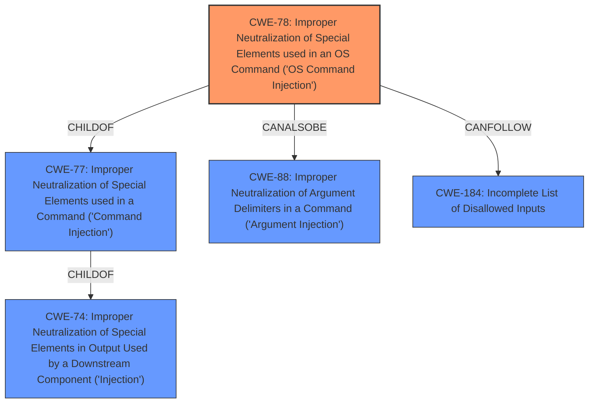

# Enhanced Analysis for CVE-2021-45990

# Summary
| CWE ID | CWE Name | Confidence | CWE Abstraction Level | CWE Vulnerability Mapping Label | CWE-Vulnerability Mapping Notes |
|---|---|---|---|---|---|
| CWE-78 | Improper Neutralization of Special Elements used in an OS Command ('OS Command Injection') | 1.0 | Base | Allowed | Primary CWE |

## Evidence and Confidence

*   **Confidence Score:** 1.0
*   **Evidence Strength:** HIGH

## Relationship Analysis
The primary relationship influencing the CWE selection is the ChildOf relationship where CWE-78 is a child of CWE-77. However, CWE-78 is more specific, dealing with OS commands, which aligns perfectly with the vulnerability description. There are other potential relationships with CWE-88 (CanAlsoBe) and CWE-184 (CanFollow), but the primary root cause is directly related to OS command injection. The base level of abstraction is appropriate as it describes the specific weakness.



## Vulnerability Chain
The vulnerability chain starts with the **improper neutralization** of input, leading directly to OS command injection, and ultimately allowing for arbitrary command execution and system compromise.

Improper Input Handling -> OS Command Injection -> Arbitrary Command Execution -> System Compromise

## Summary of Analysis
The analysis clearly points to CWE-78 as the primary weakness. The vulnerability description explicitly mentions "**command injection**" in the `uploadPicture` function via the `pic_name` parameter. The CVE Reference Links Content Summary confirms that the root cause is due to the `pic_name` parameter not properly sanitizing user-supplied input, allowing for arbitrary commands to be injected and executed.

> **Vulnerability Description Key Phrases**
> - **weakness:** **command injection**

> **CVE Reference Links Content Summary**
> - Command Injection: The `pic_name` parameter within the `uploadPicture` function does not properly sanitize user-supplied input, allowing for the injection of arbitrary commands.

The retriever results also strongly suggest CWE-78 as a potential candidate. Although CWE-77 is ranked higher, the specific mention of OS commands makes CWE-78 the more accurate choice. CWE-78's description directly aligns with the vulnerability: "The product constructs all or part of an OS command using externally-influenced input...but it does not neutralize or incorrectly neutralizes special elements that could modify the intended OS command..."

The base level of abstraction for CWE-78 is appropriate because it directly addresses the specific type of command injection involved (OS command injection). Other CWEs, like CWE-77, are broader and less specific.

Relevant CWE Information:

# Enhanced Context (25 CWEs)
The following CWEs were identified as potentially relevant to this vulnerability:

## CWE-697: Incorrect Comparison
**Abstraction Level**: Pillar
**Similarity Score**: 0.76
**Source**: dense

**Description**:
The product compares two entities in a security-relevant context, but the comparison is incorrect, which may lead to resultant weaknesses.

**Mapping Guidance**:
- Usage: Discouraged
- Rationale: This CWE entry is extremely high-level, a Pillar. However, sometimes this weakness is forced to be used due to the lack of in-depth weakness research. See Research Gaps.

**Summary of Why This CWE Was Not Used**:
This CWE is not relevant because the vulnerability is not related to incorrect comparisons.

## CWE-1289: Improper Validation of Unsafe Equivalence in Input
**Abstraction Level**: Base
**Similarity Score**: 0.75
**Source**: dense

**Description**:
The product receives an input value that is used as a resource identifier or other type of reference, but it does not validate or incorrectly validates that the input is equivalent to a potentially-unsafe value.

**Mapping Guidance**:
- Usage: Allowed
- Rationale: This CWE entry is at the Base level of abstraction, which is a preferred level of abstraction for mapping to the root causes of vulnerabilities.

**Summary of Why This CWE Was Not Used**:
This CWE is not relevant because the vulnerability is not specifically about validating equivalence of input values.

## CWE-74: Improper Neutralization of Special Elements in Output Used by a Downstream Component ('Injection')
**Abstraction Level**: Class
**Similarity Score**: 0.74
**Source**: dense

**Description**:
The product constructs all or part of a command, data structure, or record using externally-influenced input from an upstream component, but it does not neutralize or incorrectly neutralizes special elements that could modify how it is parsed or interpreted when it is sent to a downstream component.

**Mapping Guidance**:
- Usage: Discouraged
- Rationale: CWE-74 is high-level and often misused when lower-level weaknesses are more appropriate.

**Summary of Why This CWE Was Not Used**:
CWE-74 is a parent of CWE-78. CWE-78 is more specific and thus a better fit.

## CWE-184: Incomplete List of Disallowed Inputs
**Abstraction Level**: Base
**Similarity Score**: 0.74
**Source**: dense

**Description**:
The product implements a protection mechanism that relies on a list of inputs (or properties of inputs) that are not allowed by policy or otherwise require other action to neutralize before additional processing takes place, but the list is incomplete.

**Mapping Guidance**:
- Usage: Allowed
- Rationale: This CWE entry is at the Base level of abstraction, which is a preferred level of abstraction for mapping to the root causes of vulnerabilities.

**Summary of Why This CWE Was Not Used**:
While this could be a secondary contributing factor, the primary issue is the lack of any neutralization, not just an incomplete list.

## CWE-41: Improper Resolution of Path Equivalence
**Abstraction Level**: Base
**Similarity Score**: 0.73
**Source**: dense

**Description**:
The product is vulnerable to file system contents disclosure through path equivalence. Path equivalence involves the use of special characters in file and directory names. The associated manipulations are intended to generate multiple names for the same object.

**Mapping Guidance**:
- Usage: Allowed
- Rationale: This CWE entry is at the Base level of abstraction, which is a preferred level of abstraction for mapping to the root causes of vulnerabilities.

**Summary of Why This CWE Was Not Used**:
This CWE is not relevant because the vulnerability is not related to path equivalence issues.

## CWE-703: Improper Check or Handling of Exceptional Conditions
**Abstraction Level**: Pillar
**Similarity Score**: 0.73
**Source**: dense

**Description**:
The product does not properly anticipate or handle exceptional conditions that rarely occur during normal operation of the product.

**Mapping Guidance**:
- Usage: Discouraged
- Rationale: This CWE entry is extremely high-level, a Pillar.

**Summary of Why This CWE Was Not Used**:
This CWE is too generic and does not describe the specific vulnerability.

## CWE-943: Improper Neutralization of Special Elements in Data Query Logic
**Abstraction Level**: Class
**Similarity Score**: 0.72
**Source**: dense

**Description**:
The product generates a query intended to access or manipulate data in a data store such as a database, but it does not neutralize or incorrectly neutralizes special elements that can modify the intended logic of the query.

**Mapping Guidance**:
- Usage: Allowed-with-Review
- Rationale: This CWE entry is a Class and might have Base-level children that would be more appropriate

**Summary of Why This CWE Was Not Used**:
This CWE is specific to data queries (e.g., SQL) and is not applicable to OS command injection.

## CWE-653: Improper Isolation or Compartmentalization
**Abstraction Level**: Class
**Similarity Score**: 0.72
**Source**: dense

**Description**:
The product does not properly compartmentalize or isolate functionality, processes, or resources that require different privilege levels, rights, or permissions.

**Mapping Guidance**:
- Usage: Allowed
- Rationale: This CWE entry is at the Base level of abstraction, which is a preferred level of abstraction for mapping to the root


## CWE Relationship Analysis

Current CWEs represent these abstraction levels: .


### Vulnerability Chain Analysis

**Chain starting from CWE-77:**
- 77 (Improper Neutralization of Special Elements used in a Command ('Command Injection')) - ROOT


**Chain starting from CWE-88:**
- 88 (Improper Neutralization of Argument Delimiters in a Command ('Argument Injection')) - ROOT


### CWE Relationship Diagram

```mermaid
graph TD
    classDef primary fill:#f96,stroke:#333,stroke-width:2px
    classDef secondary fill:#69f,stroke:#333
    classDef tertiary fill:#9e9,stroke:#333
```