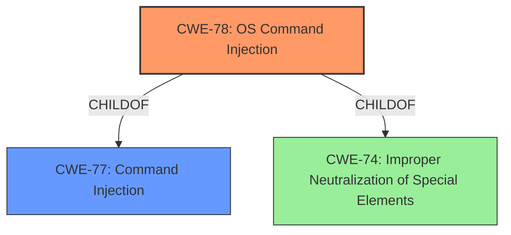

# Raw Analyzer Response for CVE-2021-45998

# Summary
| CWE ID | CWE Name | Confidence | CWE Abstraction Level | CWE Vulnerability Mapping Label | CWE-Vulnerability Mapping Notes |
|---|---|---|---|---|---|
| CWE-78 | Improper Neutralization of Special Elements used in an OS Command ('OS Command Injection') | 1.0 | Base | Allowed | Primary CWE |
| CWE-77 | Improper Neutralization of Special Elements used in a Command ('Command Injection') | 0.7 | Class | Allowed-with-Review | Secondary Candidate |

## Evidence and Confidence

*   **Confidence Score:** 0.9
*   **Evidence Strength:** HIGH

## Relationship Analysis
The primary relationship influencing the CWE selection is the parent-child relationship between CWE-77 (Command Injection) and CWE-78 (OS Command Injection). Since the vulnerability description explicitly mentions command injection in the context of an operating system command, CWE-78, being a more specific case of CWE-77, is chosen as the primary CWE.

## Vulnerability Chain
The vulnerability chain starts with **improper neutralization** of special elements within the `LocalIPAddress` parameter. This leads to the ability to inject OS commands. The impact is the execution of arbitrary commands on the device.

## Summary of Analysis
The initial analysis strongly pointed to a **command injection** vulnerability due to the vulnerability description mentioning a "command injection vulnerability" and the CVE reference links content summary highlighting that the "root cause of vulnerability" is a "command injection vulnerability". However, based on the CWE specifications, CWE-78 is a more specific case of **command injection** related to OS commands. The vulnerability description states that attackers can "execute arbitrary commands," aligning with the impact described in CWE-78. The evidence supports the selection of CWE-78 as the primary weakness due to its direct relevance to OS commands. The relationship graph further clarifies the hierarchical relationship. The selection of CWE-78 provides a more precise characterization of the vulnerability.

Relevant CWE Information:

# Enhanced Context (25 CWEs)
The following CWEs were identified as potentially relevant to this vulnerability:

## CWE-78: Improper Neutralization of Special Elements used in an OS Command ('OS Command Injection')
**CWE-78** is the most suitable because the vulnerability allows attackers to execute arbitrary commands on the operating system via the `LocalIPAddress` parameter. The vulnerability description explicitly mentions "**command injection**," and the CVE reference summary confirms that the root cause is a **command injection** vulnerability. This aligns perfectly with the description of CWE-78, which focuses on the **improper neutralization** of special elements used in constructing OS commands.
*   **How the vulnerability's details match the CWE's characteristics:** The `LocalIPAddress` parameter is used to construct an OS command, and the **lack of proper neutralization** allows attackers to inject arbitrary commands.
*   **The security implications and potential impact:** The impact is significant, as attackers can execute arbitrary commands on the affected device.
*   **Any parent-child relationships or chain patterns that influenced your mapping:** CWE-78 is a child of CWE-77 (Command Injection) and CWE-74 (Improper Neutralization of Special Elements). This hierarchical relationship emphasizes the specific nature of the command injection in this case.
*   **Whether the weakness is primary or secondary in the vulnerability:** This is the primary weakness.
*   **How the official MITRE mapping guidance influenced your decision:** The MITRE mapping guidance for CWE-78 recommends its use when the vulnerability involves constructing OS commands with externally influenced input.

## CWE-77: Improper Neutralization of Special Elements used in a Command ('Command Injection')
CWE-77 was considered as a potential mapping due to the general **command injection** aspect of the vulnerability. However, CWE-78 is more specific, as it explicitly deals with OS commands.
*   **How the vulnerability's details match the CWE's characteristics:** The vulnerability does involve **command injection**, but the commands are OS commands, making CWE-78 a more precise fit.
*   **The security implications and potential impact:** Similar to CWE-78, the impact is the execution of arbitrary commands.
*   **Any parent-child relationships or chain patterns that influenced your mapping:** CWE-77 is a parent of CWE-78. Choosing CWE-78 provides a more granular classification.
*   **Whether the weakness is primary or secondary in the vulnerability:** This could be a secondary weakness, but CWE-78 is a better primary choice.
*   **How the official MITRE mapping guidance influenced your decision:** The MITRE mapping guidance suggests using CWE-78 when the **command injection** involves OS commands.

## Other CWEs Considered and Rejected:
*   CWE-89 (SQL Injection): This was rejected because the vulnerability does not involve SQL commands.
*   CWE-121 (Stack-based Buffer Overflow): This was rejected because the description does not mention any buffer overflow issues.
*   CWE-138 (Improper Neutralization of Special Elements): This is a more general class and less specific than CWE-78.
*   CWE-184 (Incomplete List of Disallowed Inputs): While input validation is relevant, the core issue is the **improper neutralization** of special elements in OS commands, making CWE-78 more appropriate.
*   CWE-88 (Improper Neutralization of Argument Delimiters in a Command ('Argument Injection')): Not directly related to argument delimiters.
*   CWE-912 (Hidden Functionality): Not related to hidden functionality.
*   CWE-790 (Improper Filtering of Special Elements): The weakness is that the **LocalIPAddress parameter does not filter special elements**.
*   CWE-116 (Improper Encoding or Escaping of Output): The weakness is that the **LocalIPAddress parameter does not encode or escape output**.