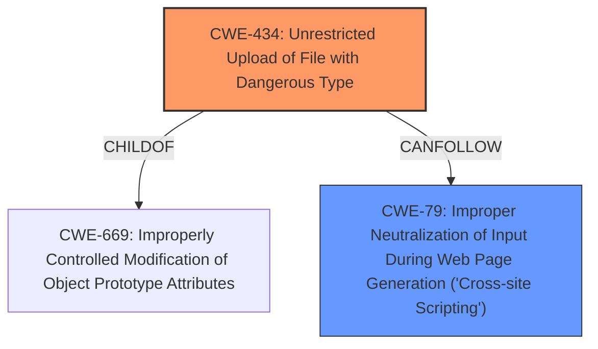

# Analysis Report for CVE-2021-46079

# Vulnerability Analysis Report: CVE-2021-46079

## Description


## Analysis (with Relationship Data)

# Summary
| CWE ID | CWE Name | Confidence | CWE Abstraction Level | CWE Vulnerability Mapping Label | CWE-Vulnerability Mapping Notes |
|---|---|---|---|---|---|
| CWE-434 | Unrestricted Upload of File with Dangerous Type | 1.0 | Base | Allowed | Primary CWE |
| CWE-79 | Improper Neutralization of Input During Web Page Generation ('Cross-site Scripting') | 0.8 | Base | Allowed | Secondary CWE |

## Evidence and Confidence

*   **Confidence Score:** 0.9
*   **Evidence Strength:** HIGH

## Relationship Analysis
The primary relationship that influenced the decision was the parent-child relationship between CWE-669 (Improperly Controlled Modification of Object Prototype Attributes) and CWE-434 (Unrestricted Upload of File with Dangerous Type), with CWE-434 being a more specific case. The potential for XSS (CWE-79) arises from the ability to upload dangerous file types (HTML files in this case), illustrating a CanFollow relationship. The other CWEs are not directly related, but describe potential weaknesses that might also be present in the application.



## Vulnerability Chain
The vulnerability chain starts with the **unrestricted file upload** (CWE-434) allowing a malicious HTML file to be uploaded. The application then fails to properly neutralize the HTML content, leading to HTML injection and potentially XSS (CWE-79).

## Summary of Analysis
The initial analysis identified **Unrestricted File Upload** as the root cause, leading to HTML Injection. The Retriever Results and Complete CWE Specifications were reviewed to determine the most appropriate CWE. CWE-434 (Unrestricted Upload of File with Dangerous Type) was selected as the primary CWE because the vulnerability description explicitly mentions **unrestricted file upload** and the ability to upload HTML files, which are then processed by the application, leading to HTML injection.

CWE-79 (Improper Neutralization of Input During Web Page Generation ('Cross-site Scripting')) was selected as a secondary CWE because the successful exploitation leads to HTML injection, which can be a form of XSS. This is supported by the CVE Reference Links Content Summary, which states "Successful exploitation leads to HTML injection. This can allow an attacker to execute arbitrary HTML code within the context of the application, potentially leading to: Cross-site scripting (XSS) attacks".

The selection of CWE-434 is based on the "Vulnerability Description Key Phrases" which contains the **rootcause**: "**Unrestricted File Upload**". The "CVE Reference Links Content Summary" also supports this with the statement "**Root Cause:** Unrestricted file upload vulnerability".
The selection of CWE-79 is based on the "Vulnerability Description" which describes a scenario leading to "Html Injection", and the "CVE Reference Links Content Summary", which states "**Impact of Exploitation:** Successful exploitation leads to HTML injection. This can allow an attacker to execute arbitrary HTML code within the context of the application, potentially leading to: Cross-site scripting (XSS) attacks".

Other CWEs considered but not used:
*   CWE-22 (Improper Limitation of a Pathname to a Restricted Directory ('Path Traversal')): While path traversal could be a related issue in some file upload vulnerabilities, the primary issue here is the lack of restrictions on the file type, not the file path.
*   CWE-89 (Improper Neutralization of Special Elements used in an SQL Command ('SQL Injection')): SQL Injection is not mentioned or implied by the vulnerability description.

Relevant CWE Information:

# Enhanced Context (25 CWEs)
The following CWEs were identified as potentially relevant to this vulnerability:

## CWE-23: Relative Path Traversal
**Abstraction Level**: Base
**Similarity Score**: 0.79
**Source**: dense

**Description**:
The product uses external input to construct a pathname that should be within a restricted directory, but it does not properly neutralize sequences such as ".." that can resolve to a location that is outside of that directory.

**Mapping Guidance**:
- Usage: Allowed
- Rationale: This CWE entry is at the Base level of abstraction, which is a preferred level of abstraction for mapping to the root causes of vulnerabilities.


## CWE-24: Path Traversal: '../filedir'
**Abstraction Level**: Variant
**Similarity Score**: 0.79
**Source**: dense

**Description**:
The product uses external input to construct a pathname that should be within a restricted directory, but it does not properly neutralize "../" sequences that can resolve to a location that is outside of that directory.

**Mapping Guidance**:
- Usage: Allowed
- Rationale: This CWE entry is at the Variant level of abstraction, which is a preferred level of abstraction for mapping to the root causes of vulnerabilities.


## CWE-41: Improper Resolution of Path Equivalence
**Abstraction Level**: Base
**Similarity Score**: 0.78
**Source**: dense

**Description**:
The product is vulnerable to file system contents disclosure through path equivalence. Path equivalence involves the use of special characters in file and directory names. The associated manipulations are intended to generate multiple names for the same object.

**Mapping Guidance**:
- Usage: Allowed
- Rationale: This CWE entry is at the Base level of abstraction, which is a preferred level of abstraction for mapping to the root causes of vulnerabilities.


## CWE-36: Absolute Path Traversal
**Abstraction Level**: Base
**Similarity Score**: 0.78
**Source**: dense

**Description**:
The product uses external input to construct a pathname that should be within a restricted directory, but it does not properly neutralize absolute path sequences such as "/abs/path" that can resolve to a location that is outside of that directory.

**Mapping Guidance**:
- Usage: Allowed
- Rationale: This CWE entry is at the Base level of abstraction, which is a preferred level of abstraction for mapping to the root causes of vulnerabilities.


## CWE-25: Path Traversal: '/../filedir'
**Abstraction Level**: Variant
**Similarity Score**: 0.77
**Source**: dense

**Description**:
The product uses external input to construct a pathname that should be within a restricted directory, but it does not properly neutralize "/../" sequences that can resolve to a location that is outside of that directory.

**Mapping Guidance**:
- Usage: Allowed
- Rationale: This CWE entry is at the Variant level of abstraction, which is a preferred level of abstraction for mapping to the root causes of vulnerabilities.


## CWE-73: External Control of File Name or Path
**Abstraction Level**: Base
**Similarity Score**: 0.76
**Source**: dense

**Description**:
The product allows user input to control or influence paths or file names that are used in filesystem operations.

**Mapping Guidance**:
- Usage: Allowed
- Rationale: This CWE entry is at the Base level of abstraction, which is a preferred level of abstraction for mapping to the root causes of vulnerabilities.


## CWE-27: Path Traversal: 'dir/../../filename'
**Abstraction Level**: Variant
**Similarity Score**: 0.75
**Source**: dense

**Description**:
The product uses external input to construct a pathname that should be within a restricted directory, but it does not properly neutralize multiple internal "../" sequences that can resolve to a location that is outside of that directory.

**Mapping Guidance**:
- Usage: Allowed
- Rationale: This CWE entry is at the Variant level of abstraction, which is a preferred level of abstraction for mapping to the root causes of vulnerabilities.


## CWE-59: Improper Link Resolution Before File Access ('Link Following')
**Abstraction Level**: Base
**Similarity Score**: 0.75
**Source**: dense

**Description**:
The product attempts to access a file based on the filename, but it does not properly prevent that filename from identifying a link or shortcut that resolves to an unintended resource.

**Mapping Guidance**:
- Usage: Allowed
- Rationale: This CWE entry is at the Base level of abstraction, which is a preferred level of abstraction for mapping to the root causes of vulnerabilities.


## CWE-552: Files or Directories Accessible to External Parties
**Abstraction Level**: Base
**Similarity Score**: 0.75
**Source**: dense

**Description**:
The product makes files or directories accessible to unauthorized actors, even though they should not be.

**Mapping Guidance**:
- Usage: Allowed
- Rationale: This CWE entry is at the Base level of abstraction, which is a preferred level of abstraction for mapping to the root causes of vulnerabilities.


## CWE-29: Path Traversal: '\..\filename'
**Abstraction Level**: Variant
**Similarity Score**: 0.75
**Source**: dense


## CWE Relationship Analysis

Current CWEs represent these abstraction levels: .


### Vulnerability Chain Analysis

**Chain starting from CWE-36:**
- 36 (Absolute Path Traversal) - ROOT


**Chain starting from CWE-27:**
- 27 (Path Traversal: 'dir/../../filename') - ROOT


### CWE Relationship Diagram

```mermaid
graph TD
    classDef primary fill:#f96,stroke:#333,stroke-width:2px
    classDef secondary fill:#69f,stroke:#333
    classDef tertiary fill:#9e9,stroke:#333
```


*Report generated on 2025-04-02 10:14:30*
