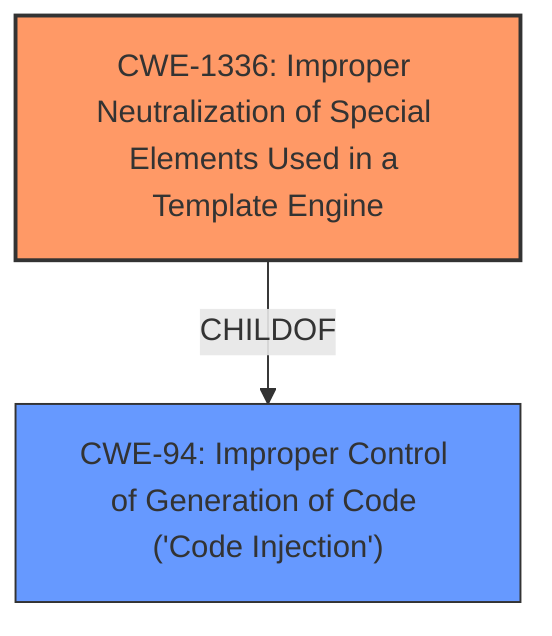

# Enhanced Analysis for CVE-2021-46114

# Summary
| CWE ID    | CWE Name                                                                                        | Confidence | CWE Abstraction Level | CWE Vulnerability Mapping Label | CWE-Vulnerability Mapping Notes |
| :-------- | :---------------------------------------------------------------------------------------------- | :--------- | :---------------------- | :------------------------------ | :------------------------------ |
| CWE-1336 | Improper Neutralization of Special Elements Used in a Template Engine                           | 0.9        | Base                    | Primary                         | Allowed                         |
| CWE-94    | Improper Control of Generation of Code ('Code Injection')                                      | 0.6        | Base                    | Secondary                       | Allowed-with-Review             |

## Evidence and Confidence

*   **Confidence Score:** 0.8
*   **Evidence Strength:** MEDIUM

## Relationship Analysis
The primary CWE is CWE-1336, which is a child of CWE-94. CWE-94 is a broader category of code injection, while CWE-1336 specifically addresses template engine injection. There are no clear chain relationships indicated in the vulnerability description, but the hierarchical relationship of CWE-1336 being a child of CWE-94 helps to refine the classification.



## Vulnerability Chain
The vulnerability chain starts with **improper input validation**, which leads to malicious code injection into an email template, ultimately resulting in remote code execution.

## Summary of Analysis
The initial assessment focused on identifying the root cause of the vulnerability described in the provided text. The description clearly indicates that the vulnerability lies in the ability to inject malicious code into email templates within the jpress v 4.2.0 application. This is facilitated through the admin panel where users can edit email templates. The **improper input validation** allows **server-side request forgery** and ultimately, remote code execution.

The selection of CWE-1336 (Improper Neutralization of Special Elements Used in a Template Engine) as the primary CWE is based on the fact that the vulnerability specifically involves injecting code into a template engine used for generating emails. The description states, "The admin panel provides a function through which attackers can edit the email templates and inject some malicious code." This aligns directly with the description of CWE-1336, which states, "The product uses a template engine to insert or process externally-influenced input, but it does not neutralize or incorrectly neutralizes special elements or syntax that can be interpreted as template expressions or other code directives when processed by the engine."

CWE-94 (Improper Control of Generation of Code ('Code Injection')) was considered as a broader category, but CWE-1336 provides a more specific classification that accurately reflects the nature of the vulnerability. While the description mentions "malicious code injection," the context clearly indicates that this injection occurs within the framework of a template engine, making CWE-1336 the more appropriate choice.

The evidence for this classification is primarily derived from the vulnerability description itself, particularly the phrases highlighting the ability to inject code into email templates and the mention of **improper input validation**. The absence of related CVE reference links content limits the strength of the evidence.

The confidence level for mapping to CWE-1336 is high (0.9) because the vulnerability description aligns strongly with the CWE's characteristics. The confidence level for CWE-94 is lower (0.6) because while code injection is a valid concern, the context makes it a less precise fit compared to CWE-1336.

Other CWEs considered but not used:

*   CWE-79 (Improper Neutralization of Input During Web Page Generation ('Cross-site Scripting')): While XSS could potentially be a result of template injection, the vulnerability description doesn't explicitly mention XSS. The focus is on server-side template processing.
*   CWE-95 (Improper Neutralization of Directives in Dynamically Evaluated Code ('Eval Injection')): Similar to CWE-94, this CWE is more general and doesn't specifically address template engine vulnerabilities.
*   CWE-89 (Improper Neutralization of Special Elements used in an SQL Command ('SQL Injection')): There is no mention of SQL databases or SQL commands in the description.
*   CWE-78 (Improper Neutralization of Special Elements used in an OS Command ('OS Command Injection')): There is no mention of OS commands in the description.

Relevant CWE Information:

# Enhanced Context (25 CWEs)

## CWE-74: Improper Neutralization of Special Elements in Output Used by a Downstream Component ('Injection')
**Abstraction Level**: Class
**Similarity Score**: 0.78
**Source**: dense

**Description**:
The product constructs all or part of a command, data structure, or record using externally-influenced input from an upstream component, but it does not neutralize or incorrectly neutralizes special elements that could modify how it is parsed or interpreted when it is sent to a downstream component.

**Mapping Guidance**:
- Usage: Discouraged
- Rationale: CWE-74 is high-level and often misused when lower-level weaknesses are more appropriate.

## CWE-184: Incomplete List of Disallowed Inputs
**Abstraction Level**: Base
**Similarity Score**: 0.76
**Source**: dense

**Description**:
The product implements a protection mechanism that relies on a list of inputs (or properties of inputs) that are not allowed by policy or otherwise require other action to neutralize before additional processing takes place, but the list is incomplete.

**Mapping Guidance**:
- Usage: Allowed
- Rationale: This CWE entry is at the Base level of abstraction, which is a preferred level of abstraction for mapping to the root causes of vulnerabilities.

## CWE-807: Reliance on Untrusted Inputs in a Security Decision
**Abstraction Level**: Base
**Similarity Score**: 0.76
**Source**: dense

**Description**:
The product uses a protection mechanism that relies on the existence or values of an input, but the input can be modified by an untrusted actor in a way that bypasses the protection mechanism.

**Mapping Guidance**:
- Usage: Allowed
- Rationale: This CWE entry is at the Base level of abstraction, which is a preferred level of abstraction for mapping to the root causes of vulnerabilities.

## CWE-80: Improper Neutralization of Script-Related HTML Tags in a Web Page (Basic XSS)
**Abstraction Level**: Variant
**Similarity Score**: 0.76
**Source**: dense

**Description**:
The product receives input from an upstream component, but it does not neutralize or incorrectly neutralizes special characters such as "<", ">", and "&" that could be interpreted as web-scripting elements when they are sent to a downstream component that processes web pages.

**Mapping Guidance**:
- Usage: Allowed
- Rationale: This CWE entry is at the Variant level of abstraction, which is a preferred level of abstraction for mapping to the root causes of vulnerabilities.

## CWE-917: Improper Neutralization of Special Elements used in an Expression Language Statement ('Expression Language Injection')
**Abstraction Level**: Base
**Similarity Score**: 0.75
**Source**: dense

**Description**:
The product constructs all or part of an expression language (EL) statement in a framework such as a Java Server Page (JSP) using externally-influenced input from an upstream component, but it does not neutralize or incorrectly neutralizes special elements that could modify the intended EL statement before it is executed.

**Mapping Guidance**:
- Usage: Allowed
- Rationale: This CWE entry is at the Base level of abstraction, which is a preferred level of abstraction for mapping to the root causes of vulnerabilities.

## CWE-1289: Improper Validation of Unsafe Equivalence in Input
**Abstraction Level**: Base
**Similarity Score**: 0.75
**Source**: dense

**Description**:
The product receives an input value that is used as a resource identifier or other type of reference, but it does not validate or incorrectly validates that the input is equivalent to a potentially-unsafe value.

**Mapping Guidance**:
- Usage: Allowed
- Rationale: This CWE entry is at the Base level of abstraction, which is a preferred level of abstraction for mapping to the root causes of vulnerabilities.

## CWE-472: External Control of Assumed-Immutable Web Parameter
**Abstraction Level**: Base
**Similarity Score**: 0.75
**Source**: dense

**Description**:
The web application does not sufficiently verify inputs that are assumed to be immutable but are actually externally controllable, such as hidden form fields.

**Mapping Guidance**:
- Usage: Allowed
- Rationale: This CWE entry is at the Base level of abstraction, which is a preferred level of abstraction for mapping to the root causes of vulnerabilities.

## CWE-639: Authorization Bypass Through User-Controlled Key
**Abstraction Level**: Base
**Similarity Score**: 0.75
**Source**: dense

**Description**:
The system's authorization functionality does not prevent one user


## CWE Relationship Analysis

Current CWEs represent these abstraction levels: .


### Vulnerability Chain Analysis

**Chain starting from CWE-1336:**
- 1336 (Improper Neutralization of Special Elements Used in a Template Engine) - ROOT


**Chain starting from CWE-79:**
- 79 (Improper Neutralization of Input During Web Page Generation ('Cross-site Scripting')) - ROOT


### CWE Relationship Diagram

```mermaid
graph TD
    classDef primary fill:#f96,stroke:#333,stroke-width:2px
    classDef secondary fill:#69f,stroke:#333
    classDef tertiary fill:#9e9,stroke:#333
```