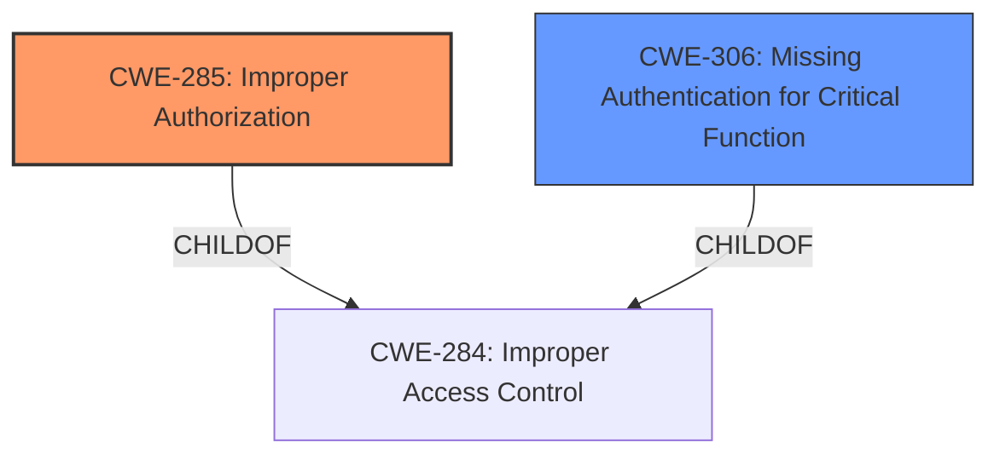

# Analysis Report for CVE-2021-46167

# Vulnerability Analysis Report: CVE-2021-46167

## Description


## Analysis (with Relationship Data)

# Summary
| CWE ID  | CWE Name                                                                                               | Confidence | CWE Abstraction Level | CWE Vulnerability Mapping Label | CWE-Vulnerability Mapping Notes |
| :-------- | :------------------------------------------------------------------------------------------------------- | :---------- | :---------------------- | :-------------------------------- | :-------------------------------- |
| CWE-285   | Improper Authorization                                                                                   | 0.75        | Class                   |                                   | Discouraged                       |
| CWE-306   | Missing Authentication for Critical Function                                                             | 0.60        | Base                    |                                   | Allowed                           |

## Evidence and Confidence

*   **Confidence Score:** 0.70
*   **Evidence Strength:** MEDIUM

## Relationship Analysis

The primary relationship influencing the CWE selection is the parent-child relationship between CWE-284 (Improper Access Control) and its children like CWE-285 (Improper Authorization) and CWE-306 (Missing Authentication for Critical Function). While the description points to an **access control issue**, the details are limited. If authentication is missing, then **authorization** cannot be performed correctly. The decision favors CWE-285 as the primary due to the high-level nature of the description and the root cause being specifically related to authorization. CWE-306 is being considered as the secondary weakness, based on the overall information about the vulnerabilities.



## Vulnerability Chain

The vulnerability chain starts with an **access control issue** in the authentication module. This leads to the ability to access sensitive data and cause a Denial of Service (DoS). The chain can be represented as:

Improper Access Control -> Access Sensitive Data / Denial of Service

## Summary of Analysis

The initial assessment focused on the **access control issue** mentioned in the vulnerability description. The CVE Reference Links Content Summary indicates issues with password authentication, exposing the password verification function's code to reverse engineering, allowing modification of the EAX register to bypass authentication.

The description mentions an **access control issue** in the authentication module. The retriever results suggested CWE-284 (Improper Access Control) and its children. Given the limited information, a more specific child CWE is preferred. The choice of CWE-285 (Improper Authorization) is based on the vulnerability description indicating a failure in the authorization process. The selection of CWE-306 (Missing Authentication for Critical Function) is considered as the secondary issue because the content summary does indicate an authentication bypass.

The decision is primarily based on the provided evidence, specifically the "Vulnerability Description Key Phrases" which highlight the **access control issue**. The graph relationships support the selection of a child CWE of CWE-284 for greater specificity.

Relevant CWE Information:

# Enhanced Context (25 CWEs)

## CWE-807: Reliance on Untrusted Inputs in a Security Decision
**Abstraction Level**: Base
**Similarity Score**: 0.75
**Source**: dense
Not Selected: This CWE focuses on untrusted inputs influencing security decisions, which isn't the primary issue here.

## CWE-664: Improper Control of a Resource Through its Lifetime
**Abstraction Level**: Pillar
**Similarity Score**: 0.75
**Source**: dense
Not Selected: This is a high-level CWE and doesn't directly address the **access control** issue.

## CWE-405: Asymmetric Resource Consumption (Amplification)
**Abstraction Level**: Class
**Similarity Score**: 0.75
**Source**: dense
Not Selected: The DoS is a consequence, not the root cause.

## CWE-404: Improper Resource Shutdown or Release
**Abstraction Level**: Class
**Similarity Score**: 0.75
**Source**: dense
Not Selected: This is not related to resource management.

## CWE-799: Improper Control of Interaction Frequency
**Abstraction Level**: Class
**Similarity Score**: 0.74
**Source**: dense
Not Selected: This relates to interaction frequency, which isn't the core issue.

## CWE-274: Improper Handling of Insufficient Privileges
**Abstraction Level**: Base
**Similarity Score**: 0.74
**Source**: dense
Not Selected: The issue isn't about handling insufficient privileges.

## CWE-302: Authentication Bypass by Assumed-Immutable Data
**Abstraction Level**: Base
**Similarity Score**: 0.74
**Source**: dense
Not Selected: This isn't about assumed-immutable data.

## CWE-303: Incorrect Implementation of Authentication Algorithm
**Abstraction Level**: Base
**Similarity Score**: 0.74
**Source**: dense
Not Selected: The issue isn't an incorrect algorithm implementation.

## CWE-226: Sensitive Information in Resource Not Removed Before Reuse
**Abstraction Level**: Base
**Similarity Score**: 0.74
**Source**: dense
Not Selected: This CWE isn't relevant to the described vulnerability.

## CWE-653: Improper Isolation or Compartmentalization
**Abstraction Level**: Class
**Similarity Score**: 0.74
**Source**: dense
Not Selected: This is not related to isolation issues.

## CWE-863: Incorrect Authorization
**Abstraction Level**: Class
**Similarity Score**: 6350.18
**Source**: sparse
Not Selected: This is not related to incorrect Authorization.

## CWE-639: Authorization Bypass Through User-Controlled Key
**Abstraction Level**: Base
**Similarity Score**: 6274.75
**Source**: sparse
Not Selected: This is not related to authorization bypass.

## CWE-285: Improper Authorization
**Abstraction Level**: Class
**Similarity Score**: 6255.01
**Source**: sparse
Selected: The vulnerability description mentions an **access control issue**, which can manifest as **improper authorization**. This CWE describes a scenario where authorization checks are not correctly performed.

## CWE-119: Improper Restriction of Operations within the Bounds of a Memory Buffer
**Abstraction Level**: Class
**Similarity Score**: 6214.37
**Source**: sparse
Not Selected: This relates to memory buffer issues, which aren't indicated in the description.

## CWE-287: Improper Authentication
**Abstraction Level**: Class
**Similarity Score**: 6191.69
**Source**: sparse
Not Selected: This relates to authentication issues, but more information needs to be known for it to be selected.

## CWE-410: Insufficient Resource Pool
**Abstraction Level**: base
**Similarity Score**: 4.33
**Source**: graph
Not Selected: This relates to resource pool issues, which aren't indicated in the description.

## CWE-770: Allocation of Resources Without Limits or Throttling
**Abstraction Level**: base
**Similarity Score**: 4.33
**Source**: graph
Not Selected: This relates to the allocation of resources, which aren't indicated in the description.

## CWE-1257: Improper Access Control Applied to Mirrored or Aliased Memory Regions
**Abstraction Level**: base
**Similarity Score**: 4.33
**Source**: graph
Not Selected: This relates to mirrored or aliased memory, which aren't indicated in the description.

## CWE-190: Integer Overflow or Wraparound
**Abstraction Level**: base
**Similarity Score**: 4.33
**Source**: graph
Not Selected: This relates to integer overflow, which aren't indicated in the description.

## CWE-1284: Improper Validation of Specified Quantity in Input
**Abstraction Level**: base
**Similarity Score**: 4.33
**Source**: graph
Not Selected: This relates to quantity in input, which aren't indicated in the description.

## CWE-125: Out-of-bounds Read
**Abstraction Level**: base
**Similarity Score**: 3.89
**Source**: graph
Not Selected: This relates to out-of-bounds issues, which aren't indicated in the description.

## CWE-787: Out-of-bounds Write
**Abstraction Level**: base
**Similarity Score**: 3.89
**Source**: graph
Not Selected: This relates to out-of-bounds issues, which aren't indicated in the description.

## CWE-789: Memory Allocation with Excessive Size Value
**Abstraction Level**: variant
**Similarity Score**: 3.88
**Source**: graph
Not Selected: This relates to memory allocation issues, which aren't indicated in the description.

## CWE-1325: Improperly Controlled Sequential Memory Allocation
**Abstraction Level**: base
**Similarity Score**: 2.93
**Source**: graph
Not Selected: This relates to


## CWE Relationship Analysis

Current CWEs represent these abstraction levels: .


### Vulnerability Chain Analysis

**Chain starting from CWE-787:**
- 787 (Out-of-bounds Write) - ROOT


**Chain starting from CWE-404:**
- 404 (Improper Resource Shutdown or Release) - ROOT


### CWE Relationship Diagram

```mermaid
graph TD
    classDef primary fill:#f96,stroke:#333,stroke-width:2px
    classDef secondary fill:#69f,stroke:#333
    classDef tertiary fill:#9e9,stroke:#333
```


*Report generated on 2025-04-02 12:14:35*
