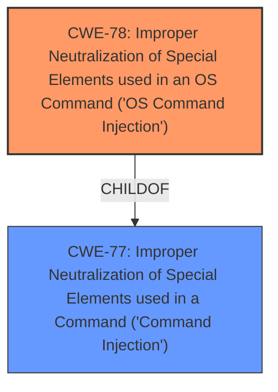

# Enhanced Analysis for CVE-2021-46233

# Summary
| CWE ID  | CWE Name                                                                                                         | Confidence | CWE Abstraction Level | CWE Vulnerability Mapping Label | CWE-Vulnerability Mapping Notes |
| :-------- | :----------------------------------------------------------------------------------------------------------------- | :----------- | :---------------------- | :------------------------------ | :------------------------------ |
| CWE-78  | Improper Neutralization of Special Elements used in an OS Command ('OS Command Injection')                            | 1          | Base                    | Primary                       | Allowed                       |
| CWE-77 | Improper Neutralization of Special Elements used in a Command ('Command Injection')                            | 0.7         | Class                    | Secondary                       | Allowed-with-Review                       |

## Evidence and Confidence

*   **Confidence Score:** 1
*   **Evidence Strength:** HIGH

## Relationship Analysis
The primary relationship influencing the decision is the ChildOf relationship between CWE-78 and CWE-77, where CWE-78 is a more specific case of CWE-77, focusing on OS commands. Since the vulnerability specifically involves the execution of OS commands, CWE-78 is the more appropriate choice. Although CWE-77 is the top retriever result, its Mapping Guidance suggests considering CWE-78 when OS command injection is intended, solidifying our choice.



## Vulnerability Chain
The vulnerability chain starts with the **improper neutralization** of special elements in the `cmd` parameter, leading to **OS command injection** and ultimately allowing attackers to **execute arbitrary commands**.

## Summary of Analysis
The initial assessment considered CWE-77 (Improper Neutralization of Special Elements used in a Command) because the vulnerability description indicated a **command injection** vulnerability. However, after reviewing the CVE Reference Links Content Summary, it became clear that the vulnerability involves the injection of OS commands, making CWE-78 (Improper Neutralization of Special Elements used in an OS Command) the more precise classification.

The decision to use CWE-78 over CWE-77 is based on the following evidence from the vulnerability description and CVE reference:

*   Vulnerability Description Key Phrases: "**weakness: command injection**", "**impact: execute arbitrary commands**", "**vector: cmd parameter**".
*   CVE Reference Links Content Summary: "**Root Cause:** The vulnerability is due to a **lack of proper input sanitization** or validation in the `msp_info.htm` function. This allows an attacker to inject malicious commands that will be executed by the underlying operating system.", "**Weaknesses/Vulnerabilities:** Command injection is the primary weakness. The web interface of the affected D-Link devices fails to properly sanitize input when processing user-provided data, making it vulnerable to malicious command execution.", "A successful command injection exploit could allow an attacker to execute arbitrary commands on the device."

The graph relationships influenced the final selection by highlighting the hierarchical relationship between CWE-77 and CWE-78. CWE-78 is at the optimal level of specificity because it precisely describes the injection of OS commands, while CWE-77 is a broader category that includes other types of command injection.

Relevant CWE Information:

# Enhanced Context (25 CWEs)
The following CWEs were identified as potentially relevant to this vulnerability:

## CWE-74: Improper Neutralization of Special Elements in Output Used by a Downstream Component ('Injection')
**Abstraction Level**: Class
**Similarity Score**: 0.77
**Source**: dense

**Description**:
The product constructs all or part of a command, data structure, or record using externally-influenced input from an upstream component, but it does not neutralize or incorrectly neutralizes special elements that could modify how it is parsed or interpreted when it is sent to a downstream component.

**Mapping Guidance**:
- Usage: Discouraged
- Rationale: CWE-74 is high-level and often misused when lower-level weaknesses are more appropriate.

*Reasoning for not selecting*: This CWE is too general. While it describes the overall category of injection vulnerabilities, it does not specify the type of injection (OS command injection).

## CWE-917: Improper Neutralization of Special Elements used in an Expression Language Statement ('Expression Language Injection')
**Abstraction Level**: Base
**Similarity Score**: 0.77
**Source**: dense

**Description**:
The product constructs all or part of an expression language (EL) statement in a framework such as a Java Server Page (JSP) using externally-influenced input from an upstream component, but it does not neutralize or incorrectly neutralizes special elements that could modify the intended EL statement before it is executed.

**Mapping Guidance**:
- Usage: Allowed
- Rationale: This CWE entry is at the Base level of abstraction, which is a preferred level of abstraction for mapping to the root causes of vulnerabilities.

*Reasoning for not selecting*: This CWE is specific to Expression Language Injection, which is not relevant to this vulnerability.

## CWE-184: Incomplete List of Disallowed Inputs
**Abstraction Level**: Base
**Similarity Score**: 0.76
**Source**: dense

**Description**:
The product implements a protection mechanism that relies on a list of inputs (or properties of inputs) that are not allowed by policy or otherwise require other action to neutralize before additional processing takes place, but the list is incomplete.

**Mapping Guidance**:
- Usage: Allowed
- Rationale: This CWE entry is at the Base level of abstraction, which is a preferred level of abstraction for mapping to the root causes of vulnerabilities.

*Reasoning for not selecting*: While a denylist might be in place and incomplete, the primary issue is the **lack of sanitization**, not specifically the incompleteness of a list.

## CWE-80: Improper Neutralization of Script-Related HTML Tags in a Web Page (Basic XSS)
**Abstraction Level**: Variant
**Similarity Score**: 0.75
**Source**: dense

**Description**:
The product receives input from an upstream component, but it does not neutralize or incorrectly neutralizes special characters such as "<", ">", and "&" that could be interpreted as web-scripting elements when they are sent to a downstream component that processes web pages.

**Mapping Guidance**:
- Usage: Allowed
- Rationale: This CWE entry is at the Variant level of abstraction, which is a preferred level of abstraction for mapping to the root causes of vulnerabilities.

*Reasoning for not selecting*: This CWE is specific to Cross-Site Scripting (XSS) vulnerabilities, which are not relevant to this vulnerability.

## CWE-138: Improper Neutralization of Special Elements
**Abstraction Level**: Class
**Similarity Score**: 0.74
**Source**: dense

**Description**:
The product receives input from an upstream component, but it does not neutralize or incorrectly neutralizes special elements that could be interpreted as control elements or syntactic markers when they are sent to a downstream component.

**Mapping Guidance**:
- Usage: Discouraged
- Rationale: This CWE entry is a level-1 Class (i.e., a child of a Pillar). It might have lower-level children that would be more appropriate

*Reasoning for not selecting*: This CWE is too general and doesn't specify the type of injection (OS command injection).

## CWE-1289: Improper Validation of Unsafe Equivalence in Input
**Abstraction Level**: Base
**Similarity Score**: 0.74
**Source**: dense

**Description**:
The product receives an input value that is used as a resource identifier or other type of reference, but it does not validate or incorrectly validates that the input is equivalent to a potentially-unsafe value.

**Mapping Guidance**:
- Usage: Allowed
- Rationale: This CWE entry is at the Base level of abstraction, which is a preferred level of abstraction for mapping to the root causes of vulnerabilities.

*Reasoning for not selecting*: Not related to the command injection vulnerability.

## CWE-88: Improper Neutralization of Argument Delimiters in a Command ('Argument Injection')
**Abstraction Level**: Base
**Similarity Score**: 0.74
**Source**: dense

**Description**:
The product constructs a string for a command to be executed by a separate component
in another control sphere, but it does not properly delimit the
intended arguments, options, or switches within that command string.

**Mapping Guidance**:
- Usage: Allowed
- Rationale: This CWE entry is at the Base level of abstraction, which is a preferred level of abstraction for mapping to the root causes of vulnerabilities.

*Reasoning for not selecting*: While argument injection could be a contributing factor, the primary issue is the lack of sanitization that allows command execution.

## CWE-943: Improper Neutralization of Special Elements in Data Query Logic
**Abstraction Level**: Class
**Similarity Score**: 0.74
**Source**: dense

**Description**:
The product generates a query intended to access or manipulate data in a data store such as a database, but it does not neutralize or incorrectly neutralizes special elements that can modify the intended logic of the


## CWE Relationship Analysis

Current CWEs represent these abstraction levels: .


### Vulnerability Chain Analysis

**Chain starting from CWE-88:**
- 88 (Improper Neutralization of Argument Delimiters in a Command ('Argument Injection')) - ROOT


**Chain starting from CWE-80:**
- 80 (Improper Neutralization of Script-Related HTML Tags in a Web Page (Basic XSS)) - ROOT


### CWE Relationship Diagram

```mermaid
graph TD
    classDef primary fill:#f96,stroke:#333,stroke-width:2px
    classDef secondary fill:#69f,stroke:#333
    classDef tertiary fill:#9e9,stroke:#333
```