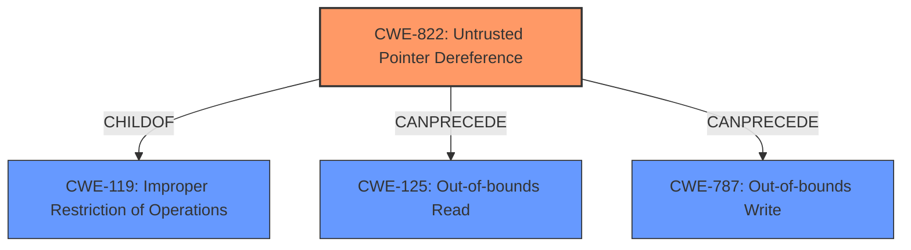

# Analysis for CVE-2021-46243

# Summary
| CWE ID | CWE Name | Confidence | CWE Abstraction Level | CWE Vulnerability Mapping Label | CWE-Vulnerability Mapping Notes |
|---|---|---|---|---|---|
| CWE-822 | Untrusted Pointer Dereference | 1.0 | Base | Allowed | Primary CWE |

## Evidence and Confidence

*   **Confidence Score:** 1.0
*   **Evidence Strength:** HIGH

## Relationship Analysis
The primary relationship that impacted the decision was the direct match of the vulnerability description to CWE-822. While other CWEs were considered, none matched as closely to the **root cause** of the vulnerability.

## Vulnerability Chain
The vulnerability chain starts with the **untrusted pointer dereference** (CWE-822), which directly leads to a denial of service (DoS).

## Summary of Analysis
The initial analysis and the retriever results pointed strongly to CWE-822, **Untrusted Pointer Dereference**, as the primary weakness. The vulnerability description explicitly mentions an **untrusted pointer dereference**, and the CVE Reference Links Content Summary confirms that the **root cause** is a pointer being dereferenced without proper validation. This dereference leads to a segmentation fault and a denial of service.

The evidence is strong: "The vulnerability is an **untrusted pointer dereference** within the `H5O__dtype_decode_helper` function located in `hdf5/src/H5Odtype.c` at line 499... The core issue is that a pointer within the `H5O__dtype_decode_helper` function is being dereferenced without proper validation, leading to a segmentation fault when it points to an invalid memory location."

CWE-822 is at the Base level of abstraction, which is the preferred level, and the mapping guidance allows its usage. This CWE is the most specific and accurate representation of the **root cause**.

Other CWEs Considered and Rejected:

*   CWE-476 (**NULL Pointer Dereference**): While a NULL pointer dereference is a type of untrusted pointer dereference, the provided information does not explicitly state that the pointer is NULL, only that it is invalid. Therefore, CWE-822 is more appropriate.
*   CWE-787 (**Out-of-bounds Write**) and CWE-125 (**Out-of-bounds Read**): These could be potential impacts of an **untrusted pointer dereference**, but the immediate **root cause** is the act of dereferencing an **untrusted pointer**.