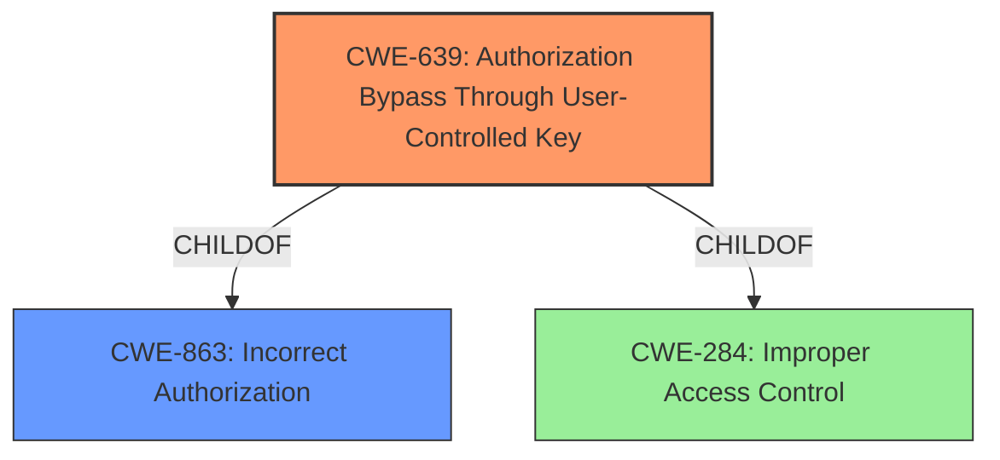

# Raw Analyzer Response for CVE-2021-46249

# Summary
| CWE ID | CWE Name | Confidence | CWE Abstraction Level | CWE Vulnerability Mapping Label | CWE-Vulnerability Mapping Notes |
|---|---|---|---|---|---|
| CWE-639 | Authorization Bypass Through User-Controlled Key | 1.0 | Base | Allowed | Primary CWE |
| CWE-863 | Incorrect Authorization | 0.7 | Class | Allowed-with-Review | Secondary Candidate |

## Evidence and Confidence

*   **Confidence Score:** 0.9
*   **Evidence Strength:** HIGH

## Relationship Analysis
The primary CWE, CWE-639, is a base-level CWE and a child of CWE-863, Incorrect Authorization, and CWE-284, Improper Access Control. This parent-child relationship indicates that CWE-639 is a more specific type of authorization issue. Given the user-controlled key aspect, CWE-639 is the most appropriate choice.

## Vulnerability Chain
The vulnerability chain starts with a **user-controlled key** which leads to an **authorization bypass**.

## Summary of Analysis
The primary CWE is CWE-639, Authorization Bypass Through User-Controlled Key.

The **Vulnerability Description Key Phrases** section has:
- **rootcause:** **user-controlled key**
- **impact:** authorization bypass

The **CVE Reference Links Content Summary** section states:
- "The vulnerability is caused by an authorization bypass in the SpecificApps REST API of ScratchOAuth2. It allows app owners to modify flags related to app verification status."
- "The API allows modification of 'flags' through user-controlled input, which should not be allowed."

The Retriever Results list CWE-639 as the top combined result with a similarity score of 0.77 (dense) and 5942.79 (sparse). The description of CWE-639, "The system's authorization functionality does not prevent one user from gaining access to another user's data or record by modifying the key value identifying the data," directly matches the vulnerability description where the app owner is able to modify flags related to the app's verification status.

CWE-863, Incorrect Authorization, was considered but it's a class-level CWE. CWE-639 is a more specific, base-level CWE that better captures the essence of the vulnerability, namely the **user-controlled key** aspect that leads to the **authorization bypass**. Therefore, CWE-639 is at the optimal level of specificity.

Relevant CWE Information:

# Enhanced Context (25 CWEs)

## CWE-639: Authorization Bypass Through User-Controlled Key
**Abstraction Level**: Base
**Similarity Score**: 0.77
**Source**: dense

**Description**:
The system's authorization functionality does not prevent one user from gaining access to another user's data or record by modifying the key value identifying the data.

**Mapping Guidance**:
- Usage: Allowed
- Rationale: This CWE entry is at the Base level of abstraction, which is a preferred level of abstraction for mapping to the root causes of vulnerabilities.

## CWE-863: Incorrect Authorization
**Abstraction Level**: Class
**Similarity Score**: 5551.66
**Source**: sparse

**Description**:
The product performs an authorization check when an actor attempts to access a resource or perform an action, but it does not correctly perform the check.

**Mapping Guidance**:
- Usage: Allowed-with-Review
- Rationale: This CWE entry is a Class and might have Base-level children that would be more appropriate