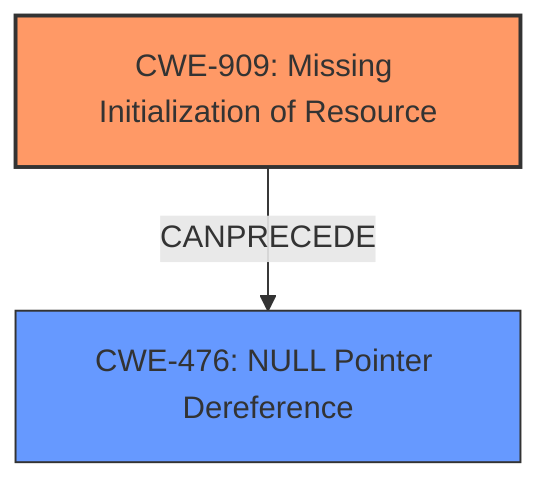

# Raw Analyzer Response for CVE-2021-46283

# Summary
| CWE ID | CWE Name | Confidence | CWE Abstraction Level | CWE Vulnerability Mapping Label | CWE-Vulnerability Mapping Notes |
|---|---|---|---|---|---|
| CWE-909 | Missing Initialization of Resource | 0.9 | Class | Primary | Allowed-with-Review |
| CWE-476 | NULL Pointer Dereference | 0.8 | Base | Secondary | Allowed |

## Evidence and Confidence

*   **Confidence Score:** 0.85
*   **Evidence Strength:** HIGH

## Relationship Analysis
The primary relationship is that CWE-909 **Missing Initialization of Resource** can precede CWE-476 **NULL Pointer Dereference**. The vulnerability description explicitly states a **missing initialization** as the root cause, which directly leads to a **NULL pointer dereference**. CWE-909 is a Class-level CWE, while CWE-476 is a Base-level CWE. Given the evidence, it is more appropriate to identify the **missing initialization** as the primary issue, leading to the **NULL pointer dereference**.

## Vulnerability Chain
The chain of events is as follows:
1.  **Missing Initialization** (CWE-909): A resource is not initialized.
2.  **NULL Pointer Dereference** (CWE-476): Code attempts to use the uninitialized resource, which results in a NULL pointer dereference.
3.  **Denial of Service:** The NULL pointer dereference leads to a crash and denial of service.

The root cause is the **missing initialization**, which then leads to the **NULL pointer dereference** and the resulting denial of service.

## Summary of Analysis
Initially, both CWE-909 and CWE-476 seemed like good candidates. The vulnerability description clearly indicates "**missing initialization**" as the root cause and "**NULL pointer dereference**" as the weakness. The Retriever results also support both CWEs. However, the relationship analysis reveals that CWE-909 can precede CWE-476, indicating a causal relationship. The root cause is the **missing initialization**, which leads to the **NULL pointer dereference**.

Supporting evidence:
*   "**missing initialization** for nft_set_elem_expr_alloc" - This directly supports CWE-909.
*   "**NULL pointer dereference** and general protection fault" - This directly supports CWE-476.

CWE-909 is a Class, and while the mapping guidance suggests examining children for a better fit, none of the children are more appropriate given the provided information. The fact that a resource was not initialized, leading to a **NULL pointer dereference**, makes CWE-909 the most appropriate primary CWE.

Other CWEs Considered:

*   CWE-665 (Improper Initialization): While related, CWE-909 is more specific as it focuses on the "missing" aspect of initialization rather than a general improper initialization.
*   CWE-908 (Use of Uninitialized Resource): This CWE describes the usage of the uninitialized resource, which is the NULL pointer dereference (CWE-476). Thus, it is a consequence of the missing initialization, not the root cause.
*   CWE-824 (Access of Uninitialized Pointer): Similar to CWE-908, this is a consequence of the **missing initialization**.