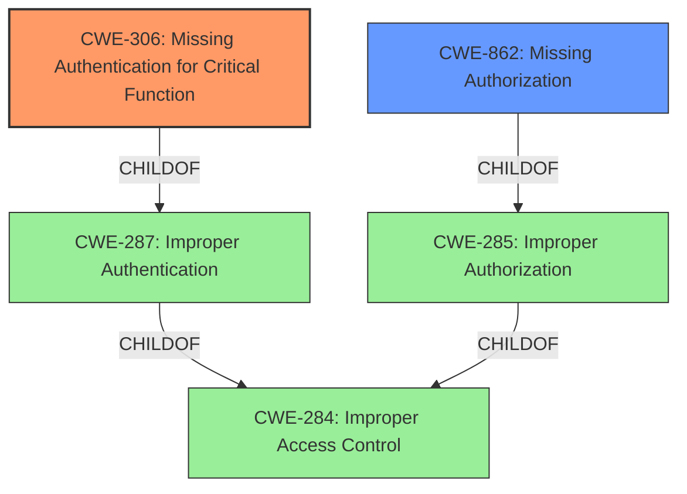

# Analysis Report for CVE-2021-46371

# Vulnerability Analysis Report: CVE-2021-46371

## Description


## Analysis (with Relationship Data)

# Summary
| CWE ID | CWE Name | Confidence | CWE Abstraction Level | CWE Vulnerability Mapping Label | CWE-Vulnerability Mapping Notes |
|---|---|---|---|---|---|
| CWE-306 | Missing Authentication for Critical Function | 0.9 | Base | Primary | Allowed |
| CWE-862 | Missing Authorization | 0.7 | Base | Secondary | Allowed |

## Evidence and Confidence

*   **Confidence Score:** 0.8
*   **Evidence Strength:** HIGH

## Relationship Analysis
The primary CWE is CWE-306, which is a base-level CWE and a child of CWE-287 (Improper Authentication). CWE-862 is a base-level CWE and a child of CWE-285 (Improper Authorization). While both authentication and authorization issues are present, the description emphasizes the lack of authentication as the primary issue, hence the higher confidence in CWE-306. These CWEs are related to the broader category of Improper Access Control (CWE-284), but are more specific and therefore more appropriate.



## Vulnerability Chain
The chain starts with a **lack of authentication** for critical functions (CWE-306). This leads to **missing authorization** checks (CWE-862), allowing unauthorized access to sensitive data. The final impact is **information disclosure**.

## Summary of Analysis
The initial assessment focused on the **incorrect access control** (**WEAKNESS**) mentioned in the vulnerability description. The retriever results suggested CWE-306 (Missing Authentication for Critical Function), CWE-425 (Direct Request ('Forced Browsing')), and CWE-284 (Improper Access Control) as potential candidates.

The "CVE Reference Links Content Summary" section provides key evidence: "Unauthorized access to API endpoints due to a **lack of proper authentication** or authorization mechanisms." This statement directly supports the selection of CWE-306. The summary also states, "Lack of authorization allows unauthenticated users to directly access sensitive data by accessing API endpoints." This supports the selection of CWE-862 (Missing Authorization).

CWE-306 is selected as the primary CWE because the **root cause** is the **missing authentication** mechanism. The impact of this is unauthorized access and information disclosure.

CWE-862 is selected as a secondary CWE because after an unauthenticated user has gained access, the system also **fails to authorize** their requests to access sensitive data.

CWE-284, CWE-285, and CWE-287 were considered but not selected because they are class-level CWEs and less specific than CWE-306 and CWE-862.
CWE-425 (Direct Request ('Forced Browsing')) was also considered, but it is less specific than CWE-306 because the issue is not simply a matter of directly accessing URLs, but rather the complete **lack of authentication**.

Relevant CWE Information:

# Enhanced Context (25 CWEs)

## CWE-306: Missing Authentication for Critical Function
**Abstraction:** Base
**Similarity Score**: 0.192 (sparse)

**Description**:
The product does not perform any authentication for functionality that requires a provable user identity or consumes a significant amount of resources.

**Mapping Guidance**:
- Usage: Allowed

## CWE-862: Missing Authorization
**Abstraction:** Base
**Similarity Score**: N/A

**Description**:
The product does not perform an authorization check when an actor attempts to access a resource or perform an action.

**Mapping Guidance**:
- Usage: Allowed


## CWE Relationship Analysis

Current CWEs represent these abstraction levels: .


### Vulnerability Chain Analysis

**Chain starting from CWE-306:**
- 306 (Missing Authentication for Critical Function) - ROOT


**Chain starting from CWE-862:**
- 862 (Missing Authorization) - ROOT


### CWE Relationship Diagram

```mermaid
graph TD
    classDef primary fill:#f96,stroke:#333,stroke-width:2px
    classDef secondary fill:#69f,stroke:#333
    classDef tertiary fill:#9e9,stroke:#333
```


*Report generated on 2025-04-02 14:33:35*
