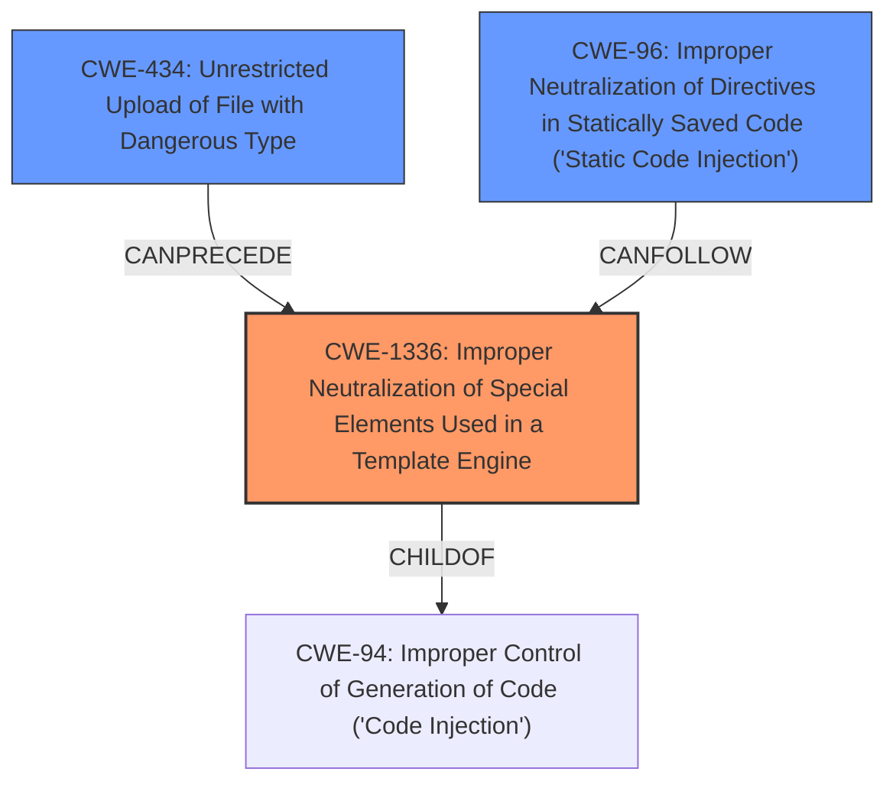

# Raw Analyzer Response for CVE-2021-46384

# Summary
| CWE ID  | CWE Name                                                                                             | Confidence | CWE Abstraction Level | CWE Vulnerability Mapping Label | CWE-Vulnerability Mapping Notes |
| :-------- | :----------------------------------------------------------------------------------------------------- | :--------- | :---------------------- | :------------------------------ | :-------------------------------- |
| CWE-1336  | Improper Neutralization of Special Elements Used in a Template Engine                                | 0.9        | Base                    | Primary                         | Allowed                           |
| CWE-434   | Unrestricted Upload of File with Dangerous Type                                                      | 0.8        | Base                    | Secondary                       | Allowed                           |
| CWE-96    | Improper Neutralization of Directives in Statically Saved Code ('Static Code Injection')             | 0.7        | Base                    | Secondary                       | Allowed                           |

## Evidence and Confidence

*   **Confidence Score:** 0.8
*   **Evidence Strength:** HIGH

## Relationship Analysis
The primary weakness is **CWE-1336 (Improper Neutralization of Special Elements Used in a Template Engine)** because the vulnerability allows an attacker to inject code into template files, leading to arbitrary code execution.
CWE-1336 is related to **CWE-94 (Improper Control of Generation of Code ('Code Injection'))**, as it is a specific type of code injection that occurs within a template engine.
**CWE-434 (Unrestricted Upload of File with Dangerous Type)** is included because the attacker uploads a malicious template file.
**CWE-96 (Improper Neutralization of Directives in Statically Saved Code ('Static Code Injection'))** is included since the uploaded file with dangerous type becomes statically saved code.

## Vulnerability Chain
1.  **CWE-434 (Unrestricted Upload of File with Dangerous Type):** The attacker uploads a malicious template file to the server.
2.  **CWE-96 (Improper Neutralization of Directives in Statically Saved Code ('Static Code Injection'))**: The uploaded file becomes statically saved code on the server.
3.  **CWE-1336 (Improper Neutralization of Special Elements Used in a Template Engine):** The application uses a template engine but fails to neutralize special elements in the user-controlled input, allowing the attacker to inject code via the uploaded template file. This leads to...
4.  Remote Code Execution (Impact): The injected code is executed by the template engine.

## Summary of Analysis
The vulnerability allows an unauthenticated attacker to achieve Remote Code Execution (RCE) by exploiting a pre-auth vulnerability in MCMS <=5.2.5. The attack vector involves injecting code into template files.

The "CVE Reference Links Content Summary" section provides sufficient evidence:
*   **Unrestricted File Upload:** The application allows modification of the upload path and permitted file extensions via a JSON configuration passed to the `EditorAction`.
*   **Insecure Template Handling:** The application uses user-controlled input (`tmpl` parameter) to select template files for rendering.
*   **Remote Code Execution (RCE):** By uploading a malicious template file and then triggering its rendering through a crafted `tmpl` parameter, an attacker can execute arbitrary code on the server.

The primary weakness is **CWE-1336 (Improper Neutralization of Special Elements Used in a Template Engine)**. This is supported by the retriever results, which lists **CWE-1336** as a top combined result. The description of CWE-1336 aligns directly with the vulnerability where the product uses a template engine but fails to neutralize special elements.

**CWE-434 (Unrestricted Upload of File with Dangerous Type)** is a key component because the attacker uploads a malicious template file. This CWE is also listed in the retriever results.

**CWE-96 (Improper Neutralization of Directives in Statically Saved Code ('Static Code Injection'))** is present due to the fact that an attacker is able to upload a file with malicious code into a folder that becomes code that is executed.

I considered **CWE-79 (Improper Neutralization of Input During Web Page Generation ('Cross-site Scripting'))** but it was not selected. Although XSS can be involved with template injection, the root cause is template injection and not XSS.

I considered **CWE-78 (Improper Neutralization of Special Elements used in an OS Command ('OS Command Injection'))**, but it was not selected because the code is injected via a template engine and not directly as an OS command.

I considered **CWE-22 (Improper Limitation of a Pathname to a Restricted Directory ('Path Traversal'))**, but it was not selected. Although the attacker modifies the upload path, the path traversal is not the root cause. The core issue is the improper neutralization of special elements in the template engine.

All the selected CWEs are at the **Base** level of abstraction, which is the preferred level for mapping to the root causes of vulnerabilities.