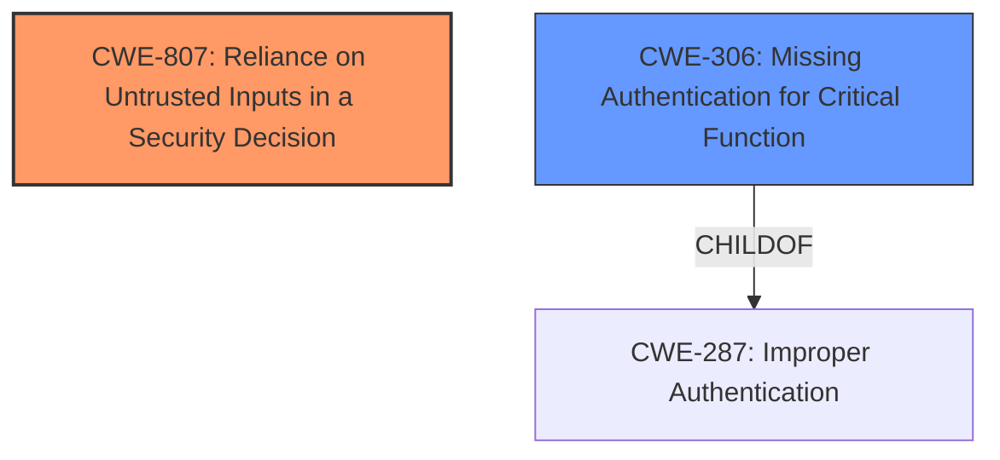

# Analysis for CVE-2021-46390

# Summary
| CWE ID | CWE Name | Confidence | CWE Abstraction Level | CWE Vulnerability Mapping Label | CWE-Vulnerability Mapping Notes |
|---|---|---|---|---|---|
| CWE-807 | Reliance on Untrusted Inputs in a Security Decision | 1.0 | Base | Primary | Allowed |
| CWE-306 | Missing Authentication for Critical Function | 0.7 | Base | Secondary | Allowed |

## Evidence and Confidence

*   **Confidence Score:** 0.8
*   **Evidence Strength:** HIGH

## Relationship Analysis
The primary CWE, CWE-807, describes the core issue where the system trusts an input (the authentication result) that can be manipulated by an untrusted actor (the attacker). While CWE-287 "Improper Authentication" is a parent of CWE-306 "Missing Authentication for Critical Function" and was considered, it is too general. CWE-306, as a child of CWE-287, more closely aligns by focusing on the absence of authentication for a critical function, which in this case is allowing access to sensitive data after bypassing authentication. The relationship between CWE-807 and CWE-287 is less direct, as CWE-807 describes the mechanism by which the improper authentication is achieved, making it the more precise root cause.

## Vulnerability Chain
The chain starts with **an access control issue in the authentication module** allowing the attacker to manipulate the authentication result. This leads to **bypassing user authentication** and accessing **sensitive data**, which results in a **Denial of Service (DoS)**.

## Summary of Analysis
The initial assessment, based on the vulnerability description and the CVE Reference Links Content Summary, points to an **access control issue** that allows manipulation of the authentication result. The FingerTool_Lexar software relies on a return value in a register to determine authentication success. An attacker can modify this value to bypass authentication, gain unauthorized access to encrypted data, and obtain administrator privileges.

The primary CWE identified is CWE-807, "Reliance on Untrusted Inputs in a Security Decision." This is justified by the fact that the software relies on the authentication result, an input that can be modified by the attacker. The vulnerability description explicitly states that "an attacker can bypass password authentication by analyzing the functions that return the password verification or comparison results and manipulate the authentication result values." This aligns perfectly with CWE-807.

CWE-306, "Missing Authentication for Critical Function," is a secondary consideration. While the vulnerability does result in a bypass of authentication, the root cause is not the *absence* of authentication, but rather the *insecure reliance* on a manipulatable authentication result. The system attempts authentication, but the mechanism is flawed due to the reliance on an untrusted input. Therefore, CWE-807 more accurately reflects the core weakness.

The chosen CWEs are at the optimal level of specificity. CWE-807 is a Base level CWE, which is preferred, and accurately describes the vulnerability.

Relevant CWE Information:

# Enhanced Context (25 CWEs)
The following CWEs were identified as potentially relevant to this vulnerability:

## CWE-312: Cleartext Storage of Sensitive Information
**Abstraction Level**: Base
**Similarity Score**: 0.79
**Source**: dense

**Description**:
The product stores sensitive information in cleartext within a resource that might be accessible to another control sphere.
**Not Used:** The described vulnerability does not involve storing information in cleartext. The issue is with the authentication process, not data storage.

## CWE-319: Cleartext Transmission of Sensitive Information
**Abstraction Level**: Base
**Similarity Score**: 0.78
**Source**: dense

**Description**:
The product transmits sensitive or security-critical data in cleartext in a communication channel that can be sniffed by unauthorized actors.
**Not Used:** The vulnerability focuses on manipulating the authentication result, rather than transmitting data in cleartext.

## CWE-311: Missing Encryption of Sensitive Data
**Abstraction Level**: Class
**Similarity Score**: 0.78
**Source**: dense

**Description**:
The product does not encrypt sensitive or critical information before storage or transmission.
**Not Used:** The vulnerability doesn't involve a lack of encryption; the data is encrypted, but the authentication mechanism is flawed, allowing access to the encrypted data.

## CWE-1391: Use of Weak Credentials
**Abstraction Level**: Class
**Similarity Score**: 0.78
**Source**: dense

**Description**:
The product uses weak credentials (such as a default key or hard-coded password) that can be calculated, derived, reused, or guessed by an attacker.
**Not Used:** The vulnerability isn't about weak credentials; it's about bypassing the authentication process regardless of the strength of the password.

## CWE-345: Insufficient Verification of Data Authenticity
**Abstraction Level**: Class
**Similarity Score**: 0.78
**Source**: dense

**Description**:
The product does not sufficiently verify the origin or authenticity of data, in a way that causes it to accept invalid data.
**Not Used:** While there is insufficient verification of the authentication result, CWE-807 describes this more accurately.

## CWE-1240: Use of a Cryptographic Primitive with a Risky Implementation
**Abstraction Level**: Base
**Similarity Score**: 0.77
**Source**: dense

**Description**:
To fulfill the need for a cryptographic primitive, the product implements a cryptographic algorithm using a non-standard, unproven, or disallowed/non-compliant cryptographic implementation.
**Not Used:** The vulnerability doesn't directly relate to the implementation of cryptographic algorithms.

## CWE-798: Use of Hard-coded Credentials
**Abstraction Level**: Base
**Similarity Score**: 0.77
**Source**: dense

**Description**:
The product contains hard-coded credentials, such as a password or cryptographic key.
**Not Used:** The vulnerability doesn't involve hard-coded credentials; it's about bypassing authentication regardless of the credentials used.

## CWE-303: Incorrect Implementation of Authentication Algorithm
**Abstraction Level**: Base
**Similarity Score**: 0.77
**Source**: dense

**Description**:
The requirements for the product dictate the use of an established authentication algorithm, but the implementation of the algorithm is incorrect.
**Not Used:** The vulnerability is about manipulating the authentication result, not necessarily an incorrect implementation of the algorithm itself.

## CWE-807: Reliance on Untrusted Inputs in a Security Decision
**Abstraction Level**: Base
**Similarity Score**: 0.77
**Source**: dense

**Description**:
The product uses a protection mechanism that relies on the existence or values of an input, but the input can be modified by an untrusted actor in a way that bypasses the protection mechanism.
**Used:** This accurately describes the root cause, as the program relies on the authentication result, which is manipulatable by an attacker.

## CWE-522: Insufficiently Protected Credentials
**Abstraction Level**: Class
**Similarity Score**: 0.76
**Source**: dense

**Description**:
The product transmits or stores authentication credentials, but it uses an insecure method that is susceptible to unauthorized interception and/or retrieval.
**Not Used:** The vulnerability doesn't involve insecurely storing or transmitting credentials.

## CWE-916: Use of Password Hash With Insufficient Computational Effort
**Abstraction Level**: Base
**Similarity Score**: 7416.17
**Source**: sparse

**Description**:
The product generates a hash for a password, but it uses a scheme that does not provide a sufficient level of computational effort that would make password cracking attacks infeasible or expensive.
**Not Used:** This vulnerability is not about password hashing.

## CWE-327: Use of a Broken or Risky Cryptographic Algorithm
**Abstraction Level**: Class
**Similarity Score**: 6854.03
**Source**: sparse

**Description**:
The product uses a broken or risky cryptographic algorithm or protocol.
**Not Used:** This vulnerability is not about a broken cryptographic algorithm.

## CWE-1390: Weak Authentication
**Abstraction Level**: Class
**Similarity Score**: 6770.37
**Source**: sparse

**Description**:
The product uses an authentication mechanism to restrict access to specific users or identities, but the mechanism does not sufficiently prove that the claimed identity is correct.
**Not Used:** While the authentication is bypassed, the root cause is not a weak authentication mechanism but the reliance on a manipulatable result.

## CWE-613: Insufficient Session Expiration
**Abstraction Level**: base
**Similarity Score**: 4.33
**Source**: graph

**Description**:
CWE-613: Insufficient Session Expiration
**Not