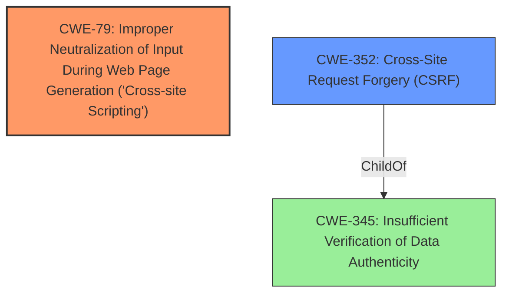

# Raw Analyzer Response for CVE-2021-46426

# Summary
| CWE ID | CWE Name | Confidence | CWE Abstraction Level | CWE Vulnerability Mapping Label | CWE-Vulnerability Mapping Notes |
|---|---|---|---|---|---|
| CWE-79 | Improper Neutralization of Input During Web Page Generation ('Cross-site Scripting') | 1.0 | Base | Primary | Allowed |
| CWE-352 | Cross-Site Request Forgery (CSRF) | 1.0 | Compound | Secondary | Allowed |

## Evidence and Confidence

*   **Confidence Score:** 1.0
*   **Evidence Strength:** HIGH

## Relationship Analysis
The primary weakness is **CWE-79** [Improper Neutralization of Input During Web Page Generation ('Cross-site Scripting')] because the application fails to neutralize user-controllable input before placing it in a web page. **CWE-79** is a Base level CWE.
The secondary weakness is **CWE-352** [Cross-Site Request Forgery (CSRF)] because the forms lack CSRF tokens. **CWE-352** is a Compound level CWE.

## Vulnerability Chain
The vulnerability chain starts with the lack of proper input sanitization, leading to **CWE-79** [Improper Neutralization of Input During Web Page Generation ('Cross-site Scripting')]. The absence of CSRF tokens leads to **CWE-352** [Cross-Site Request Forgery (CSRF)].

## Summary of Analysis
The analysis is based on the provided evidence, which includes the vulnerability description and the CVE reference links content summary.

The vulnerability description clearly states that the application is susceptible to both Reflected XSS and CSRF. The CVE reference links content summary confirms that the root cause of the XSS vulnerability is the lack of proper input sanitization in `app/admin/subnets/find_free_section_subnets.php`, and the root cause of the CSRF vulnerability is the absence of CSRF tokens in the form.

The retriever results also support this classification, with **CWE-79** [Improper Neutralization of Input During Web Page Generation ('Cross-site Scripting')] and **CWE-352** [Cross-Site Request Forgery (CSRF)] being the top two combined results.

The selected CWEs are at the optimal level of specificity, as they accurately represent the weaknesses described in the vulnerability description and the CVE reference links content summary. **CWE-79** [Improper Neutralization of Input During Web Page Generation ('Cross-site Scripting')] is a Base level CWE that accurately represents the lack of input sanitization, while **CWE-352** [Cross-Site Request Forgery (CSRF)] is a Compound level CWE that accurately represents the absence of CSRF tokens.

Relevant CWE Information:

# Enhanced Context (25 CWEs)
The following CWEs were identified as potentially relevant to this vulnerability:

## CWE-80: Improper Neutralization of Script-Related HTML Tags in a Web Page (Basic XSS)
**Abstraction Level**: Variant
**Similarity Score**: 0.82
**Source**: dense

**Description**:
The product receives input from an upstream component, but it does not neutralize or incorrectly neutralizes special characters such as "<", ">", and "&" that could be interpreted as web-scripting elements when they are sent to a downstream component that processes web pages.

**Mapping Guidance**:
- Usage: Allowed
- Rationale: This CWE entry is at the Variant level of abstraction, which is a preferred level of abstraction for mapping to the root causes of vulnerabilities.

CWE-80 was considered but not used because **CWE-79** [Improper Neutralization of Input During Web Page Generation ('Cross-site Scripting')] is a more general case of XSS.

## CWE-74: Improper Neutralization of Special Elements in Output Used by a Downstream Component ('Injection')
**Abstraction Level**: Class
**Similarity Score**: 0.79
**Source**: dense

**Description**:
The product constructs all or part of a command, data structure, or record using externally-influenced input from an upstream component, but it does not neutralize or incorrectly neutralizes special elements that could modify how it is parsed or interpreted when it is sent to a downstream component.

**Mapping Guidance**:
- Usage: Discouraged
- Rationale: CWE-74 is high-level and often misused when lower-level weaknesses are more appropriate.

CWE-74 was considered but not used because **CWE-79** [Improper Neutralization of Input During Web Page Generation ('Cross-site Scripting')] is a lower-level weakness that is more appropriate.

## CWE-184: Incomplete List of Disallowed Inputs
**Abstraction Level**: Base
**Similarity Score**: 0.78
**Source**: dense

**Description**:
The product implements a protection mechanism that relies on a list of inputs (or properties of inputs) that are not allowed by policy or otherwise require other action to neutralize before additional processing takes place, but the list is incomplete.

**Mapping Guidance**:
- Usage: Allowed
- Rationale: This CWE entry is at the Base level of abstraction, which is a preferred level of abstraction for mapping to the root causes of vulnerabilities.

CWE-184 was considered but not used because the vulnerability is not specifically related to an incomplete list of disallowed inputs, but rather a general lack of input sanitization.

## CWE-138: Improper Neutralization of Special Elements
**Abstraction Level**: Class
**Similarity Score**: 0.77
**Source**: dense

**Description**:
The product receives input from an upstream component, but it does not neutralize or incorrectly neutralizes special elements that could be interpreted as control elements or syntactic markers when they are sent to a downstream component.

**Mapping Guidance**:
- Usage: Discouraged
- Rationale: This CWE entry is a level-1 Class (i.e., a child of a Pillar). It might have lower-level children that would be more appropriate

CWE-138 was considered but not used because **CWE-79** [Improper Neutralization of Input During Web Page Generation ('Cross-site Scripting')] is a lower-level weakness that is more appropriate.

## CWE-1289: Improper Validation of Unsafe Equivalence in Input
**Abstraction Level**: Base
**Similarity Score**: 0.77
**Source**: dense

**Description**:
The product receives an input value that is used as a resource identifier or other type of reference, but it does not validate or incorrectly validates that the input is equivalent to a potentially-unsafe value.

**Mapping Guidance**:
- Usage: Allowed
- Rationale: This CWE entry is at the Base level of abstraction, which is a preferred level of abstraction for mapping to the root causes of vulnerabilities.

CWE-1289 was considered but not used because it is not directly related to the lack of input validation in the context of XSS.

## CWE-116: Improper Encoding or Escaping of Output
**Abstraction Level**: Class
**Similarity Score**: 0.77
**Source**: dense

**Description**:
The product prepares a structured message for communication with another component, but encoding or escaping of the data is either missing or done incorrectly. As a result, the intended structure of the message is not preserved.

**Mapping Guidance**:
- Usage: Allowed-with-Review
- Rationale: This CWE entry is a Class and might have Base-level children that would be more appropriate

CWE-116 was considered but not used because **CWE-79** [Improper Neutralization of Input During Web Page Generation ('Cross-site Scripting')] is a more specific description of the vulnerability.

## CWE-113: Improper Neutralization of CRLF Sequences in HTTP Headers ('HTTP Request/Response Splitting')
**Abstraction Level**: Variant
**Similarity Score**: 0.77
**Source**: dense

**Description**:
The product receives data from an HTTP agent/component (e.g., web server, proxy, browser, etc.), but it does not neutralize or incorrectly neutralizes CR and LF characters before the data is included in outgoing HTTP headers.

**Mapping Guidance**:
- Usage: Allowed
- Rationale: This CWE entry is at the Variant level of abstraction, which is a preferred level of abstraction for mapping to the root causes of vulnerabilities.

CWE-113 was considered but not used because the vulnerability is not specifically related to CRLF sequences in HTTP headers.

## CWE-41: Improper Resolution of Path Equivalence
**Abstraction Level**: Base
**Similarity Score**: 0.