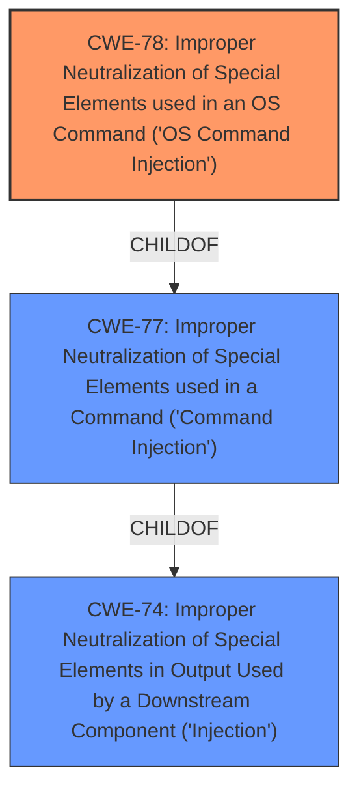

# Raw Analyzer Response for CVE-2021-46456

# Summary
| CWE ID | CWE Name | Confidence | CWE Abstraction Level | CWE Vulnerability Mapping Label | CWE-Vulnerability Mapping Notes |
|---|---|---|---|---|---|
| CWE-78 | Improper Neutralization of Special Elements used in an OS Command ('OS Command Injection') | 1.0 | Base | Allowed | Primary CWE |

## Evidence and Confidence

*   **Confidence Score:** 1.0
*   **Evidence Strength:** HIGH

## Relationship Analysis
The primary relationship that influenced the decision was the ChildOf relationship between CWE-78 and CWE-77. Since the vulnerability involves **command injection** at the OS level, CWE-78 is more specific and therefore more appropriate than its parent CWE-77. The retriever results also listed CWE-78 as a strong candidate.

## Vulnerability Chain
The vulnerability chain starts with the **improper neutralization** of special elements in the `wl(0).(0)_maclist` parameter, leading to **OS command injection**, and ultimately resulting in the ability to execute arbitrary commands on the device.

## Summary of Analysis
The initial analysis identified CWE-77 as a potential candidate based on the "Top CWEs" information. However, upon closer inspection of the vulnerability description and the details provided in the CVE Reference Links Content Summary, it became clear that the **command injection** occurs at the OS level.

The vulnerability description states: "D-Link device D-Link DIR-823-Pro v1.0.2 was discovered to contain a **command injection** vulnerability in the function SetWLanACLSettings. This vulnerability allows attackers to execute arbitrary commands via the wl(0).(0)_maclist parameter." The CVE Reference Links Content Summary also explicitly mentions "**Command Injection:** The primary vulnerability is a command injection".

CWE-78, "Improper Neutralization of Special Elements used in an OS Command ('OS Command Injection')", is a Base level CWE that directly addresses this type of vulnerability. The description of CWE-78 states: "The product constructs all or part of an OS command using externally-influenced input from an upstream component, but it does not neutralize or incorrectly neutralizes special elements that could modify the intended OS command when it is sent to a downstream component." This aligns perfectly with the vulnerability description, where the `wl(0).(0)_maclist` parameter is used to construct an OS command, and the **improper neutralization** of special elements allows attackers to modify the command.

The MITRE mapping guidance for CWE-78 recommends its use, stating: "This CWE entry is at the Base level of abstraction, which is a preferred level of abstraction for mapping to the root causes of vulnerabilities."

Therefore, CWE-78 is the most appropriate CWE for this vulnerability due to its specificity, alignment with the vulnerability description, and adherence to MITRE mapping guidance.

CWE-77 was considered but not used because it is a more general Class-level CWE that encompasses all types of command injection, not just OS command injection. While CWE-77 could be used, CWE-78 provides a more precise and accurate classification of the vulnerability. Other CWEs like CWE-121, CWE-138, CWE-95, CWE-912, CWE-184, CWE-259, CWE-426, CWE-790 were not used because they don't directly relate to the **command injection** aspect of this vulnerability.