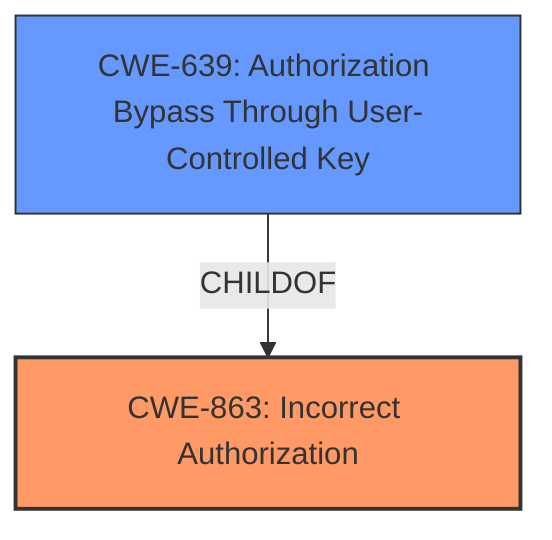

# Raw Analyzer Response for CVE-2021-46561

# Summary
| CWE ID | CWE Name | Confidence | CWE Abstraction Level | CWE Vulnerability Mapping Label | CWE-Vulnerability Mapping Notes |
|---|---|---|---|---|---|
| CWE-863 | Incorrect Authorization | 0.9 | Class | Primary | Allowed-with-Review |
| CWE-639 | Authorization Bypass Through User-Controlled Key | 0.7 | Base | Secondary | Allowed |

## Evidence and Confidence

*   **Confidence Score:** 0.8
*   **Evidence Strength:** HIGH

## Relationship Analysis
The primary CWE is CWE-863, which is a Class-level CWE. CWE-639 is a ChildOf CWE-863 which represents a more specific case of authorization bypass. The analysis considered the parent-child relationship between CWE-863 and CWE-639, opting for CWE-863 as the primary due to its broader applicability.

## Vulnerability Chain
The vulnerability chain starts with the **lack of proper authorization checks** on user organization assignments, leading to an **organizational administrator's ability to transfer a user account to an arbitrary new organization**, ultimately resulting in **unintended access within the context of that new organization**.

## Summary of Analysis
Initially, the analysis focused on identifying the root cause of the vulnerability, which stems from **insufficient authorization** controls. The vulnerability description clearly states that an organizational administrator could transfer a user account to an arbitrary new organization, achieving unintended access.

The **CVE Reference Links Content Summary** confirms the root cause, stating that the vulnerability results from a "lack of proper authorization checks when updating user organization assignments" and that "Org Admins...were able to modify user assignments across different organizations."

The retriever results highlighted CWE-863 (Incorrect Authorization) and CWE-639 (Authorization Bypass Through User-Controlled Key) as potential candidates.

CWE-863 (Incorrect Authorization) is a Class-level CWE, while CWE-639 (Authorization Bypass Through User-Controlled Key) is a Base-level CWE. Given the specific nature of the vulnerability, where an administrator bypasses authorization checks to transfer a user account, CWE-639 is considered as a secondary CWE. However, since the root cause is primarily an incorrect authorization check, CWE-863 is the better fit as the primary CWE.

The decision to select CWE-863 as the primary CWE is based on the evidence that the system performed an authorization check but performed it incorrectly, allowing the bypass. This aligns with the description of CWE-863: "The product performs an authorization check when an actor attempts to access a resource or perform an action, but it does not correctly perform the check."

Relevant CWE Information:

# Enhanced Context (25 CWEs)
The following CWEs were identified as potentially relevant to this vulnerability:

## CWE-639: Authorization Bypass Through User-Controlled Key
**Abstraction Level**: Base
**Similarity Score**: 0.78
**Source**: dense

**Description**:
The system's authorization functionality does not prevent one user from gaining access to another user's data or record by modifying the key value identifying the data.

**Mapping Guidance**:
- Usage: Allowed
- Rationale: This CWE entry is at the Base level of abstraction, which is a preferred level of abstraction for mapping to the root causes of vulnerabilities.

## CWE-863: Incorrect Authorization
**Abstraction Level**: Class
**Similarity Score**: 5806.73
**Source**: sparse

**Description**:
The product performs an authorization check when an actor attempts to access a resource or perform an action, but it does not correctly perform the check.

**Mapping Guidance**:
- Usage: Allowed-with-Review
- Rationale: This CWE entry is a Class and might have Base-level children that would be more appropriate