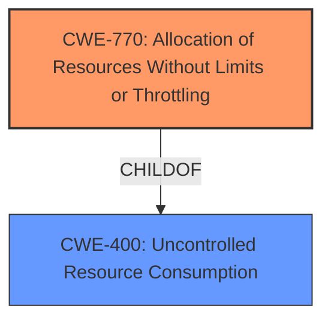

# Enhanced Analysis for CVE-2021-46668

# Summary
| CWE ID | CWE Name | Confidence | CWE Abstraction Level | CWE Vulnerability Mapping Label | CWE-Vulnerability Mapping Notes |
|---|---|---|---|---|---|
| CWE-770 | Allocation of Resources Without Limits or Throttling | 0.9 | Base | Allowed | Primary CWE |
| CWE-400 | Uncontrolled Resource Consumption | 0.7 | Class | Discouraged | Secondary Candidate |

## Evidence and Confidence

*   **Confidence Score:** 0.8
*   **Evidence Strength:** HIGH

## Relationship Analysis
The primary relationship influencing the decision is the ChildOf relationship where CWE-770 is a child of CWE-400. This indicates that CWE-770 is a more specific case of CWE-400, where the vulnerability stems from allocating resources without limits or throttling. Choosing CWE-770 provides a more precise classification.



## Vulnerability Chain
The vulnerability chain starts with the **improper interaction with storage-engine resource limitations for temporary data structures** and leads to an application crash. The root cause is the **lack of limits on resource allocation** when processing long `SELECT DISTINCT` statements, which results in a denial-of-service due to resource exhaustion.

## Summary of Analysis
The initial analysis focused on identifying the root cause of the application crash in MariaDB. The key phrase from the vulnerability description is "**improper interaction with storage-engine resource limitations for temporary data structures**". The CVE Reference Links Content Summary highlights that the crash occurs with long `SELECT DISTINCT` statements, particularly involving a large number of `BLOB` fields. This points to a resource management issue.

CWE-770 (Allocation of Resources Without Limits or Throttling) aligns well with the root cause, as it describes the **lack of restrictions on the size or number of resources allocated**, which leads to resource exhaustion and the crash. This is a Base level CWE, which is preferred.

CWE-400 (Uncontrolled Resource Consumption) was also considered, but it is a Class-level CWE and is discouraged for use when more specific CWEs are available. Since the vulnerability involves the allocation of resources without proper limits, CWE-770 is the more appropriate choice.

The graph relationships show that CWE-770 is a child of CWE-400, indicating that it's a more specific type of uncontrolled resource consumption. This further supports the decision to use CWE-770.

The evidence from the vulnerability description and CVE reference links strongly supports the selection of CWE-770 as the primary CWE. This choice provides the most accurate and specific classification of the vulnerability, aligning with the principle of selecting the most detailed CWE that fits the evidence.

Relevant CWE Information:

# Enhanced Context (25 CWEs)
The following CWEs were identified as potentially relevant to this vulnerability:

## CWE-668: Exposure of Resource to Wrong Sphere
**Abstraction Level**: Class
**Similarity Score**: 0.77
**Source**: dense

**Description**:
The product exposes a resource to the wrong control sphere, providing unintended actors with inappropriate access to the resource.

**Mapping Guidance**:
- Usage: Discouraged
- Rationale: CWE-668 is high-level and is often misused as a catch-all when lower-level CWE IDs might be applicable. It is sometimes used for low-information vulnerability reports [REF-1287]. It is a level-1 Class (i.e., a child of a Pillar). It is not useful for trend analysis.

**Reason Not Used**: This vulnerability does not involve exposing resources to the wrong sphere. It is focused on resource exhaustion.

## CWE-404: Improper Resource Shutdown or Release
**Abstraction Level**: Class
**Similarity Score**: 0.77
**Source**: dense

**Description**:
The product does not release or incorrectly releases a resource before it is made available for re-use.

**Mapping Guidance**:
- Usage: Allowed-with-Review
- Rationale: This CWE entry is a Class and might have Base-level children that would be more appropriate

**Reason Not Used**: The issue is not about improper shutdown or release of resources, but about allocating too many resources without limits.

## CWE-41: Improper Resolution of Path Equivalence
**Abstraction Level**: Base
**Similarity Score**: 0.76
**Source**: dense

**Description**:
The product is vulnerable to file system contents disclosure through path equivalence. Path equivalence involves the use of special characters in file and directory names. The associated manipulations are intended to generate multiple names for the same object.

**Mapping Guidance**:
- Usage: Allowed
- Rationale: This CWE entry is at the Base level of abstraction, which is a preferred level of abstraction for mapping to the root causes of vulnerabilities.

**Reason Not Used**: This CWE is not relevant as it focuses on path equivalence issues, which are not present in the described vulnerability.

## CWE-226: Sensitive Information in Resource Not Removed Before Reuse
**Abstraction Level**: Base
**Similarity Score**: 0.76
**Source**: dense

**Description**:
The product releases a resource such as memory or a file so that it can be made available for reuse, but it does not clear or "zeroize" the information contained in the resource before the product performs a critical state transition or makes the resource available for reuse by other entities.

**Mapping Guidance**:
- Usage: Allowed
- Rationale: This CWE entry is at the Base level of abstraction, which is a preferred level of abstraction for mapping to the root causes of vulnerabilities.

**Reason Not Used**: This CWE is not related to the vulnerability, which is about resource exhaustion, not about sensitive information leakage upon reuse.

## CWE-667: Improper Locking
**Abstraction Level**: Class
**Similarity Score**: 0.76
**Source**: dense

**Description**:
The product does not properly acquire or release a lock on a resource, leading to unexpected resource state changes and behaviors.

**Mapping Guidance**:
- Usage: Allowed-with-Review
- Rationale: This CWE entry is a Class and might have Base-level children that would be more appropriate

**Reason Not Used**: The vulnerability does not involve locking issues, but resource allocation without limits.

## CWE-59: Improper Link Resolution Before File Access ('Link Following')
**Abstraction Level**: Base
**Similarity Score**: 0.76
**Source**: dense

**Description**:
The product attempts to access a file based on the filename, but it does not properly prevent that filename from identifying a link or shortcut that resolves to an unintended resource.

**Mapping Guidance**:
- Usage: Allowed
- Rationale: This CWE entry is at the Base level of abstraction, which is a preferred level of abstraction for mapping to the root causes of vulnerabilities.

**Reason Not Used**: This CWE is not related as the vulnerability does not involve link resolution or file access issues.

## CWE-212: Improper Removal of Sensitive Information Before Storage or Transfer
**Abstraction Level**: Base
**Similarity Score**: 0.76
**Source**: dense

**Description**:
The product stores, transfers, or shares a resource that contains sensitive information, but it does not properly remove that information before the product makes the resource available to unauthorized actors.

**Mapping Guidance**:
- Usage: Allowed
- Rationale: This CWE entry is at the Base level of abstraction, which is a preferred level of abstraction for mapping to the root causes of vulnerabilities.

**Reason Not Used**: This CWE is not relevant as the vulnerability is about resource exhaustion, not sensitive information handling.

## CWE-23: Relative Path Traversal
**Abstraction Level**: Base
**Similarity Score**: 0.75
**Source**: dense

**Description**:
The product uses external input to construct a pathname that should be within a restricted directory, but it does not properly neutralize sequences such as ".." that can resolve to a location that is outside of that directory.

**Mapping Guidance**:
- Usage: Allowed
- Rationale: This CWE entry is at the Base level of abstraction, which is a preferred level of abstraction for mapping to the root causes of vulnerabilities.

**Reason Not Used**: This CWE is not relevant as it deals with path traversal, not resource exhaustion.

## CWE-754: Improper Check for Unusual or Exceptional Conditions
**Abstraction Level**: Class
**Similarity Score**: 0.75
**Source**: dense

**Description**:
The product does not check or incorrectly checks for unusual or exceptional conditions that are not expected to occur frequently during day to day operation of the product.

**Mapping Guidance**:
- Usage: Allowed-with-Review
- Rationale: This CWE entry is a Class and might have Base-level children that would be more appropriate

**Reason Not Used**: While the vulnerability involves exceptional conditions leading to a crash, the root cause is specifically related to resource allocation, making CWE-770 a more direct match.

## CWE-53


## CWE Relationship Analysis

Current CWEs represent these abstraction levels: .


### Vulnerability Chain Analysis

**Chain starting from CWE-667:**
- 667 (Improper Locking) - ROOT


**Chain starting from CWE-754:**
- 754 (Improper Check for Unusual or Exceptional Conditions) - ROOT


### CWE Relationship Diagram

```mermaid
graph TD
    classDef primary fill:#f96,stroke:#333,stroke-width:2px
    classDef secondary fill:#69f,stroke:#333
    classDef tertiary fill:#9e9,stroke:#333
```